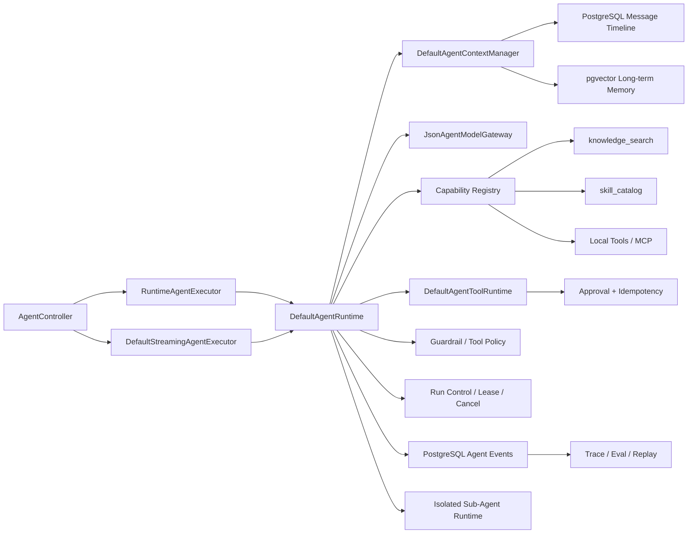
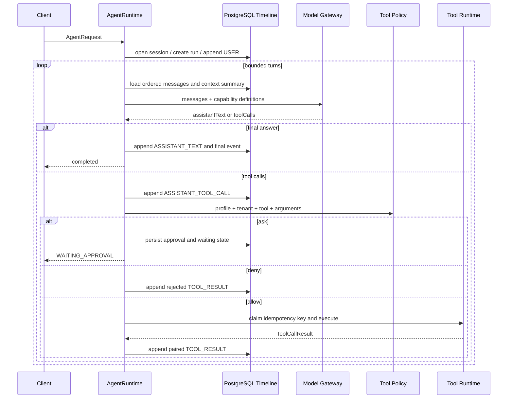

# 当前架构

## 1. 组件关系

核心依赖方向是 Controller/Adapter -> Runtime -> Port/Store。HTTP、SSE、RAG、MCP 和 Sub-Agent 都不能各自创建一套执行语义。

## 2. Agent Loop

模型只负责“下一步是什么”。能否执行、何时终止、如何恢复、是否重复执行副作用，都由 Runtime 决定。

## 3. 消息与上下文

`agent_message` 是完整事实时间线。`DefaultAgentContextManager` 只生成下一轮模型投影，不删除历史：

1. 找到最新 `CONTEXT_SUMMARY` 及其 `coversThroughSequence`。
2. 将工具调用和工具结果组合为不可拆分单元。
3. 按 Token 预算从后向前选择完整近期单元。
4. 超预算时，对更早的完整单元生成滚动摘要并持久化。
5. 加入 pgvector 长期记忆，但明确标记为不可信历史用户数据。
6. Provider 返回上下文溢出时，缩小预算再压缩一次；仍失败则以 `CONTEXT_OVERFLOW` 终止。

## 4. Tool Runtime

能力目录包含：

- `knowledge_search`：RAG 只读能力；
- `skill_catalog`：只读技能指导，不授予工具权限；
- 本地工单工具；
- 可选 MCP 工具。

执行前依次经过 Profile 白名单、能力存在性、JSON Schema 参数校验、Tool Policy 和审批。写工具使用 `toolCallId/requestId` 持久化执行声明；不确定副作用不会盲目重试，而是进入 `MANUAL_REVIEW`。

## 5. 同步与 SSE

`RuntimeAgentExecutor` 收集 Runtime 结果并投影为同步 `AgentResponse`。`DefaultStreamingAgentExecutor` 将相同 Runtime 发出的事件转成 SSE，客户端断开时请求取消对应 Run。

当前 SSE 是 Runtime 事件流，不是逐 Token 输出流。`MODEL_STARTED`、`MODEL_COMPLETED`、工具、审批、压缩、Sub-Agent 和终态事件都先持久化再通知监听器。

## 6. Sub-Agent

Planner、Specialist、Reviewer 都通过同一个 Runtime 运行，但使用独立 `AgentExecutionProfile`：

- 独立 Session 和 child Run；
- 独立 System Prompt；
- 独立工具白名单；
- 独立模型/工具/Token/时间预算；
- 禁用长期记忆写入；
- 主协调者只接收摘要和 childRunId。

这实现了上下文与权限隔离，但还不是跨进程分布式调度。
