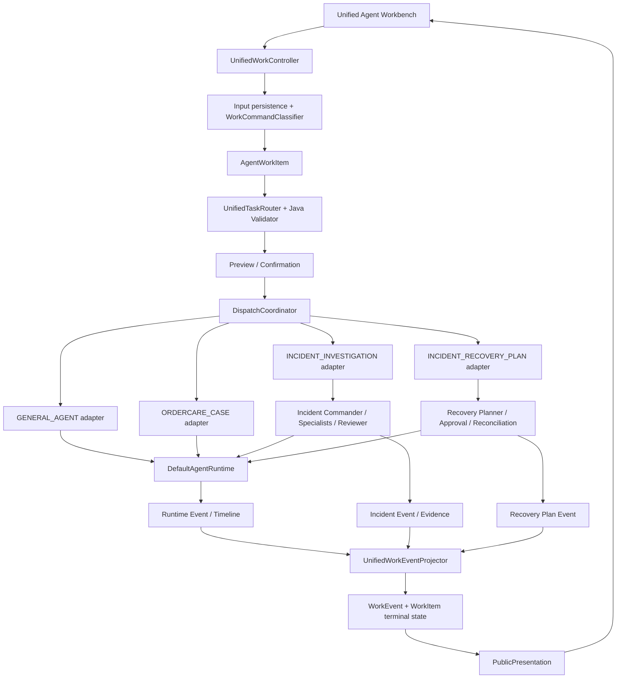
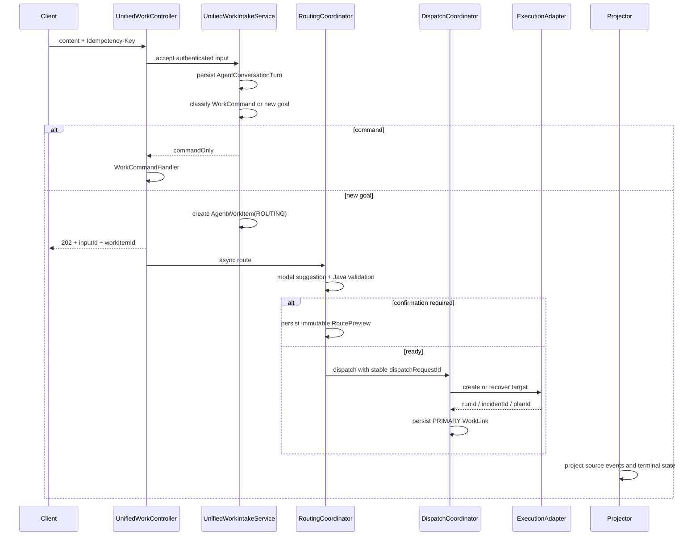
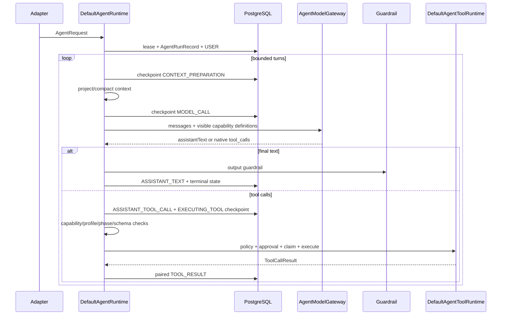
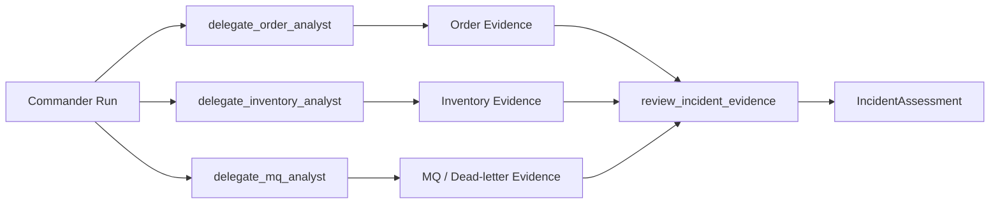

# 当前架构

> 实现基线：`b6207a4`，核对日期：2026-08-10。

## 1. 三个平面



- **产品控制面**：持久化输入、识别命令、新建 WorkItem、路由、确认、派发、命令控制和统一展示。
- **业务编排面**：OrderCare Case、Incident Command、Recovery Plan 和 Scope Discovery 的领域状态机。
- **执行面**：单 Run 的模型、上下文、工具、审批、预算、Checkpoint 与恢复。

## 2. Unified Workbench 主链

统一入口是：

```http
POST /api/agent/conversations/{conversationId}/inputs
Idempotency-Key: <clientInputId>
```



`AgentConversationTurn` 是用户输入事实；`AgentWorkItem` 是稳定用户目标。继续、暂停、取消、放弃和补充输入不会创建新的 WorkItem。

WorkItem 的状态分成三个维度：

| 维度 | 含义 | 示例 |
|---|---|---|
| `WorkControlState` | 控制面推进到哪里 | `ROUTING / WAITING_CONFIRMATION / DISPATCHED / CLOSED` |
| `WorkExecutionState` | 底层执行状态 | `RUNNING / WAITING_APPROVAL / COMPLETED / FAILED` |
| `WorkOutcome` | 产品或业务结果 | `ANSWERED / ASSESSED / RESOLVED / MANUAL_REVIEW` |

## 3. 单 Agent Runtime

`AgentController` 的同步和 SSE 接口，以及 General/OrderCare Adapter，最终复用同一个 `DefaultAgentRuntime`。



模型只提出下一步；Java 决定工具是否存在、当前 Profile 是否授权、当前阶段是否可见、是否需要审批、是否已经执行过以及何时停止。

## 4. 模型协议

默认网关为 `NativeToolCallingAgentModelGateway`：

- 使用 Spring AI `ChatResponse` 和 Provider 原生 `tools/tool_calls`；
- 流式聚合 ToolCall 名称与参数分片；
- 将持久化 `ASSISTANT_TOOL_CALL / TOOL_RESULT` 重建为 Provider Assistant/ToolResponse 消息；
- ToolCall 不进入用户正文 `MODEL_DELTA`；
- `reasoningContent` 只作为内部 Provider 协议元数据，不投影为公开 Chain of Thought；
- Gateway 不调用 ToolCallback 的执行函数，避免形成第二套工具循环。

`JsonAgentModelGateway` 是兼容模式，不再是默认生产路径。

## 5. Capability 与 Tool Runtime

```text
LLM ToolCall
→ Capability 是否注册
→ ExecutionProfile 是否授权
→ AgentCapabilityVisibilityPolicy 是否允许当前阶段使用
→ JSON Schema / 参数边界
→ Tool Guardrail：ALLOW / REQUIRE_APPROVAL / BLOCK
→ ToolExecutionClaim
→ AgentCapabilityExecutor / ToolHandler
→ ToolExecutionRecord + ToolResult
```

高风险审批不会阻塞线程。Runtime 保存 `ApprovalRecord + pendingToolCall + BudgetSnapshot`，进入 `WAITING_APPROVAL` 后释放线程和模型连接；用户决定后通过 Resume 恢复原 Run。

Tool Claim 解决“是否已经执行过”，Approval 解决“是否允许执行”，二者不能互相替代。

## 6. Incident Command 与受控 SubAgent



SubAgent 调度仍然经过 Runtime ToolCall 链路。只有显式声明为只读、低风险、`parallelSafe` 且 `singleUse` 的 SubAgent Tool 才允许有界并行。每个 Specialist 有独立 childRunId、Profile、预算和只读工具白名单。

Reviewer 不是自由文本汇总器：它输出强类型 Assessment 草稿，Java 验证 EvidenceSubtype 覆盖、evidenceId/conflictId 引用、冲突一致性和只读建议边界。

Incident Task/Recovery Item 的 Phase 3 可靠性由 PostgreSQL lease、heartbeat、stale scan 和 fencing token 提供；这不等于建设了通用 Agent Mailbox 或任意 DAG 平台。

## 7. Incident Scope Discovery

```text
业务现象 + 时间/订单/扣减/死信锚点
→ Java 解析受支持条件
→ FlowOrder 固定只读 Scope API
→ 候选 requestId/orderNo/deductNo/deadLetterId/queueName
→ IncidentScopeSnapshot(version + fingerprint + TTL)
→ Preview
→ Explicit Confirmation
→ 复用 INCIDENT_INVESTIGATION Adapter
```

模型不获得任意 SQL、任意 URL 或内部标识生成工具。当前 Java 时间解析只支持明确白名单，最多自动发现 24 小时范围。没有权威 queueName 时只启动 Order/Inventory Specialist；只有持久化死信解析出权威队列时才增加 MQ Specialist。

## 8. WorkEvent、SSE 与前端

底层权威源包括 Runtime、Incident 和 Recovery Plan。`UnifiedWorkEventProjector` 使用 source cursor、claim/lease/fencing 和 sourceSequence 幂等投影到 WorkEvent；WorkItem 的统一 sequence 是产品展示顺序，不伪装成跨 Store 的全局真实时间。

`PublicPresentation` 是用户可读、安全投影，前端中间时间线消费它；原始 WorkEvent 和 Trace 进入右侧 Inspector。

统一 SSE 支持：

- WorkEvent cursor；
- Primary Run `MODEL_DELTA` cursor；
- eventId 去重与断线 replay；
- Child Run delta 隔离；
- heartbeat/gap；
- terminal event 后重新读取权威 WorkItem Detail。

## 9. 持久化与恢复边界

- Run Checkpoint 恢复的是业务阶段，不是 Java 调用栈；
- Dispatch Reconciliation 处理“目标已创建、WorkLink 未写入”的崩溃窗口；
- Terminal Projector 处理“底层已结束、WorkItem 仍 RUNNING”的收敛；
- Tool Reconciliation 处理“副作用可能发生、调用方没收到响应”的 UNKNOWN；
- Snapshot/Preview/Approval 都绑定版本与摘要，状态漂移后必须重新确认；
- 所有自主执行都有模型、Token、工具、费用和时间上限。

## 10. 不属于当前架构的能力

- 内建生产身份认证和租户管理后台；
- OS/容器级 Sandbox；
- 通用分布式 Agent Mailbox 或任意工作流平台；
- 任意 SQL/URL Tool；
- 自动批量恢复；
- 完整生产迁移、密钥轮换、告警和容量 SLO。

详细边界见 [remaining-gaps.md](remaining-gaps.md)。
