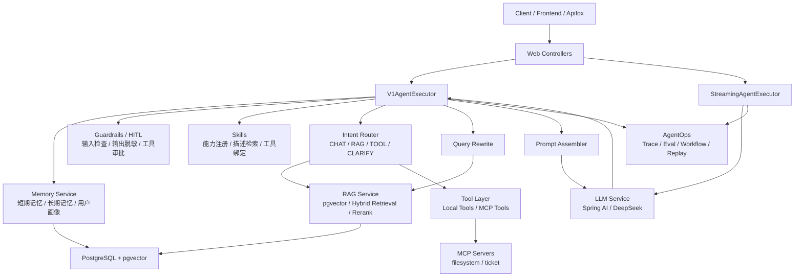
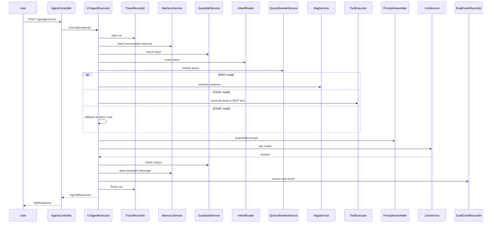
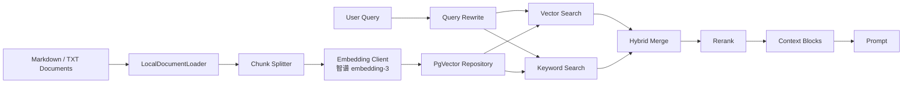
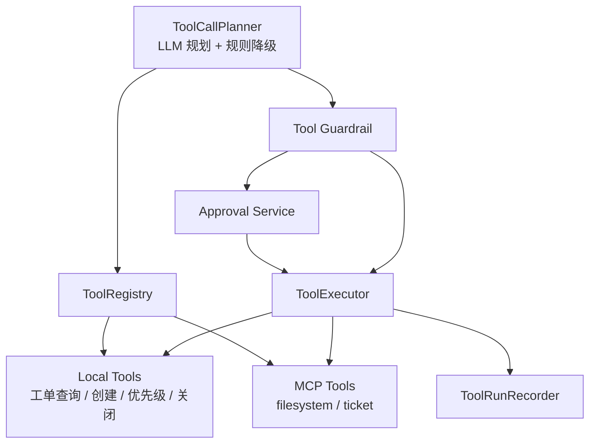
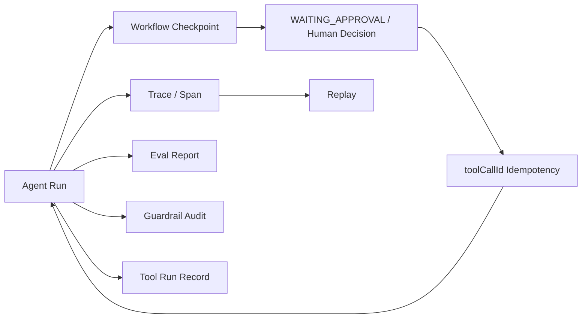

# Enterprise Agent 架构说明

本文用于解释 Enterprise Agent 的整体架构、主执行链路和关键模块关系。

## 总体架构

## Agent 主执行链路

## RAG 链路

## Tool / MCP 链路

## AgentOps 闭环

## 当前边界

- Agent Run、计划、checkpoint、待审批 ToolCall 和工具执行结果支持 JDBC 持久化；审批后从同一 run 恢复。
- `toolCallId` 用作副作用幂等键；已成功结果直接复用，结果不确定时进入 `MANUAL_REVIEW`。
- Multi-Agent 已有角色协作，但目前是轻量顺序编排。
- Streaming 已支持 LLM token 流式输出，RAG / Tool 阶段是事件化输出。
- 运行时同时保留 memory 模式用于本地演示，默认 storage 模式为 JDBC。
