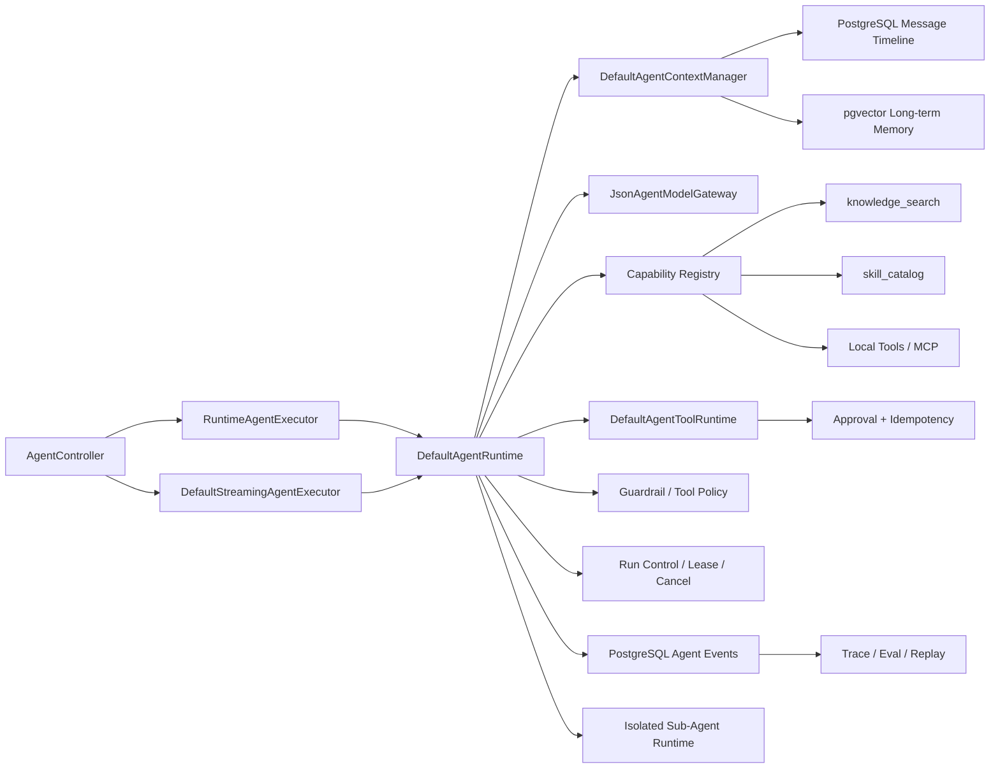
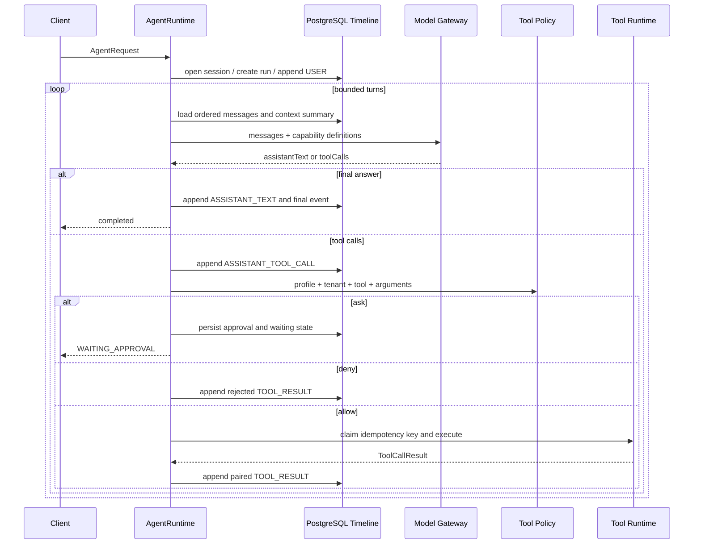

# 当前架构

## 1. 组件关系

核心依赖方向是 Controller/Adapter -> Runtime -> Port/Store。HTTP、SSE、RAG、MCP 和 Sub-Agent 都不能各自创建一套执行语义。

## 2. Agent Loop

模型只负责“下一步是什么”。能否执行、何时终止、如何恢复、是否重复执行副作用，都由 Runtime 决定。

## 3. 消息与上下文

`agent_message` 是完整事实时间线。`DefaultAgentContextManager` 只生成下一轮模型投影，不删除历史：

1. 找到最新 `CONTEXT_SUMMARY` 及其 `coversThroughSequence`。
2. 将工具调用和工具结果组合为不可拆分单元。
3. 按 Token 预算从后向前选择完整近期单元。
4. 超预算时，对更早的完整单元生成滚动摘要并持久化。
5. 加入 pgvector 长期记忆，但明确标记为不可信历史用户数据。
6. Provider 返回上下文溢出时，缩小预算再压缩一次；仍失败则以 `CONTEXT_OVERFLOW` 终止。

## 4. Tool Runtime

能力目录包含：

- `knowledge_search`：RAG 只读能力；
- `skill_catalog`：只读技能指导，不授予工具权限；
- 本地工单工具；
- 可选 MCP 工具。

执行前依次经过 Profile 白名单、能力存在性、JSON Schema 参数校验、Tool Policy 和审批。模型返回的 ToolCall ID 只作为追踪信息，Runtime 会为每次工具请求生成全局执行 ID，并用它作为时间线配对键和持久化幂等键；存储层同时拒绝跨 Run 复用同一执行 ID。不确定副作用不会盲目重试，而是进入 `MANUAL_REVIEW`。

## 5. 同步与 SSE

`RuntimeAgentExecutor` 收集 Runtime 结果并投影为同步 `AgentResponse`。`DefaultStreamingAgentExecutor` 将相同 Runtime 发出的事件转成 SSE。客户端断开时只发起协作式暂停；显式 cancel API 才表示永久取消。

当前 SSE 同时承载 Runtime 生命周期事件和模型正文增量。Provider chunk 先经过滚动输出 Guardrail，再按最小字符数合并为持久化 `MODEL_DELTA`，避免逐 Token 写数据库；ToolCall JSON 不会作为回答增量发送。持久事件携带数据库 `sequence`，长调用期间发送不落库的心跳并附带最后序号；背压缓冲溢出时发送 `stream_gap/replayRequired` 后结束连接，不再静默丢弃事件。

## 6. 恢复检查点

Run 持久化原始 `AgentExecutionProfile`、累计 `BudgetSnapshot`、当前 Phase、pending ToolCall 和已完成结果。进入人工审批时会冻结剩余 Agent 执行时长，审批等待时间不计入 Run 执行预算；Approval 使用独立的可配置有效期（默认 24 小时）。审批决定通过数据库同时检查 `status=REQUESTED` 与 `expiresAt>decisionTime`，过期迁移检查 `status=REQUESTED` 与 `expiresAt<=checkedAt`，因此并发批准、拒绝和过期不会互相覆盖，也不存在“读取时有效、更新时已过期”仍批准成功的窗口。审批恢复采用数据库原子 claim；普通未处理异常收敛为 `FAILED/INTERNAL_ERROR`。进程直接退出后，新的执行尝试只能在旧租约过期后接管。

用户中断采用 `RUNNING -> PAUSE_REQUESTED -> PAUSED -> RUNNING`。暂停请求和预算冻结都持久化；恢复通过数据库行锁原子 claim `PAUSED`，保持原 `runId`、会话、事件 sequence、权限和累计预算。模型调用不能从供应商内部 token 精确续跑，因此从完整消息边界重做本轮决策；工具阶段则依靠 pending ToolCall 与 ToolExecutionStore 对账，避免重复副作用。

暂停后提交新需求不会复用旧 Checkpoint：Runtime 先将旧 Run 永久收敛为取消状态，再创建新 Run。若旧 Run 停在已经写入 `ASSISTANT_TOOL_CALL` 的工具阶段，取消路径会补写确定的持久化结果，或写入明确的 `RUN_ABANDONED/outcomeKnown=false` 终态 ToolResult；它只闭合消息协议，不重试未知副作用。这样同一会话的新 Run 不会读到孤立 ToolCall。

若中断点为 `EXECUTING_TOOL`，Runtime 会按 pending `requestId` 查询 `ToolExecutionStore`：确定的 `SUCCEEDED/FAILED` 结果直接复用；`RUNNING` 结果先交给匹配的 `UncertainToolExecutionResolver`。OrderCare resolver 使用原 Proposal、审批参数和 actionRequestId 调用确定性对账，解析为确定结果后再补写原 ToolResult 并继续 Agent Loop；没有 resolver、记录不匹配或仍无法证明时才进入人工核对。时间线已有同一 ToolResult 时不会重复追加。

审批的单条与列表 HTTP 查询统一经过 `ApprovalService`，不会绕过上述过期迁移直接暴露存储层的陈旧 `REQUESTED` 状态。

## 7. Sub-Agent

Planner、Specialist、Reviewer 都通过同一个 Runtime 运行，但使用独立 `AgentExecutionProfile`：

- 独立 Session 和 child Run；
- 独立 System Prompt；
- 独立工具白名单；
- 独立模型/工具/Token/时间预算；
- 禁用长期记忆写入；
- 主协调者只接收摘要和 childRunId。

这实现了上下文与权限隔离，但还不是跨进程分布式调度。
