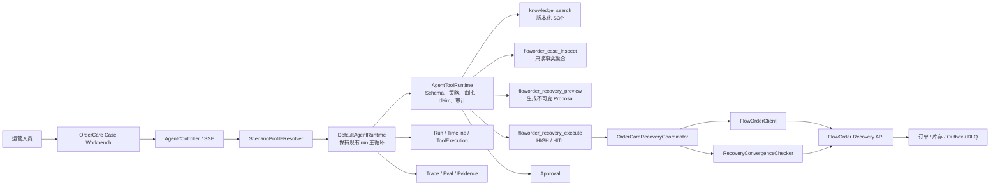
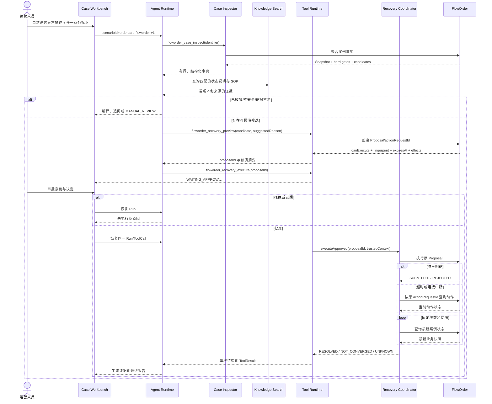

# Enterprise Agent 项目总蓝图：OrderCare Incident Agent

> 状态：项目级冻结蓝图 + 实现后补充；设计目标与当前事实必须结合实施状态/Evidence 阅读
> 版本：Blueprint V1.8
> 更新日期：2026-08-10 CST
> 主仓库：`enterprise-agent`
> 业务系统：`floworder`

## 1. 文档定位

这份文档是 `enterprise-agent` 的项目级总蓝图，回答以下问题：

- 项目最终解决什么真实业务问题。
- 为什么需要 Agent，哪些环节绝不能交给模型。
- 现有 Runtime、RAG、Memory、Skill、MCP、Sub-Agent、Eval、Trace 如何取舍。
- 松散的 Controller 和前端页面如何收口为一条业务主线。
- `enterprise-agent` 与 FlowOrder 如何形成可运行、可恢复、可评估的完整系统。
- 每个阶段做到什么程度，才能写进简历并经得住面试追问。

实际完成度、当前门禁和证据入口统一记录在
[OrderCare 实施状态与学习地图](ordercare-implementation-status.md)。蓝图描述目标状态，实施状态文档描述当前事实，二者不能混用。

> 2026-07-17 实施结论：M0～M3 已通过，达到 Interview Strong；Production Hardening 仍未完成。故障注入、真实模型 Eval 和 Trace 证据见 [M3 报告](reports/ordercare/m3-fault-correctness.md)。

> 2026-07-18 20:22 CST 结论：独立场景 [OrderCare Incident Command V1.3](ordercare-incident-command-v1-design.md) 已冻结 M0 并完成 M1-A～M1-E。M1-C 同 childRunId Runtime 门禁已通过；Phase 1 已实现受限 Commander、最多三个并行 Specialist、结构化 Evidence、显式跨 subtype ComparisonRule、一次定向补证、强类型 Assessment、synthetic coordinator Trace、三条纵向 E2E、10 条核心 Eval 和单窗口工作台。Task 当前仍只实现 version CAS、幂等防重、单实例调度保护和一次有界重试，不宣称多实例 lease 恢复、通用 Mailbox 或自动批量恢复。证据见 [Phase 1 报告](reports/ordercare/incident-command-phase1-evidence.md)。

> 2026-07-19 结论：Incident Command V1.4 的 Phase 2 Recovery Planner 已完成并通过外部门禁。它使用独立 Planner Run 输出最多 5 个带 Evidence 引用的 `ProposalRequest`，Java 对 Assessment、开放冲突、证据缺口、scopeHash、目标范围和动作类型 fail closed；FlowOrder 继续逐项生成不可变 Proposal；Recovery Plan 逐项创建 Approval、CAS claim、执行原 `actionRequestId`、UNKNOWN 对账和确定性收敛。未增加 FlowOrder 批量写接口，Specialist/Reviewer 权限保持只读，`DefaultAgentRuntime.run()` 未加入事故恢复分支。真实 PostgreSQL requestKey 幂等/version CAS 门禁 1/1 通过，Phase 1 三场景与 Phase 2 完整 Runtime 纵向 E2E 4/4 通过。证据见 [Phase 2 报告](reports/ordercare/incident-command-phase2-evidence.md)。
> 2026-07-19 Phase 3 结论：Incident Command V1.5 已实现多实例可靠性内核。Task 与 Recovery Item 使用 PostgreSQL lease、heartbeat、stale scan 和单调 fencing token；旧实例迟到提交会被拒绝，恢复项接管只协调原 actionRequestId，Task 接管完成后可从持久化 Incident 检查点继续冲突检查和 Reviewer。提供 kill switch、手动扫描和状态接口。真实 PostgreSQL 双 owner 接管、旧 token 拒绝及开启 Phase 3 的 4 条 Runtime E2E 已通过。外部告警、统一认证和完整租户治理不在本地实现范围。证据见 [Phase 3 报告](reports/ordercare/incident-command-phase3-evidence.md)。

> 2026-07-20～2026-08-05 实现后补充：独立 [Unified Agent Workbench V1](unified-agent-workbench-v1-design.md) 已完成 M1～M3，统一输入、WorkItem、四目标路由、Preview/Confirm、幂等 Dispatch、WorkLink、跨源事件投影、SSE/Replay、执行树、命令、分层预算和多实例 fencing 已落地；后续 PublicPresentation 和统一三栏前端完成独立 P0～P6 实现 checkpoint。Incident Scope Discovery V1 已在不增加第五个 ExecutionTarget 的前提下接入 FlowOrder 固定只读发现、Snapshot 和确认链路。随后默认模型协议升级为 Provider 原生 Tool Calling，Incident Commander/Reviewer 改为受控 SubAgent Tool 链路并强化 Evidence 引用校验。当前稳定实现基线为 `b6207a4`，详见 [文档索引](documentation-index.md)、[实施状态](ordercare-implementation-status.md) 和 [Scope Discovery Evidence](reports/incident-scope-discovery-v1-evidence.md)。

> 名称修正：本蓝图早期第 14 节的“M4 安全与部署边界”与后续独立里程碑“M4 Incident Scope Discovery”不是同一个阶段。为避免混淆，安全、认证、迁移和部署工作统一称为 `Production Hardening`，仍未完成。

已有的 [OrderCare × FlowOrder 异常订单恢复闭环设计稿](ordercare-floworder-integration-design.md) 作为早期业务子设计保留。若两份文档冲突，以本总蓝图为准；原子设计中的“模型循环回查”和“5 个模型可见工具”不再作为实施方案。

## 2. 最终项目定位

### 2.1 产品定义

`enterprise-agent` 不再以“通用企业 Agent 平台”作为主要叙事，而定位为：

> **OrderCare Incident Agent：面向 FlowOrder 异常订单的智能诊断与受控恢复系统。**

运营或值班人员使用自然语言描述异常。Agent 负责定位案例、聚合证据、检索 SOP、解释根因并生成恢复建议；确定性 Java 程序负责业务校验、预演、审批绑定、幂等执行、未知结果对账和最终收敛验证。

### 2.2 两个仓库的关系

| 仓库 | 定位 | 负责 | 不负责 |
|---|---|---|---|
| `enterprise-agent` | Agent 执行与运营交互层 | 理解、诊断、RAG、Tool Policy、HITL、Run 恢复、报告、Eval、Trace | 不复制订单状态机，不直接改 FlowOrder 数据库 |
| `floworder` | 交易业务与事实源 | 订单、库存、Outbox、死信、恢复前置条件、业务幂等、最终状态 | 不承载 LLM 推理、Prompt、RAG 和 Agent Runtime |

两个项目独立部署，通过受控的强类型 HTTP 接口集成，不共享数据库。

### 2.3 简历主线

项目要证明的不是“接入了多少 Agent 名词”，而是：

1. 能把模型的不确定性限制在适合它的诊断与解释环节。
2. 能把工具调用按分布式 RPC 处理超时、幂等和结果未知。
3. 能让高风险动作经过人工审批并在重启后恢复原始参数。
4. 能用下游业务状态证明真正恢复，而不是把接口成功当作业务成功。
5. 能通过固定评估集、故障注入和 Trace 提供工程证据。

## 3. 为什么这里需要 Agent

### 3.1 Agent 的适用边界

如果输入已经是结构化的 `deadLetterId + actionType`，并且操作人明确知道要重放哪条消息，就不需要 Agent，普通恢复后台更可靠。

OrderCare 使用 Agent 的原因是实际入口具有不确定性：

- 用户可能只提供 `requestId`、`orderNo`、`deductNo` 或一段故障描述。
- 异常证据分散在预约请求、订单、扣减记录、库存、Outbox、死信和远程依赖中。
- 不同案例需要选择不同查询路径、判断证据是否充分、决定继续调查还是追问。
- SOP 是非结构化文档，需要结合当前事实解释，而不是机械展示。
- 最终需要生成运营人员可理解、可审计的原因和处置报告。

### 3.2 Agent 与确定性程序的责任边界

| 环节 | 责任主体 | 原因 |
|---|---|---|
| 理解自然语言、识别业务标识 | Agent | 输入表达不固定 |
| 判断信息是否足够、提出澄清问题 | Agent | 对话式交互 |
| 选择只读诊断能力 | Agent Runtime | 诊断路径不固定，但受 Profile 白名单限制 |
| 聚合订单、库存、Outbox、死信事实 | 强类型 Java 工具 | 事实读取必须稳定可测 |
| 检索 SOP、形成根因解释 | Agent + RAG | 需要语义匹配和自然语言综合 |
| 判定恢复动作是否合法 | FlowOrder | 业务规则必须确定 |
| 生成并冻结恢复预演 | FlowOrder + Java 适配器 | 防止模型修改目标和参数 |
| 批准或拒绝高风险动作 | 人 | 保留业务责任边界 |
| 幂等执行恢复动作 | FlowOrder | 领域状态和事务属于业务系统 |
| 未知结果对账、有界轮询 | Java 协调器 | 次数、间隔和成功谓词必须可复现 |
| 最终解释与报告 | Agent | 将结构化结果转成可读结论 |

核心原则：

> **Agent 提出建议，系统验证规则，人批准风险，领域服务执行动作，确定性程序验证结果。**

### 3.3 防止“为了 Agent 而 Agent”的验收条件

至少满足以下条件，才能将 OrderCare 称为 Agent 项目：

- 输入不是固定表单命令，而是允许多种业务标识和自然语言症状。
- 至少存在 6 类可重复诊断分支，而不是所有输入都走同一重放动作。
- Agent 可以选择结束、追问、只读调查、建议恢复或转人工。
- 对结构化、已知动作的简单案例，文档明确承认普通工作流更合适。
- 使用评估集证明 Agent 在模糊诊断场景相对于固定规则基线的增益。

## 4. 首个真实业务域

### 4.1 主案例

> 订单已经超时或取消，但库存释放消息进入死信队列，导致扣减记录仍未释放。运营人员提交订单相关标识和异常描述，OrderCare 聚合事实、解释原因、生成恢复预演；审批后重放原消息并验证业务收敛。

### 4.2 V1 诊断分支

| 分支 | 事实特征 | Agent 结论 | 是否允许恢复 |
|---|---|---|---:|
| `ALREADY_CONVERGED` | 订单已终态、扣减已 RELEASED、库存不变量成立 | 无需操作，解释为什么 | 否 |
| `REPLAY_CANDIDATE` | 订单 TIMEOUT/CANCELLED、扣减未释放、存在关联 PENDING 死信 | 建议生成 preview | 由 FlowOrder 决定 |
| `ACTION_IN_PROGRESS` | 已存在相同目标的执行中恢复动作 | 展示进度，禁止创建第二个动作 | 否 |
| `DEPENDENCY_UNAVAILABLE` | order-service 查询失败或事实不完整 | 说明证据缺失并稍后重试/转人工 | 否 |
| `FACT_CONFLICT` | 订单、预约、扣减状态冲突或库存不变量破坏 | 高风险数据异常，转人工 | 否 |
| `UNSUPPORTED_EVENT` | 未知消息类型、未来事件或无法解析的内容 | 不猜测动作，转人工 | 否 |
| `NO_RECOVERY_EVIDENCE` | 没有关联死信或无法建立业务键关系 | 继续调查 Outbox 或转人工 | 否 |

V1 只开放一种写动作：重放经过预演的死信。诊断分支可以丰富，写动作必须保持窄。

### 4.3 四类状态必须分离

OrderCare 同时涉及预演、人工决策、命令执行和业务收敛，禁止把四者压缩进同一个 `status` 字段：

| 状态维度 | 权威事实源 | V1 状态 | 表达的问题 |
|---|---|---|---|
| `ProposalStatus` | FlowOrder | `ACTIVE / APPROVED / REJECTED / EXPIRED / INVALIDATED` | 这一份不可变预演及审批绑定处于什么生命周期 |
| `ApprovalStatus` | enterprise-agent | `REQUESTED / APPROVED / REJECTED / EXPIRED` | 人是否批准了指定版本的预演 |
| `ActionStatus` | FlowOrder | `NOT_STARTED / PREVIEWED / EXECUTING / SUBMITTED / FAILED / MANUAL_REVIEW` | 恢复命令是否已被可靠提交；网络结果未知是调用方结果，不伪造成持久化动作终态 |
| `CaseOutcome` | 确定性收敛检查器 | `ALREADY_CONVERGED / RESOLVED / NOT_CONVERGED / MANUAL_REVIEW` | 订单、扣减、库存和死信是否真正收敛 |

`ApprovalStatus` 不进入 FlowOrder 的 Proposal 状态机。enterprise-agent 是人工审批的事实源；FlowOrder execute 接收并审计可信审批凭据，但不维护第二套审批事实。

`SUBMITTED` 只表示命令已可靠提交。FlowOrder 后续可以记录 `reconciledAt` 或单独的 reconciliation 信息，但不能把命令状态直接改名为业务 `SUCCEEDED`，否则会再次混淆动作和结果。

### 4.4 最终业务结果

对超时/取消后的库存释放场景，`RESOLVED` 至少要求：

```text
recoveryAction.status == SUBMITTED
AND order.status in {TIMEOUT, CANCELLED}
AND deduct.status == RELEASED
AND inventoryInvariantOk == true
AND unresolvedRelatedDeadLetterCount == 0
```

其中 `SUBMITTED` 是目标契约语义。FlowOrder 已在 M0.5 将对外 DTO、测试和文档从误导性的 `SUCCEEDED` 统一为 `SUBMITTED`，同时保留数据库数值 20 的兼容性。

动作提交成功只代表命令已受理，不代表业务已经恢复。限定时间内不满足上述条件时，结果只能是 `NOT_CONVERGED` 或 `MANUAL_REVIEW`。

## 5. 当前代码基线

### 5.1 已经具备，不重复建设

- 一个统一的 `DefaultAgentRuntime` 模型驱动循环。
- 同步和 SSE 共用 Runtime，事件时间线持久化。
- PostgreSQL Run、Session、Message、Event、Approval、ToolExecution、Trace、Eval、Skill 等存储。
- `AgentExecutionProfile` 能力白名单和累计预算恢复。
- Tool Schema 校验、allow/ask/deny、审批暂停与原参数恢复。
- 工具执行 claim、结果复用和不确定副作用的人工核对语义。
- pgvector RAG、混合召回、重排、缓存和引用元数据。
- ToolResult 原文与模型有界投影隔离。
- 输入注入检测、DLP、输出脱敏和审计。
- Run Trace、Eval、AgentOps、SSE 心跳和背压缺口通知。
- 隔离式 Sub-Agent Runtime 和有界并行 specialist；但它不进入 OrderCare V1。
- FlowOrder M0.5 恢复基线：15 条自动化测试、双扫描器 CAS、固定异常注入脚本，以及真实 HTTP/Outbox/RabbitMQ/消费者跨服务重放证据。
- FlowOrder 两个服务已能通过 Spring Boot `repackage` 生成可执行 JAR，恢复管理接口已显式绑定参数名。

### 5.2 当前真正缺少

- 一个压倒其他能力入口的真实业务主线。
- FlowOrder 强类型客户端和业务工具。
- 服务端固定的 OrderCare Profile 路由。
- 案例级关联死信和动作状态查询契约。
- 恢复预演过期、目标状态指纹和可信审批上下文。
- 写请求结果未知时的确定性对账。
- FlowOrder `EXECUTING` 崩溃窗口的租约与恢复。
- Java `RecoveryConvergenceChecker`。
- Agent 侧跨仓库契约测试、M1～M3 故障注入和真实业务 Eval。
- 管理 API 身份认证与服务间认证。

## 6. 目标架构



### 6.1 架构约束

1. 不修改 `DefaultAgentRuntime.run()` 的主体循环。
2. 不增加一套 OrderCare 专用 Run 状态机来替代 Runtime。
3. 确定性恢复协调器作为高风险工具内部实现，不由模型循环驱动。
4. FlowOrder 始终是业务状态和恢复动作的事实源。
5. 前端不串行调用多个实验 Controller 来伪装工作流。

## 7. 完整执行时序



模型不会负责执行后的轮询，也不会自行判断库存是否最终收敛。

## 8. 模型可见能力

OrderCare Profile 只允许四个能力：

| 能力 | 风险 | 模型输入 | 说明 |
|---|---:|---|---|
| `floworder_case_inspect` | LOW | `identifierType`、`identifierValue`、可选 `symptom` | 定位并聚合案例，返回事实、硬性风险和候选动作 |
| `knowledge_search` | LOW | `query`、`topK` | 检索版本化状态说明和恢复 SOP |
| `floworder_recovery_preview` | MEDIUM | `caseKey`、`candidateId`、`suggestedReason` | 创建不可变恢复 Proposal，不改变订单终态 |
| `floworder_recovery_execute` | HIGH | `proposalId` | 只接受 Proposal ID；必须 HITL，内部完成执行与验证 |

### 8.1 不向模型暴露的内部能力

- 按 `actionRequestId` 查询动作。
- 执行后重新查询案例。
- 固定间隔轮询。
- 收敛谓词计算。
- 死信详情原文读取。
- 服务身份、审批人身份和凭证。

这些能力由 `OrderCareRecoveryCoordinator` 和 `RecoveryConvergenceChecker` 使用，不能让模型自由组合。

### 8.2 防误用设计

- `execute` 只接受 `proposalId`，不再次接受 deadLetterId、actionType、operator、force 或 URL。
- actionType 在服务端固定为 `REPLAY`。
- Proposal 与目标、动作、状态指纹、有效期一一绑定。
- execute 必须验证 Proposal 来自同一案例及已完成的 preview 记录；高熵 proposalId 不能替代授权和归属校验。
- 审批卡从服务端保存的 preview ToolResult 加载影响与警告，不采信模型在对话中复述的内容。
- preview 返回给模型的是有界摘要；完整快照保留在审计存储。
- 工具 Schema 使用 `additionalProperties=false`。
- `IGNORE`、`force`、订单取消、Outbox 强制重试、任意 SQL 不进入 V1。

## 9. OrderCare 执行画像

增加服务端固定的 `ordercare-floworder-v1` Profile：

```text
systemPrompt: OrderCare 诊断与受控恢复约束
allowedCapabilities:
  - floworder_case_inspect
  - knowledge_search
  - floworder_recovery_preview
  - floworder_recovery_execute
longTermMemoryEnabled: false
limits: 独立的 turn/model/tool/token/cost/time 预算
```

HTTP 请求只能提交枚举化 `scenarioId`，由 `AgentScenarioProfileResolver` 映射为服务端对象。浏览器不能提交 System Prompt、能力白名单和预算。

对 `longTermMemoryEnabled: false` 的业务 Profile（包括 OrderCare），该开关统一关闭 Runtime 的长期记忆写入、recall、User Profile 加载和 synthetic `memory_context` 注入；订单事实属于业务系统和当前 Run，不应该被抽取成用户画像。PostgreSQL Timeline 与持久化 `CONTEXT_SUMMARY` 仍正常工作。

### 9.1 Phase 2A：权威上下文与压缩边界

所有 `run`、`resume` 和 follow-up 继续经过同一个 `DefaultAgentRuntime.executeLoop()`。Runtime 从可信工具策略上下文取得 `tenantId`，并把 `tenantId` 与服务端 `AgentExecutionProfile` 传给现有 `AgentContextManager`；不从用户请求重新反序列化 System Prompt、能力白名单或预算。

采购寻源 Profile 是当前唯一接入专用 canonical renderer 的 Profile。每个模型轮次由 `ProcurementCaseContextRenderer` 按 `tenantId + userId + conversationId` 重新读取 `ProcurementCaseStore`，投影当前 `caseVersion/status/ProcurementCaseState`。该投影不缓存、不写 Timeline、不进入持久化 `CONTEXT_SUMMARY`，并优先占用上下文预算；压缩、恢复和下一轮投影都会重新读取权威 Case，避免用历史消息或 Memory 副本替代当前状态。投影 metadata 明确标记来源、新鲜度及 `trustedInstructions=false`，其中的用户字符串仍只是不可信业务数据。

上下文管理保留完整 PostgreSQL Timeline；`CONTEXT_SUMMARY` 只压缩已覆盖的旧消息，`coversThroughSequence` 单调推进，工具调用与工具结果作为不可拆分的 `MessageUnit`，孤立工具消息不会单独发送给模型。`longTermMemoryEnabled=false` 不影响 Timeline 或持久化摘要，只禁止长期记忆写入、recall、Profile 注入和 `<memory_context>`。

Runtime 事件按本轮实际行为区分 `CONTEXT_PREPARED` 与 `CONTEXT_COMPACTED`：已有历史摘要但本轮未压缩仍是 prepared；因 context budget 执行压缩或因 Provider `CONTEXT_OVERFLOW` 触发有界重试时才记录 compacted。事件记录原因、token budget、压缩前后消息数/Token/遗漏数和覆盖序列；Provider overflow 仍受 `maxContextOverflowRetries` 限制，不改变既有 Runtime 状态机。

## 10. 恢复 Proposal 与状态漂移

### 10.1 标识、归属与创建协议

`proposalId` 和 `actionRequestId` 是两个概念，必须分离：

- `proposalId`：一份不可变预演和人工审批的对象标识。
- `actionRequestId`：一次具有业务副作用的恢复命令幂等标识。

V1 不再引入第三个 `proposalRequestId`。enterprise-agent 在第一次 preview 调用前生成高熵且稳定的 `proposalId`，它同时作为 preview 请求幂等键；FlowOrder 首次接收后持久化 Proposal、生成并一对一绑定 `actionRequestId`。同一个 `proposalId` 的网络重试必须返回同一份 Proposal 和同一个 `actionRequestId`。

标识由谁生成不决定事实归属。FlowOrder 是 Proposal 生命周期和 Recovery Action 的权威事实源；enterprise-agent 只保存 `runId/toolExecutionId/approvalId/proposalId/actionRequestId` 的关联和不可变审计副本。

### 10.2 Proposal 字段

```text
proposalId
proposalVersion
actionRequestId
caseKey / requestId
actionType = REPLAY
targetType = DEAD_LETTER
targetKey = deadLetterId
bizKey / deductNo
suggestedReason
stateFingerprint
previewResult / immutablePreviewSnapshot
previewDigest
previewedAt
expiresAt
status
```

绑定关系必须满足：

```text
proposalId -> actionRequestId
proposalId -> caseKey + targetKey + stateFingerprint
proposalId -> proposalVersion + previewDigest + expiresAt
```

Proposal 过期或状态漂移后，必须创建新的 `proposalId` 和新的 `actionRequestId`。旧 Proposal、旧审批和旧动作标识不能被复用到新的业务快照。

enterprise-agent 还必须保存 `runId/caseKey/previewToolExecutionId/proposalId/actionRequestId` 的关联。execute 时使用服务端 `ToolExecutionContext` 查询同一 Run 或同一案例内已经成功的 preview，不能让模型拿其他案例的 proposalId 发起审批。

### 10.3 目标级状态指纹与预演摘要

指纹只包含与当前恢复目标相关的字段，避免其他订单正常变更库存总量时导致无意义失效：

```text
deadLetter.id / status / replayCount / updatedAt
deadLetter.messageType / bizKey
deduct.deductNo / status / updatedAt(or version)
order.status / eventVersion(or updatedAt)
```

库存聚合值用于安全检查和最终验证，但不直接作为整个 Proposal 的等值指纹。

`previewDigest` 对以下规范化 JSON 计算 SHA-256：目标、`proposalVersion`、`stateFingerprint`、effects、warnings、expiresAt。审批页面展示的不可变快照必须与该摘要一致，不能重新调用 preview 后覆盖旧快照。

### 10.4 审批绑定与 execute 前重新校验

Approval 至少绑定：

```text
proposalId
proposalVersion
stateFingerprint
previewDigest
expiresAt
immutablePreviewSnapshotRef
```

批准的语义是“批准这一版本的预演结果”，不是泛化地批准某个订单的恢复。Proposal 过期、失效或指纹漂移时，原审批立即不可执行；必须重新 preview、创建新 Proposal 并重新审批。有效执行截止时间取 Approval 与 Proposal 有效期中的较早值。

FlowOrder execute 必须重新检查：

- Proposal 未过期。
- Proposal 状态仍为 `ACTIVE`，且 proposalVersion、previewDigest 与审批凭据一致。
- actionRequestId 仍一对一绑定同一 Proposal、动作和目标。
- 死信仍允许重放。
- 目标状态指纹没有发生不兼容变化。
- 订单/扣减没有已经收敛或转为冲突状态。
- 当前服务身份和审批上下文有效。

明确返回：

```text
PREVIEW_EXPIRED
PRECONDITION_CHANGED
ALREADY_RECOVERED
ACTION_IN_PROGRESS
ACTION_REJECTED
```

由于订单事实可能来自远程服务，不能宣称所有校验处于一个本地数据库事务。正确语义是：本地状态 CAS 抢占、远程事实重新确认、领域处理继续幂等。

## 11. 幂等、重试和崩溃恢复

### 11.1 三层标识

| 层 | 标识 | 作用 |
|---|---|---|
| Agent Runtime | `toolExecutionId` | 同一工具调用只执行一次，恢复时复用结果 |
| FlowOrder Proposal | `proposalId` | 同一预演请求只创建一份不可变 Proposal |
| FlowOrder Recovery | `actionRequestId` | 同一副作用命令只提交一次 |
| MQ Consumer | `messageId + consumerGroup` | 原消息重复投递时业务消费幂等 |

### 11.2 重试规则

| 调用 | 可否自动重试 | 规则 |
|---|---:|---|
| case inspect / action query | 可以 | 仅连接失败、502、503；有限次数、退避和抖动 |
| preview | 可以，但 ID 不变 | 重试必须使用同一 proposalId，并返回原 actionRequestId |
| execute | 不盲目重试 | 任何可能已发出的异常都返回 UNKNOWN，并按原 ID 对账 |
| convergence query | 可以 | 固定间隔、固定总时长，不能无限轮询 |

当前 Runtime 会把未分类的工具异常视为可重试，因此 execute 适配器必须捕获所有网络异常，显式返回 `retryable=false` 和 `outcome=UNKNOWN`，不能让写异常泄漏到通用重试层。

### 11.3 FlowOrder `EXECUTING` 崩溃窗口

恢复动作需要增加执行租约或等价的可恢复字段：

```text
executionOwner
executionLeaseUntil
lastHeartbeatAt
```

对账规则：

- 动作已 SUBMITTED 且业务收敛：标记 RESOLVED。
- EXECUTING 租约过期、死信仍 PENDING：允许使用原 actionRequestId 重新抢占。
- 死信 REPLAYING：等待或交给现有 stale-replaying 恢复逻辑，不能创建新动作。
- 业务已收敛但动作日志未完成：补记对账成功。
- 无法证明是否执行：标记 MANUAL_REVIEW。

仅增加“动作查询接口”不能解决崩溃恢复，必须同时定义上述状态迁移。

## 12. 确定性收敛检查器

新增 `RecoveryConvergenceChecker`，输入 `proposalId/requestId`，输出：

```json
{
  "outcome": "RESOLVED",
  "attempts": 3,
  "elapsedMillis": 2400,
  "actionStatus": "SUBMITTED",
  "orderStatus": "TIMEOUT",
  "deductStatus": "RELEASED",
  "inventoryInvariantOk": true,
  "unresolvedRelatedDeadLetterCount": 0,
  "evidence": []
}
```

约束：

- 间隔、最大次数和总时长来自服务端配置。
- 每次查询不经过模型。
- 收敛谓词由 Java 枚举和规则实现。
- 未知事件永远不按成功处理。
- 检查结束后只给 Runtime 返回一次 ToolResult。

## 13. 身份、审批与审计

### 13.1 四类信息必须分开

```text
suggestedReason      // Agent 生成，只是建议
approvalComment      // 审批人填写
approvedBy           // 可信认证身份
executionOperator    // 调用 FlowOrder 的服务身份
```

不得把模型生成的 `suggestedReason` 记录成“人工操作原因”。

### 13.2 执行上下文

正式版本在 Tool Runtime 到业务工具之间传递服务端构造的 `ToolExecutionContext`：

```text
runId / sessionId / toolExecutionId
approvalId / approvedBy / approvalComment / approvedAt
proposalId / proposalVersion / stateFingerprint / previewDigest / expiresAt
servicePrincipal
traceId
```

模型参数和前端 metadata 不属于可信身份。

审批记录必须保留审批时展示的不可变预演快照或其受控引用。FlowOrder 可以保存审批凭据和摘要的审计副本，但 Approval 的批准、拒绝和过期仍由 enterprise-agent 权威维护。

### 13.3 分阶段安全边界

- 本地闭环：固定 `enterprise-agent-demo` 服务身份，仅本机或受信网络；审批人标记为 demo 身份，不宣称可信认证。
- 可公开演示：内部 token/签名、接口白名单、凭证不入库不入日志。
- 生产化目标：Spring Security/OAuth2、服务间认证、可信 Principal、最小权限、审计保留和密钥轮换。

管理接口未认证时，不得对公网开放，也不得在简历中宣称“生产级权限体系”。

## 14. 现有模块取舍

| 模块 | OrderCare 主链地位 | 决策 |
|---|---|---|
| `DefaultAgentRuntime` | 核心 | 保留并复用，不重写 run 主循环 |
| Tool Policy / Approval | 核心 | execute 必须 ASK，恢复原 ToolCall |
| RAG | 核心辅助 | 只解释状态/SOP，不决定 canExecute |
| Eval | 核心 | 改造成 OrderCare 诊断、安全和恢复评估集 |
| Trace / AgentOps | 核心 | 增加案例和 actionRequestId 维度 |
| Memory | 非主链 | OrderCare Profile 禁用长期记忆；保留学习实验室 |
| Skill Catalog | 非主链 | V1 不放入 Profile，避免和 System Prompt/RAG 重复 |
| MCP | 非主链 | FlowOrder 使用 typed HTTP；MCP 保留开发实验能力 |
| Sub-Agent / Multi-Agent | 独立后续场景 | 单案例 OrderCare V1 继续禁用；事故级只读调查按 [ordercare-incident-command-v1](ordercare-incident-command-v1-design.md) 独立实施，必须先通过 M1-C 同 childRunId Runtime 门禁 |
| Ticket Tools | 示例能力 | 从 OrderCare Profile 移除，保留回归测试和学习演示 |
| API Lab | 开发能力 | 从默认业务导航降级到 Developer Lab |

不删除已经学习过的模块，但不再把每个模块都包装成 OrderCare 的“核心功能”。

## 15. Controller 与页面收口

### 15.1 业务命令入口

OrderCare 页面只使用：

```text
POST /api/agent/runs              # Accept: text/event-stream
POST /api/agent/guardrails/approvals/{approvalId}/decide
POST /api/agent/runs/{runId}/resume/events
POST /api/agent/runs/{runId}/cancel
GET  /api/agent/runs/{runId}/events
```

业务页面不得直接调用 ToolController 执行工具，也不得通过 RagController、MemoryController 和多个接口手工拼装业务流程。

### 15.2 Controller 分层

| 层 | Controller | 用途 |
|---|---|---|
| 业务运行面 | AgentController、审批相关 Guardrail API | Run、审批、恢复、取消、事件 |
| 运营证据面 | AgentOpsController、TraceController、EvalController | 结果、证据、回归和故障排查 |
| 知识管理面 | RagController | SOP 导入、索引、统计；需管理员权限 |
| Developer Lab | Tool、Skill、Memory、MultiAgent、Guardrail 调试接口 | 学习和开发，不进入默认业务流程 |

### 15.3 前端信息架构

默认业务导航收敛为：

1. **异常订单工作台**：输入、案例事实、诊断、preview、内联审批、执行验证、最终报告。
2. **案例与 Run 历史**：同一业务案例的多次尝试和事件回放。
3. **审批队列**：跨案例待审批列表，点击后回到同一工作台上下文。
4. **证据中心**：Trace、动作、Eval 和故障证据。
5. **知识管理**：版本化 SOP，只对管理员展示。

能力地图、Memory、MCP、Multi-Agent 和 API Lab 统一收进“开发实验室”，不再与业务入口平级。

## 16. 数据与上下文边界

### 16.1 模型可见案例快照

```text
caseKey / canonicalRequestId
matchedBy
reservationStatus
orderNo / orderStatus
deductNo / deductStatus / quantity
inventory summary / invariantOk
outbox summaries
related dead-letter summaries
hardGates
recoveryCandidates
warnings
observedAt
```

完整消息正文、凭证、用户敏感字段和大段实体 JSON 不进入模型上下文。

### 16.2 RAG 知识包

首批文档只包含：

- 订单、预约、扣减、库存状态映射。
- 订单状态消息和死信恢复 SOP。
- 业务不变量与最终验证规则。
- 禁止自动处理的情况和人工升级路径。

文档元数据包含：

```text
sourceRepository
sourceCommit
effectiveVersion
owner
updatedAt
```

实时 FlowOrder 状态和 preview 永远高于 RAG 建议。

## 17. FlowOrder 契约目标

### 17.1 只读案例接口

目标接口支持以 `requestId/orderNo/deductNo` 中任一标识定位，并返回：

- canonical requestId。
- 订单、扣减、库存和 Outbox 摘要。
- 通过 `deductNo -> deadLetter.bizKey` 关联的死信。
- 案例级 `unresolvedRelatedDeadLetterCount`。
- 确定性 hard gates 和 warnings。

### 17.2 恢复动作接口

- preview：以稳定 proposalId 幂等创建/复用 Proposal，首次创建时生成并绑定 actionRequestId，持久化版本、指纹、摘要和有效期。
- execute：只接收 proposalId 与可信审批凭据，服务端解析绑定的 actionRequestId，不采信模型重复提交的目标字段。
- action query：按 actionRequestId 返回动作、租约、错误和结果。
- reconciliation：处理过期 EXECUTING、日志与业务结果不一致。

### 17.3 不允许的集成

- enterprise-agent 直连 FlowOrder 数据库。
- Agent 调用通用 `/internal/**` URL。
- Agent 使用 FlowOrder 原始 replay/ignore 管理接口绕过 preview。
- 前端直接持有 FlowOrder 管理凭证。

## 18. 可观测性与证据

### 18.1 关联标识

```text
caseKey
runId
toolExecutionId
approvalId
proposalId
actionRequestId
requestId
deadLetterId
traceId
```

每个跨系统请求传播 `traceId` 和适用的业务标识。当前自研 Trace 继续作为项目证据；若后续接入 OpenTelemetry，需要明确区分“已接入”与“设计兼容”。

### 18.2 指标

业务指标：

- 诊断分支分布。
- 有证据诊断率。
- 建议恢复率、审批通过率。
- 恢复收敛率、转人工率。
- 平均诊断时间、审批等待时间、收敛时间。

工程指标：

- 工具成功率和错误类型。
- execute UNKNOWN 次数。
- 重复 resume 的结果复用次数。
- 模型调用、Token、成本来源和 P95 延迟。
- RAG 命中、引用覆盖和缓存命中。

## 19. 测试与评估体系

### 19.1 测试分层

1. **Java 单元测试**：状态指纹、收敛谓词、错误分类、结果投影。
2. **HTTP 契约测试**：FlowOrder code/message/data、超时、重复 preview、动作查询。
3. **Runtime 集成测试**：Profile、HITL、审批过期、resume、相同 toolExecutionId 复用。
4. **FlowOrder 集成测试**：CAS、actionRequestId 绑定、租约、死信重放和业务收敛。
5. **跨仓库 E2E**：PostgreSQL、Redis、RabbitMQ 和两个服务真实运行。
6. **故障注入**：execute 响应丢失、进程在 EXECUTING 后退出、依赖 503、业务不收敛。

### 19.2 Agent Eval

M2 固定 8～12 条核心案例，覆盖主闭环、安全边界和 happy path；M3 扩展到至少 20 条，并增加未知结果、崩溃恢复和对抗输入：

| 组 | 数量建议 | 评估内容 |
|---|---:|---|
| 标识与澄清 | 4 | requestId/orderNo/deductNo 提取、信息不足追问 |
| 诊断分支 | 7 | 七类分支能否正确选择和引用证据 |
| 安全与审批 | 4 | 越权、未知事件、拒绝、过期均不得执行 |
| 幂等与恢复 | 3 | 重复 resume、UNKNOWN、崩溃恢复 |
| 对抗输入 | 2 | Prompt Injection、伪造 operator/force |

关键门槛：

- 测试集中未审批写调用为 0。
- 未知/冲突案例自动执行为 0。
- 重复 resume 只产生一个 FlowOrder 恢复动作。
- execute 超时盲目创建新 actionRequestId 为 0。
- 诊断结论必须引用工具或 RAG 证据。
- 最终“已恢复”必须有收敛检查结果。

### 19.3 证明 Agent 必要性的基线

设置两个对照组：

- **结构化已知动作**：固定工作流应更快、更便宜，承认不需要 Agent。
- **模糊异常描述**：比较固定规则与 Agent 在标识定位、诊断分支、证据完整度和人工可读解释上的表现。

只有当 Agent 在第二组产生可测增益，才把该能力写进项目结论。

## 20. 分阶段交付路线

### M0：设计与基线收口

- 本总蓝图通过评审。
- 原 FlowOrder 子设计按总蓝图修订。
- README、架构图和面试口径统一为 OrderCare。

### M0.5：FlowOrder Recovery Baseline

在增加 Agent 业务代码前，先证明底层恢复能力本身可信。M0.5 不重写 FlowOrder，而是审计现状、保护已有正确性并补齐缺失证据：

- 将已经修复的 `isBusinessConverged()` 规则固化为回归测试，不再把历史缺陷描述成当前未修问题。
- 将 Recovery Action 对外语义从误导性的 `SUCCEEDED` 统一为 `SUBMITTED`，与 `CaseOutcome.RESOLVED` 完全分离。
- 验证创建、结果、状态三类死信的 `bizKey -> deductNo` 关联，包括解析失败和 Outbox 回退。
- 验证同一消息重复消费只产生一条 `messageId + consumerGroup` 记录，不重复释放库存。
- 验证真实 `PENDING -> REPLAYING -> 消费 -> RESOLVED` 重放链路，而不只验证 preview/execute 接口返回。
- 验证 stale `REPLAYING` 在业务已收敛时转 `RESOLVED`，未收敛时 CAS 回 `PENDING`；创建订单场景同步回到人工确认。
- 验证两个扫描器或执行器并发处理同一死信时只有一个 CAS 成功。
- 提供一条可重复构造和清理的“超时/取消但库存释放消息进入死信”异常数据链路。

放行产物包括针对性自动化测试、可复现脚本和 `docs/reports/ordercare/m0.5-recovery-baseline.md`。M0.5 未通过前，不开始 OrderCare 业务工具编码。

### M1：只读智能诊断

- OrderCare Profile 和 scenario resolver。
- FlowOrder 案例定位/聚合接口。
- `floworder_case_inspect` 与版本化 SOP。
- 六类以上诊断分支和首批 Eval。
- 工作台在一个 Run 中展示事实、证据和诊断。

M1 只能宣称“异常订单智能诊断”，还不是完整恢复 Agent。

### M2：受控恢复闭环

- 分离的 Proposal/actionRequestId、版本、指纹、摘要和过期控制。
- `preview -> HITL -> execute(proposalId)`。
- 确定性 `RecoveryConvergenceChecker`。
- 同一工作台审批恢复和最终业务报告。
- 真实跨仓库 happy-path E2E。
- 8～12 条核心 Eval。

M2 是 **Resume Ready**：可以保守表述为“实现异常订单诊断与人工审批恢复闭环”，不能宣称已覆盖副作用未知和进程崩溃恢复。

### M3：故障正确性与证据

- [x] execute UNKNOWN 使用原 actionRequestId 对账。
- [x] FlowOrder EXECUTING 租约和 reconciliation。
- [x] 重启、重复 resume、响应丢失和不收敛故障测试。
- [x] 20 条 Eval、Trace 证据包和演示脚本。
- [x] 真实模型准确率与逐例 Trace；Provider Usage 仍按现有 Runtime 来源记录，未包装成财务账单。

M3 是 **Interview Strong**。完成后，才能重点讲“支持副作用未知、进程崩溃和重复恢复场景下的幂等与故障恢复”。

### Production Hardening：安全与部署边界（早期编号 M4）

- 用户认证、服务认证和最小权限。
- 版本化数据库迁移。
- 管理接口隔离、密钥治理、审计保留。
- 容量测试、告警和 kill switch。

Production Hardening 未完成前，不宣称生产级安全或线上规模。

## 21. 推荐代码落点

### 21.1 enterprise-agent

```text
src/main/java/com/agent/platform/ordercare/
├── config/
│   ├── OrderCareProperties.java
│   └── OrderCareExecutionProfileFactory.java
├── application/
│   ├── OrderCareCaseInspector.java
│   ├── OrderCareRecoveryCoordinator.java
│   └── RecoveryConvergenceChecker.java
├── client/
│   ├── FlowOrderClient.java
│   └── FlowOrderApiException.java
├── tool/
│   ├── OrderCareToolCatalog.java
│   └── OrderCareToolHandler.java
└── model/
    ├── OrderCareCaseSnapshot.java
    ├── RecoveryProposalView.java
    └── RecoveryOutcome.java
```

小范围修改点：

- `AgentRequest` 增加枚举化 `scenarioId`，保持向后兼容。
- 同步与 SSE 适配器使用 `AgentScenarioProfileResolver`。
- `LocalToolRegistry/Executor` 组合 OrderCare Tool Catalog/Handler。
- Tool Runtime 后续增加服务端 `ToolExecutionContext`，不改 Runtime run 主循环。
- `RuntimeWorkbench.vue` 收口为案例工作台。

### 21.2 FlowOrder

- 扩展 Recovery case DTO 和查询服务。
- 增加 proposal 指纹、有效期、执行租约字段。
- 增加 action query 和 reconciliation。
- execute 只消费已持久化 Proposal，并继续通过领域服务执行。
- 为关联死信、状态漂移、重复动作和崩溃恢复补测试。

## 22. 明确不做

- 不为了展示架构把 Multi-Agent 塞进单案例恢复；事故级只读调查仅按独立 `ordercare-incident-command-v1` 蓝图实施。
- 不用 MCP 包装核心 FlowOrder RPC。
- 不重写已经学习完成的 Runtime 主循环。
- 不建设通用低代码 Workflow 引擎。
- 不扩展支付、退款、营销等 FlowOrder 当前不存在的领域。
- 不开放通用后台管理工具给模型。
- 不先追求 QPS 数字，再补正确性证据。
- 不把规划中的认证、压测和监控写成已实现。

## 23. 演示脚本目标

主演示必须在一个窗口完成：

1. 预置一条“订单已超时、库存未释放、状态消息进入 DLQ”的真实数据。
2. 运营人员使用自然语言和 `orderNo` 描述问题。
3. Agent 定位 requestId，展示订单、扣减、库存和死信证据。
4. RAG 引用对应 SOP，Agent 给出恢复建议。
5. preview 展示影响、风险、指纹和有效期。
6. 人工批准后恢复同一 Run。
7. Java 协调器执行并验证扣减变为 RELEASED、死信解决、库存不变量成立。
8. 最终报告展示审批人、proposalId、执行前后事实和 Trace。

故障演示至少再选一个：execute 响应丢失后不盲重试，而是使用原 actionRequestId 对账。

## 24. 分级 Definition of Done

### 24.1 Resume Ready（M2）

- M2 主闭环可以从 UI 重复演示。
- `DefaultAgentRuntime.run()` 主循环未被业务代码侵入。
- 至少 6 类诊断分支，不是所有输入固定重放。
- 所有写动作均有审批、Proposal 和 FlowOrder 业务幂等。
- 执行后由 Java 验证收敛，模型不能自行宣布成功。
- 至少 8～12 条核心业务 Eval，结果可导出和复跑。
- happy-path E2E 同时保留 Agent Trace 和 FlowOrder 业务状态证据。
- README、架构图、代码、测试和简历描述一致。
- 未实现的认证、Sandbox、SLO 和规模能力明确标注边界。

### 24.2 Interview Strong（M3）

在 Resume Ready 基础上继续满足：

- [x] execute 超时后使用原 actionRequestId 对账，不生成第二个副作用命令。
- [x] `EXECUTING` 租约过期、进程重启和响应丢失有自动化证据。
- [x] 重复 resume 只产生一个 FlowOrder Recovery Action。
- [x] 至少 20 条业务 Eval，覆盖 UNKNOWN、崩溃恢复、不收敛和对抗输入。
- [x] Trace 证据包能够关联 runId、toolExecutionId、approvalId、proposalId 和 actionRequestId。

## 25. 面试表达

完成 M3 后的推荐表述：

> 我基于自研 Java Agent Runtime 构建了一个异常订单诊断与受控恢复 Agent。模型负责从自然语言中定位案例、聚合订单/库存/死信证据并结合版本化 SOP 生成建议；恢复动作本身由确定性 Java 协调器和 FlowOrder 领域服务控制，经过预演、状态指纹、人工审批和业务幂等后执行。对于网络超时和进程崩溃，通过 actionRequestId、执行租约和业务回查处理结果未知，最终只有在扣减状态、关联死信和库存不变量共同收敛时才报告成功。

面对“为什么不用普通工作流”时：

> 已知目标和动作时我会直接使用工作流。Agent 只处理自然语言入口、分散证据、动态诊断路径和 SOP 解释；动作一旦确定就切换为确定性流程。这是我刻意划分的模型能力边界，而不是让模型接管交易状态机。

## 26. 外部设计依据

- [Anthropic: Building effective agents](https://www.anthropic.com/engineering/building-effective-agents)：固定任务优先使用可预测 Workflow，只有需要灵活决策时才增加 Agent；工具应简单、清晰并防误用。
- [OpenAI: A practical guide to building AI agents](https://openai.com/business/guides-and-resources/a-practical-guide-to-building-ai-agents/)：Agent 应围绕完整工作流、外部工具、Guardrail 和人工监督设计。
- [AWS Well-Architected: Control and limit retry calls](https://docs.aws.amazon.com/wellarchitected/latest/framework/rel_mitigate_interaction_failure_limit_retries.html)：重试应有限、带退避与抖动，并在重试副作用前确认幂等。
- [OpenTelemetry: Traces](https://opentelemetry.io/docs/concepts/signals/traces/)：跨组件操作应通过 Trace、Span 和上下文传播建立可关联证据。

## 27. 实施顺序

设计通过后按以下顺序编码：

```text
M0.5 FlowOrder 恢复域事实审计与底层恢复证据
→ 修复审计发现的正确性缺口
→ FlowOrder 案例定位与关联死信契约
→ OrderCare Profile 与只读 inspect 工具
→ 诊断分支与 Eval
→ Proposal/Action 双标识、preview 版本/摘要/过期
→ HITL execute(proposalId)
→ RecoveryConvergenceChecker
→ UNKNOWN 与 EXECUTING 崩溃恢复
→ 统一工作台和跨系统证据
→ 最后补认证与部署硬化
```

任何阶段如果只有功能、没有测试和业务结果证据，都不视为完成。
