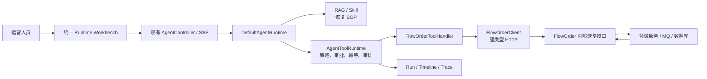
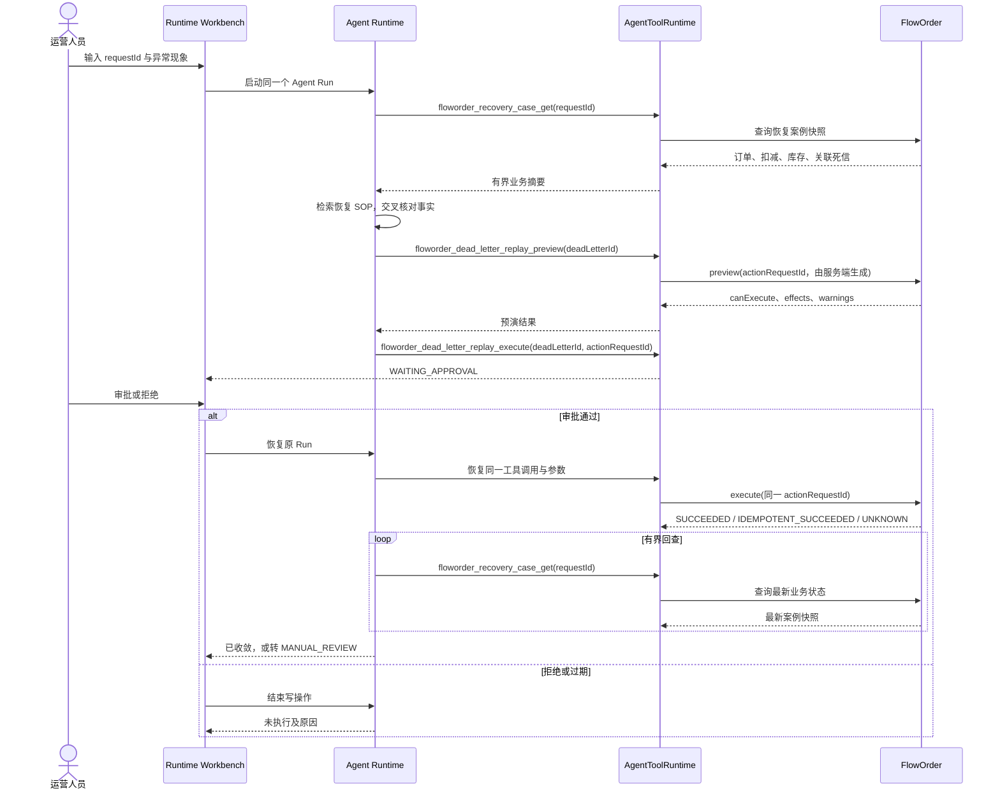

# OrderCare Agent × FlowOrder 异常订单恢复闭环设计稿

> 状态：历史业务子设计，仅用于保留决策演进，不可直接作为编码依据
> 目标版本：已由 Blueprint V1.1 接管
> 更新日期：2026-07-17
> 涉及仓库：`enterprise-agent`、`floworder`

> 项目级决策已迁移到 [Enterprise Agent 项目总蓝图](enterprise-agent-master-blueprint.md)。本文件保留为早期业务子设计；其中模型循环回查、5 个模型可见工具、`proposalId == actionRequestId`、由 Agent 保存业务 Proposal 状态等方案均已被 Blueprint V1.1 替代。

Blueprint V1.1 的覆盖性决策如下：

- 编码前先完成 M0.5 FlowOrder Recovery Baseline。
- Proposal、Approval、Recovery Action、Case Outcome 使用四套独立状态语义。
- FlowOrder 是 Proposal 与 Recovery Action 的事实源；enterprise-agent 是人工 Approval 的事实源。
- `proposalId` 与 `actionRequestId` 分离并一对一绑定；preview 以稳定 proposalId 实现请求幂等。
- 审批绑定 proposalVersion、stateFingerprint、previewDigest 和 expiresAt；状态漂移后必须重新预演、重新审批。
- 执行后轮询和收敛判断由确定性 Java 协调器完成，不由模型循环驱动。
- M2 定义为 Resume Ready，M3 定义为 Interview Strong，验收标准分别计算。

## 1. 结论先行

`enterprise-agent` 应当与 FlowOrder 联动，但两个项目继续独立部署、独立维护，通过受控 HTTP 接口集成，不共享数据库，也不把 Agent 代码塞进 FlowOrder。

首个真实业务场景只做一条纵向闭环：

> **订单已经超时或取消，但库存释放消息进入死信队列，造成库存仍被锁定。运营人员把 `requestId` 交给 OrderCare Agent，由 Agent 聚合事实、检索恢复 SOP、建议生成恢复预演；人工确认后，确定性 Java 协调器使用绑定的业务幂等键提交重放并有界回查，直到业务状态收敛或转人工。**

这条链路能自然使用现有能力：Agent loop、RAG、Tool、HITL、暂停与恢复、幂等、重试边界、状态持久化、Trace、评估。每项能力都有业务理由，不是功能堆叠。

本方案有三个硬约束：

1. 不改 `DefaultAgentRuntime.run()` 的主体流程，保留现有学习成果。
2. 不新增一个孤立的“OrderCare Controller”；仍从当前统一运行窗口和 Agent Runtime 进入。
3. V1 只开放窄工具，不向模型暴露通用管理接口。

## 2. 设计目标与非目标

### 2.1 设计目标

- 在一个工作台中完成“提问—诊断—预演—审批—执行—验证—结论”。
- FlowOrder 始终是订单、库存、死信与恢复动作的事实源。
- 所有写操作必须可审计、可幂等、可拒绝、可暂停和可恢复。
- 网络超时导致执行结果未知时，不进行盲目重试。
- 最终回答必须基于执行后的重新查询，而不是仅依据“接口返回成功”。
- 形成可复现的测试集、运行证据和面试故事。

### 2.2 V1 明确不做

- 不做通用“订单运营 Copilot”。
- 不开放死信 `IGNORE`、`force=true`、订单取消、Outbox 强制重试、任意 SQL。
- 不允许模型自由拼接 URL、HTTP 方法或 FlowOrder 原始接口参数。
- 不直接访问 FlowOrder 数据库。
- 不先上多 Agent；单 Agent 尚未证明不足时，不增加协作复杂度。
- 不用 MCP 包装核心恢复链路。V1 使用强类型 HTTP 客户端，以便明确超时、业务错误、幂等和结果未知语义。
- 不把 RAG 文档当作业务事实；实时状态与 FlowOrder 的预演结果优先级更高。

## 3. 当前事实与规划边界

下表用于避免把设计目标误写成当前能力。

| 项目 | 当前已有 | 本设计新增/补齐 | 当前不能宣称 |
|---|---|---|---|
| enterprise-agent | 自主 Runtime loop、Tool Schema 校验、工具风险策略、人工审批、运行暂停/恢复、工具执行记录、RAG、Skill、Trace、SSE 工作台 | FlowOrder 客户端、5 个窄业务工具、OrderCare 执行画像、业务结果投影、场景化 UI 与跨系统测试 | 已完成 FlowOrder 业务闭环、已具备可信用户身份传播 |
| FlowOrder | 预约恢复检查、死信详情、恢复 preview/execute、`actionRequestId` 幂等、恢复审计 | 按 `requestId` 返回关联死信、按 `actionRequestId` 查询恢复动作、服务身份认证 | 内部管理接口已适合公网/生产直接暴露 |
| 跨系统 | 两个仓库各自可运行 | 统一 Trace、契约测试、真实依赖 E2E、故障演练、验收数据集 | 生产级 SLA、生产级安全或完整压测结论 |

FlowOrder 的内部管理接口当前默认关闭，且现有注释明确说明其无完整鉴权。因此本地演示可以通过受信网络直连，正式版本必须先补服务认证和可信操作者身份。

## 4. 业务场景

### 4.1 典型输入

运营人员在统一工作台输入：

```text
预约 requestId=REQ-20260717-001 的订单已经超时，但库存一直没有释放，请帮我定位并给出安全处理方案。
```

### 4.2 Agent 必须查明的事实

- 预约请求是否存在、当前状态是什么。
- 关联订单是否为 `TIMEOUT` 或 `CANCELLED`。
- 扣减记录及 `deductNo` 是什么，是否仍未 `RELEASED`。
- 库存的总量、可用量、锁定量、已售量是否满足不变量。
- 是否存在与该 `deductNo` 相关、仍未解决的死信。
- 死信类型是否允许自动建议重放。
- FlowOrder preview 是否明确返回 `canExecute=true`，以及影响和警告是什么。

### 4.3 成功判定

对于“超时/取消后释放库存”的 V1 场景，业务完成不是“重放接口返回成功”，而是重新查询后同时满足：

```text
order.status in {TIMEOUT, CANCELLED}
AND deduct.status == RELEASED
AND inventoryInvariantOk == true
AND unresolvedRelatedDeadLetterCount == 0
```

在限定时间内没有收敛，或者任何事实冲突，运行都进入 `MANUAL_REVIEW`，不得生成“已修复”的结论。

## 5. 系统边界



关键边界：

- `enterprise-agent` 负责理解意图、编排、权限决策、人工审批、过程记录和最终解释。
- FlowOrder 负责业务规则、状态变更、领域幂等与最终状态。
- Agent 不复制一套订单状态机，也不自行判断数据库应该如何修改。
- FlowOrder 的公开 Gateway 当前不路由 `/internal/**`；本地联调直连资源服务，正式环境使用专用内部入口。

## 6. 完整执行时序



这里存在两套状态，不能混为一谈：

- Agent Run 状态：`RUNNING -> WAITING_APPROVAL -> RUNNING -> COMPLETED/MANUAL_REVIEW`。
- FlowOrder 业务状态：订单、扣减、库存、死信和恢复动作状态。

Agent Run 完成不天然代表业务修复；只有 FlowOrder 回查满足收敛条件，才能返回“已恢复”。

## 7. V1 工具目录

| 工具名 | 风险 | 输入 | 输出重点 | 是否写业务状态 |
|---|---:|---|---|---:|
| `floworder_recovery_case_get` | LOW | `requestId` | 订单、扣减、库存不变量、Outbox 摘要、关联死信、警告 | 否 |
| `floworder_dead_letter_get` | LOW | `deadLetterId` | 消息类型、业务键、状态、失败原因、重放次数 | 否 |
| `floworder_dead_letter_replay_preview` | MEDIUM | `deadLetterId`、`reason` | 服务端生成的 `actionRequestId`、`canExecute`、影响、警告 | 不改变订单；会形成预演审计 |
| `floworder_dead_letter_replay_execute` | HIGH | `deadLetterId`、`actionRequestId`、`reason` | 动作受理状态、时间、消息 | 是，必须人工审批 |
| `floworder_recovery_action_get` | LOW | `actionRequestId` | 恢复动作最终状态与目标 | 否 |

### 7.1 防误用约束

- `actionType` 不进入工具 Schema，V1 在服务端固定为 `REPLAY`。
- `operator` 不允许由模型提供；由 Agent 服务端的可信身份上下文注入。
- `force` 不进入工具 Schema。
- preview 工具在服务端生成 UUID 形式的 `actionRequestId`，模型不能自造。
- execute 只能复用 preview 返回的 `actionRequestId`。
- execute 审批页通过 `actionRequestId` 关联并展示原 preview 的影响与警告，不采信模型复述的风险说明。
- Schema 使用 `additionalProperties=false`，多余参数直接拒绝。
- 所有工具返回业务摘要，不把完整实体、消息正文或大段原始 JSON 塞入模型上下文。

### 7.2 建议 Schema

```json
{
  "name": "floworder_dead_letter_replay_execute",
  "description": "执行已经预演过的 FlowOrder 死信重放。高风险，必须人工审批。",
  "inputSchema": {
    "type": "object",
    "properties": {
      "deadLetterId": { "type": "integer", "minimum": 1 },
      "actionRequestId": { "type": "string", "minLength": 16, "maxLength": 64 },
      "reason": { "type": "string", "minLength": 5, "maxLength": 200 }
    },
    "required": ["deadLetterId", "actionRequestId", "reason"],
    "additionalProperties": false
  }
}
```

### 7.3 服务端执行画像

V1 增加一个服务端固定的 `ordercare-floworder-v1` 执行画像，只允许：

```text
knowledge_search
skill_catalog
floworder_recovery_case_get
floworder_dead_letter_get
floworder_dead_letter_replay_preview
floworder_dead_letter_replay_execute
floworder_recovery_action_get
```

统一工作台只能提交枚举化的 `scenarioId=ordercare-floworder-v1`，由服务端 `AgentExecutionProfileResolver` 映射到 `AgentExecutionProfile`。浏览器不能提交任意 system prompt、能力白名单或预算。同步与 SSE 适配器调用现有的 profile 版 `AgentRuntime.run(...)`，不改 `DefaultAgentRuntime.run()` 内部循环。

## 8. FlowOrder 接口映射与最小缺口

### 8.1 可复用的现有接口

| Agent 工具 | FlowOrder 当前接口 | 说明 |
|---|---|---|
| 案例查询 | `GET /internal/recovery/reservation/check?requestId=...` | 已聚合预约、扣减、订单、库存与 Outbox |
| 死信详情 | `GET /internal/mq/dead-letter/{id}` | 获取死信事实 |
| 恢复预演 | `POST /internal/recovery/dead-letter/preview` | 返回 `canExecute/effects/warnings` |
| 执行重放 | `POST /internal/recovery/dead-letter/execute` | 支持 `actionRequestId` 领域幂等 |

FlowOrder 的统一响应体包含 `code/message/data`。客户端必须同时检查 HTTP 状态和响应体 `code`，不能把 HTTP 200 一律视为业务成功。

### 8.2 FlowOrder 需要补的两个小契约

#### 缺口 A：案例级关联死信

当前恢复检查中的 `unresolvedDeadLetterCount` 是全局计数，不能证明当前 `requestId` 对应的死信已经解决。

建议在恢复快照中增加：

```text
relatedDeadLetters[]
unresolvedRelatedDeadLetterCount
```

关联路径使用 `requestId -> deductNo -> deadLetter.bizKey`。这样 Agent 不需要先拉取全局死信再自行猜测关联关系。

#### 缺口 B：按业务幂等键查询恢复动作

建议增加：

```http
GET /internal/recovery/actions/{actionRequestId}
```

用途是处理 execute 已发出、但客户端因超时或连接中断没有拿到结果的情况。没有这个接口时，Agent 只能回查业务结果并转人工，无法可靠区分“未执行”和“已执行但响应丢失”。

这两个改动都是对现有恢复域的窄增强，不改变订单主流程。

## 9. 幂等、重试与未知结果

### 9.1 两层幂等键

| 层级 | 标识 | 作用 |
|---|---|---|
| Agent 执行层 | `ToolCallRequest.requestId` / tool execution id | 防止同一个 Run 恢复时重复执行同一工具调用 |
| FlowOrder 业务层 | `actionRequestId` | 防止网络重试、进程恢复或重复提交产生第二次恢复动作 |

两者不能互相替代。Agent 的执行记录不能保证下游业务幂等；FlowOrder 的 `actionRequestId` 也不能恢复 Agent 的审批上下文。

### 9.2 重试矩阵

| 情况 | Agent 行为 |
|---|---|
| 查询工具遇到连接失败、502、503 | 指数退避并加随机抖动，最多有限次数 |
| 查询工具收到 4xx 或 FlowOrder 业务错误码 | 不重试，返回可解释错误 |
| preview 返回 `canExecute=false` | 禁止发起 execute |
| execute 明确返回业务失败 | 不自动换新 `actionRequestId` 重试 |
| execute 超时、连接重置、响应无法解析 | 标记 `UNKNOWN`；用原 `actionRequestId` 查询动作状态，再回查业务状态；仍不确定则转人工 |
| execute 返回 `SUCCEEDED` | 仅代表恢复动作已受理；继续回查业务收敛 |
| execute 返回 `IDEMPOTENT_SUCCEEDED` | 视为同一动作已成功受理；继续回查业务收敛 |

写工具不能沿用“看到 timeout 就重试”的通用策略。适配器要把未知副作用明确投影为 `retryable=false`，避免 Runtime 的通用重试造成业务重复。

## 10. 身份、安全与授权

### 10.1 本地演示边界

- `agent.floworder.enabled=false` 默认关闭集成。
- 本地联调时显式开启 FlowOrder 的管理接口，并只监听受信网络或本机端口。
- Agent 服务端注入固定演示服务身份，例如 `enterprise-agent-demo`。
- UI 的 metadata JSON 当前是用户可编辑输入，不能作为可信角色或操作者身份来源。
- 日志不得记录凭证、完整消息正文或敏感个人信息。

### 10.2 可对外宣称“可靠集成”前必须补齐

- 服务到服务认证：内部 token、签名请求或 mTLS，凭证进入安全配置而非仓库。
- 可信用户身份：由认证层生成审批人和操作者，不采信模型参数或浏览器自报 metadata。
- 最小权限：Agent 服务身份只能访问列入白名单的恢复接口。
- 网络隔离：内部恢复接口不经公网 Gateway 暴露。
- FlowOrder 审计与 Agent approval/run/toolExecution 能通过关联 ID 双向追踪。
- 管理接口关闭、401、403 或身份缺失时一律 fail closed。

V1 的高风险工具继续使用现有 `DefaultToolPermissionPolicy`：策略先判定为 `ASK`，只有审批通过才执行。审批拒绝、过期或 Run 无法恢复时，FlowOrder 不应收到写请求。

## 11. 上下文、RAG 与结果投影

### 11.1 给模型的案例快照

建议将 FlowOrder 原始 DTO 投影为稳定的 `OrderCareCaseSnapshot`：

```text
requestId
reservationStatus
orderNo / orderStatus
deductNo / deductStatus / quantity
inventory.total / available / locked / sold / invariantOk
outboxSummaries[]
relatedDeadLetters[]: id / messageType / status / deathReason / replayCount
warnings[]
observedAt
```

模型只接收完成诊断所需字段。完整响应可保留在工具执行记录或受控原始引用中，但不直接进入 prompt。

### 11.2 RAG 知识包

首批只准备四类文档：

1. FlowOrder 订单、扣减和库存状态映射。
2. 死信恢复 preview/execute SOP。
3. 库存不变量与恢复后的验证清单。
4. 不允许自动处理的情况和人工升级路径。

每份文档写入 `sourceRepository`、`sourceCommit`、`effectiveVersion`。当文档建议与实时 preview 冲突时，以 FlowOrder 实时结果为准，并记录知识可能过期。

## 12. 统一工作台设计

不新增独立页面，扩展现有 `RuntimeWorkbench.vue`：

1. 增加场景模板“FlowOrder 异常库存恢复”，自动生成提示词骨架，但仍走现有运行接口。
2. 增加案例摘要卡：订单、扣减、库存、关联死信。
3. 在同一时间线展示 `DIAGNOSED -> PREVIEWED -> WAITING_APPROVAL -> EXECUTING -> VERIFYING -> RESOLVED/MANUAL_REVIEW`。
4. 审批卡直接展示 FlowOrder preview 的 `effects`、`warnings`、`actionRequestId`，并明确“执行成功不等于业务已收敛”。
5. 审批后继续使用现有 resume SSE，不打开第二个窗口，也不创建第二条脱节会话。
6. 最终报告展示“执行前事实、批准人、执行动作、执行后事实、是否收敛、Trace ID”。

建议约定 `conversationId=ordercare:{requestId}` 便于聚合同一案例的多次尝试，但 V1 必须如实说明这只是命名约定，除非后续增加服务端校验。

Controller 收口规则：

- OrderCare 业务链路只调用现有 `/api/agent/runs/events` 与 `/api/agent/runs/{runId}/resume/events`。
- RAG、Tool、Approval 等现有 Controller 继续作为能力实验室或运维查询接口，不由 OrderCare 页面串行调用来“假装工作流”。
- 正式部署配置中应关闭或保护调试型写接口，避免绕过 Runtime 的策略、审批和审计。

## 13. 可观测性与关联标识

| 标识 | 生成方 | 下游用途 |
|---|---|---|
| `runId` | enterprise-agent | 一次 Agent 尝试 |
| `toolExecutionId` | enterprise-agent | 工具幂等、Trace span，作为 `X-Trace-Id` 传播 |
| `requestId` | FlowOrder 业务请求 | 案例主键，作为业务查询条件与 `X-Request-Id` |
| `deadLetterId` | FlowOrder | 恢复目标 |
| `actionRequestId` | preview 适配器生成，FlowOrder 持久化 | 恢复动作幂等和未知结果查询 |
| `approvalId` | enterprise-agent | 审批证据 |

建议指标：

- `ordercare.case.diagnose.duration`
- `ordercare.approval.wait.duration`
- `ordercare.recovery.converge.duration`
- `ordercare.recovery.resolved.count`
- `ordercare.recovery.manual_review.count`
- `ordercare.execute.unknown.count`
- 按工具统计成功率、错误类型、重试次数、Token 与估算成本

日志中每一步至少包含 `runId/toolExecutionId/requestId/actionRequestId` 中适用的标识，禁止只记录一段不可关联的自然语言。

## 14. 推荐代码落点

### 14.1 enterprise-agent：小范围增量

建议新增：

```text
src/main/java/com/agent/platform/floworder/
├── FlowOrderProperties.java
├── FlowOrderClient.java
├── FlowOrderApiException.java
├── FlowOrderToolCatalog.java
├── FlowOrderToolHandler.java
└── dto/
    ├── OrderCareCaseSnapshot.java
    ├── RecoveryPreviewView.java
    └── RecoveryActionView.java
```

建议最小修改：

- `LocalToolRegistry`：仅在 `agent.floworder.enabled=true` 时追加 5 个工具定义。
- `LocalToolExecutor`：将 `floworder_*` 委托给 `FlowOrderToolHandler`。
- 增加 `AgentExecutionProfileResolver`，让同步与 SSE 入口选择服务端固定的 OrderCare 能力白名单。
- `DefaultToolPermissionPolicy` 配置：execute 固定为 HIGH/ASK。
- `RuntimeWorkbench.vue`：增加场景模板、案例卡和审批预演展示。
- `application.yaml`：增加 FlowOrder 地址、超时、服务身份和开关。

明确不修改：

- `DefaultAgentRuntime.run()` 主循环。
- 现有 Agent Run、审批与 resume 的核心状态机。
- 现有 Controller 数量和路由体系。

HTTP 客户端建议使用同步 `RestClient`。当前同步 Controller 和 SSE 执行适配器已把整次 Runtime 调用切到 `boundedElastic` 工作线程，V1 没必要再引入一套 WebFlux 客户端语义。仍需通过连接池、超时和并发测试控制阻塞请求；只有测量证明该线程模型成为瓶颈后，再评估异步客户端。

### 14.2 FlowOrder：窄契约增强

- 恢复案例快照增加关联死信及案例级未解决计数。
- 增加按 `actionRequestId` 查询恢复动作的只读接口。
- 增加服务认证与可信 operator 接收方式。
- 为上述接口补 Controller/Service 契约测试。

不修改订单核心状态机，不让 Agent 绕过既有领域服务直接改表。

当未来接入第二个真实业务系统时，再把 `LocalToolExecutor` 的分支提取为通用 `ToolProvider` 插件机制。只有一个 FlowOrder 集成时立即重构，会增加学习成本而没有业务收益。

## 15. 分阶段交付

### M1：本地可演示闭环

- 5 个工具与 FlowOrder typed client。
- FlowOrder 两个最小查询契约。
- 统一工作台完成 query/preview/approval/execute/verify。
- 固定服务身份，仅限本机受信环境。
- Mock HTTP 契约测试和 3 条真实依赖 E2E。

交付口径：**已完成本地跨系统异常订单恢复闭环**，不能称生产级。

### M2：可面试辩护的可靠性

- execute 未知结果恢复。
- 重启后从审批点恢复，保持原 `actionRequestId`。
- 12 条评估案例、失败注入、审计查询和演示脚本。
- Trace/指标面板展示一次恢复的全链路证据。
- RAG 文档版本与源码 commit 对齐。

交付口径：**实现了具备审批、幂等、故障恢复和可观测证据的业务 Agent**。

### M3：生产化安全边界

- 服务认证、可信用户身份、密钥管理、网络隔离。
- 并发与容量测试、告警阈值、SLO。
- 灰度开关、kill switch、审计保留策略。

没有完成 M3 前，不在简历写“生产级安全”或“线上大规模稳定运行”。

## 16. 测试与评估集

至少固定以下 12 条案例，输入、工具调用、状态转移和最终断言都可重复：

| ID | 场景 | 核心断言 |
|---|---|---|
| C01 | 正常订单查询 | 只读，不触发 preview/execute |
| C02 | 超时订单且库存已释放 | 判定已收敛，不产生恢复动作 |
| C03 | 超时订单、库存未释放、有关联 PENDING 死信 | 正确选中候选死信并 preview |
| C04 | 找不到关联死信 | 不猜测 ID，转人工 |
| C05 | 未知消息类型 | 不自动执行 |
| P01 | execute 被策略拦截 | Run 进入 `WAITING_APPROVAL`，FlowOrder 无写请求 |
| P02 | 审批拒绝/过期 | 不执行，留下拒绝证据 |
| P03 | 审批通过 | 恢复原工具参数和原 `actionRequestId` |
| P04 | actionRequestId 与目标不匹配 | FlowOrder/适配器拒绝执行 |
| R01 | 重复 resume | 只产生一个领域恢复动作，返回幂等成功 |
| R02 | execute 响应超时 | 不盲重试，通过动作查询与业务回查判定 |
| R03 | 执行受理但业务未在期限内收敛 | 最终进入 `MANUAL_REVIEW`，不谎报成功 |

测试分层：

1. `FlowOrderClient` 使用 MockWebServer/WireMock 做响应体 code、超时和未知结果契约测试。
2. `FlowOrderToolHandler` 测 Schema、字段投影、operator 注入、actionRequestId 生成。
3. Runtime 集成测试覆盖审批暂停、恢复、重复 resume 与执行记录。
4. 跨仓库 E2E 使用真实 PostgreSQL、Redis、MQ，保留 Trace 和数据库状态证据。
5. 评估集检查模型是否选择正确工具、是否越权、最终结论是否有事实支撑。

## 17. 关键风险与取舍

| 风险 | 设计应对 |
|---|---|
| 模型选错写工具 | 工具面窄化、固定 REPLAY、Schema 校验、HIGH 风险审批 |
| 超时后重复执行 | 双层幂等、未知结果查询、写工具不盲重试 |
| 用全局死信数误判当前案例 | 增加关联死信与案例级计数 |
| UI metadata 伪造角色 | 不作为可信身份；服务端认证后再传播 operator |
| RAG 文档过期 | 记录源码版本；实时状态与 preview 优先 |
| Agent 说成功但业务没恢复 | execute 后强制有界回查，按收敛谓词判断 |
| 为了“架构感”过早多 Agent/MCP | V1 保持单 Agent + typed HTTP，用评估数据决定是否升级 |
| 改动过大影响学习 | 保持 Runtime 主循环、审批恢复主链不变，只扩展工具适配层 |

## 18. 简历与面试表达

完成 M2 后，可以按事实描述为：

> 面向交易系统异常订单恢复，设计并实现 OrderCare Agent。Agent 聚合订单、库存与死信事实，结合版本化 SOP 生成恢复预演；高风险重放经人工审批后复用业务幂等键执行，并通过动作状态查询和业务回查处理网络超时与未知结果。运行链路支持暂停恢复、审计追踪和失败转人工，避免模型直接操作数据库或把接口成功误判为业务收敛。

面试时重点讲四个取舍：

1. 为什么选异常订单恢复，而不是通用聊天助手。
2. 为什么 Agent Tool 仍按分布式 RPC 设计超时、幂等和未知结果。
3. 为什么审批放在工具执行前，业务验证放在执行后。
4. 为什么保留单 Agent 和现有 Runtime，而没有为了名词增加多 Agent/MCP。

## 19. 外部设计依据

- [Anthropic: Building effective agents](https://www.anthropic.com/engineering/building-effective-agents)：优先使用简单、可组合模式；工具接口要按 Agent 的使用方式设计；自主执行需要环境反馈、停止条件和人工检查点。
- [OpenAI: A practical guide to building AI agents](https://openai.com/business/guides-and-resources/a-practical-guide-to-building-ai-agents/)：Agent 适用于需要复杂判断和外部工具的完整工作流，同时需要 guardrails 和人工监督。
- [AWS Well-Architected: REL05-BP03 Control and limit retry calls](https://docs.aws.amazon.com/wellarchitected/latest/framework/rel_mitigate_interaction_failure_limit_retries.html)：重试必须有限、带退避与抖动，并在重试写操作前确认幂等性。

## 20. 评审决策点

进入编码前只需要确认以下三点：

1. 首个场景固定为“订单超时/取消后的库存释放死信恢复”，不扩到支付或通用运营。
2. 接受两个仓库独立、HTTP 集成，并在 FlowOrder 增加两个窄查询契约。
3. 第一阶段按本地可信环境交付，同时在文档和简历中明确安全边界；后续再完成服务认证。

确认后，建议按 **FlowOrder 查询契约 -> enterprise-agent 只读工具 -> preview -> HITL execute -> verify -> E2E 证据** 的顺序实施。
