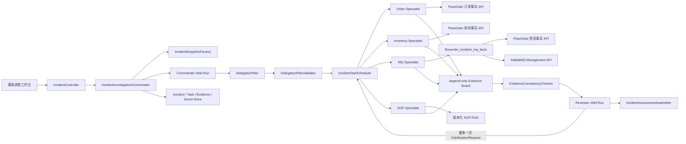
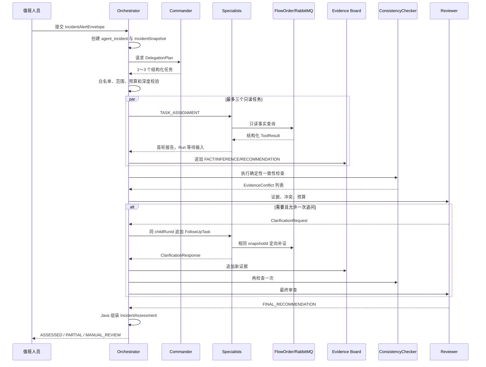

# OrderCare Incident Command V1：只读事故调查 Multi-Agent 设计

> 文档状态：`M0_FROZEN / M1-C_GATE_PASSED / PHASE_1_IMPLEMENTED`
>
> 场景 ID：`ordercare-incident-command-v1`
>
> 版本：V1.3
>
> 更新日期：2026-07-18 20:20 CST
>
> 代码仓库：`enterprise-agent` + `floworder`

## 1. 文档定位与结论

这是一份 `ordercare-incident-command-v1` 场景的完整实施蓝图，不是整个 `enterprise-agent` 项目总蓝图的替代品。

本设计完整定义了该场景的目标架构、Phase 1 代码边界、运行状态、数据表、接口、证据协议、测试和后续阶段；其中只有 Phase 1 允许进入下一轮编码：

> **针对异常订单事故，Commander 动态委派最多三个只读 Specialist 并行调查，Java Orchestrator 负责受控调度，证据板记录可追溯事实，确定性规则发现冲突，Reviewer 负责解释风险并最多发起一次定向追问，最终形成只读 IncidentAssessment。**

Phase 1 明确不包含：

- 死信重放、订单修改、库存修改和任何批量写操作；
- Recovery Planner、Proposal 创建、人工审批和恢复执行；
- Specialist 自主创建子 Agent；
- 通用 Agent 邮箱、自由聊天和无限循环；
- 多实例任务抢占、复杂 DAG、跨租户治理和生产级 SLO。

这项设计解决了“为什么不用普通 Workflow”的质疑：

- LLM 只负责理解事故描述、选择调查角色、解释证据和形成建议；
- Java 负责计划校验、并发、超时、重试、状态机、预算、冲突检测和持久化；
- FlowOrder 和 RabbitMQ 只提供受限、可审计的只读事实；
- 对结构化且已知调查路径的事故，固定 Workflow 仍然是基线方案；
- 只有模糊入口、跨域证据组合和需要定向补证的事故才进入 Multi-Agent。

## 2. 当前代码事实审计

### 2.1 enterprise-agent 已有能力

| 现有能力 | 代码事实 | 本设计是否复用 |
|---|---|---|
| 主 Runtime | `DefaultAgentRuntime` 已支持受限循环、Tool Calling、流式事件、预算、Guardrail、暂停和审批恢复 | 复用，不重写 `run()` 主循环 |
| Run 检查点 | `agent_run_state` 持久化请求、Profile、预算、phase、pendingToolCall 和结果 | 复用 |
| Timeline | `agent_message` 与 `agent_runtime_event` 保存完整消息及事件序列 | 复用，作为每个 child Run 的模型上下文与 Trace 来源 |
| Tool Runtime | Schema、Profile 白名单、Policy、HITL、幂等 claim、UNKNOWN 对账已具备 | 复用；Phase 1 只注册只读工具 |
| 子 Agent 隔离 | `SubAgentRunner` 已为每个子 Agent 创建独立 session、userId、Profile 和 Run | 复用其思想，扩展为事故任务 Runner |
| Trace | `RuntimeTraceProjector` 能从 Run/Event 投影模型、工具、审批和子 Agent Span | 扩展 incident/task/evidence 关联，不另造一套 Trace |

### 2.2 现有 Multi-Agent 的真实边界

当前 `DefaultMultiAgentOrchestrator` 是一个固定演示链：

```text
Planner
  -> 最多两个 Specialist 并行执行
  -> Reviewer 汇总文本摘要
```

它具有真实的独立 child Run，但还不是本场景需要的成熟 Multi-Agent，原因包括：

- Planner 只能在 `RAG_WORKER` 与 `TOOL_WORKER` 中选择；
- 并发上限固定为 2，且没有持久化 AgentTask；
- `MultiAgentMessage` 只是响应 DTO，不是运行时消息总线；
- Reviewer 读取的是未结构化文本摘要，没有独立证据板；
- 没有事实、推断、建议分层；
- 没有确定性冲突检测；
- 没有定向追问、消息预算和链路深度控制；
- 没有 Multi-Agent 专项自动化测试；
- 协调 Run 完成后无法从任务状态恢复。

因此 Phase 1 不直接给现有固定编排器继续堆条件分支，而是在 `ordercare.incident` 业务包内新增场景编排器；旧接口先保留兼容，待新场景通过验收后再决定是否废弃。

### 2.3 同一个 childRunId 追问的关键缺口

当前 Runtime 的 `resume(runId)` 只处理：

- `RUNNING` 崩溃恢复；
- `PAUSED / PAUSE_REQUESTED` 用户暂停恢复；
- `WAITING_APPROVAL` 人工审批恢复。

当 Specialist 正常生成首轮结论后，Run 会进入 `COMPLETED`。已完成 Run 不允许追加新的用户输入，因此当前代码无法满足：

> Reviewer 发现冲突后，携带结构化 FollowUpTask，沿用原 Specialist 的同一个 childRunId 继续补证。

正式实现不能把“同 session 新建 Run”包装成“同 childRunId”。Phase 1 必须增加一个窄而通用的内部续跑检查点，见第 11 节。

### 2.4 FlowOrder 已有能力

FlowOrder 已经具备可信的单案例恢复事实：

- `/internal/recovery/cases/inspect` 能按 requestId、orderNo、deductNo、deadLetterId 聚合单个案例；
- 案例结果包含 reservation、order、deduct、inventory、deadLetters、recoveryActions 和诊断分支；
- `/internal/mq/dead-letter` 支持按状态列出死信和按 ID 查询；
- `fo_reservation_request.request_id`、`fo_stock_deduct_record.request_id`、`deduct_no` 和 `fo_mq_dead_letter.biz_key` 已有适合点查的索引；
- M0.5～M3 已验证恢复基线、Proposal、幂等动作、租约和 UNKNOWN 对账。

### 2.5 FlowOrder 当前缺口

现有接口仍不能直接支持事故级调查：

- `cases/inspect` 是单案例接口，不适合 100 条订单的事故批次；
- 通用死信列表只能按 status + limit 查询，无法绑定同一事故范围；
- 没有统一的 `IncidentSnapshot` 范围契约；
- 没有订单域、库存域、死信域的批量只读事实切片；
- 没有 RabbitMQ ready、unacked、consumer 等 Broker 运行态查询；
- 没有对返回是否截断、缺失 requestId、数据观测时间和范围哈希做契约化表达；
- 现有表适合根据 requestId/deductNo 做有界查询，不适合让模型发起任意时间范围全表扫描。

结论：Phase 1 应当使用“上游告警给出有界 requestId 集合”的事故范围，不开放任意 SQL、任意状态组合或无限时间窗口。

### 2.6 复用、扩展、新增与延期矩阵

| 分类 | 内容 |
|---|---|
| 直接复用 | `DefaultAgentRuntime` 主循环、AgentExecutionProfile、Tool Runtime、Run/Timeline/Approval/ToolExecution 存储、SSE 事件、Context、Guardrail、预算、现有 FlowOrder HTTP Client 模式、Runtime Trace 投影 |
| 小范围扩展 | Runtime 最终答案处增加 `WAITING_INPUT`；AgentRunStore 增加同 Run 的 CAS claim；Trace 增加 incidentId/taskId/childRunId/evidenceId 关联并投影 synthetic coordinator span；Capability Registry 注册事故只读工具 |
| 场景新增 | Incident Orchestrator、Task Scheduler、四类 Specialist Profile、Incident/Task/Evidence/Event Store、EvidenceProjector、Trust、ConsistencyChecker、Reviewer Protocol、IncidentAssessment、事故工作台 |
| FlowOrder 新增 | 有界订单/库存/死信批量事实 API、order-service 批量点查契约、RabbitMQ Management 只读适配所需配置 |
| 明确延期 | 批量恢复、Recovery Planner、通用邮箱、复杂 DAG、多实例抢占、自动扩缩容、多租户、线上告警接入和生产 SLO |

## 3. 业务场景

### 3.1 使用者

- 值班开发；
- 订单运营；
- 库存运营；
- MQ 平台值班人员。

### 3.2 输入

一个事故告警批次，例如：

```json
{
  "scenarioId": "ordercare-incident-command-v1",
  "alertBatchId": "alert-stock-release-20260718-001",
  "alertType": "STOCK_RELEASE_DLQ_BACKLOG",
  "detectedAt": "2026-07-18T12:00:00+08:00",
  "symptom": "订单超时数量和库存释放死信数量不一致，请调查影响范围和风险",
  "candidateRequestIds": ["REQ-0001", "REQ-0002"],
  "queueNames": ["floworder.order.state.dlq"]
}
```

约束：

- `alertBatchId` 必填且在一次事故中不可变；
- Phase 1 最多 100 个 requestId；
- queueName 必须命中服务端白名单；
- tenantScope 由服务端注入为固定本地演示租户，模型和请求体不能指定；
- 调查范围由 Java 创建，Commander 不能扩张范围。

### 3.3 输出

```text
IncidentAssessment
├─ 事故范围与数据新鲜度
├─ 已确认事实
├─ 事实冲突与缺失证据
├─ 根因候选及其证据引用
├─ 风险等级
├─ 只读处置建议
└─ outcome: ASSESSED / PARTIAL / MANUAL_REVIEW
```

报告只能说“调查完成”“证据不足”或“建议进入后续受控恢复”；Phase 1 不得声称已经恢复业务。

## 4. 总体架构



### 4.1 责任边界

| 环节 | LLM | Java/领域服务 |
|---|---|---|
| 理解事故症状 | 是 | 校验输入边界 |
| 选择 1～3 个 Specialist | Commander 提议 | Validator 最终决定是否合法 |
| 选择模型、工具、预算 | 否 | ProfileFactory 与 Scheduler |
| 并行、超时、重试、取消 | 否 | Scheduler |
| 查询事实 | 选择受限工具 | Tool Handler 调用强类型只读 API |
| 认定 FACT | 否 | EvidenceProjector 从 ToolResult 生成 |
| 生成推断与建议 | Specialist/Reviewer | 引用和 Schema 校验 |
| 检测数量、集合、范围和时间冲突 | 否 | EvidenceConsistencyChecker |
| 解释冲突风险 | Reviewer | 只能基于已记录证据 |
| 是否允许一次追问 | Reviewer 建议 | Orchestrator 校验并执行 |
| 写订单、库存、死信 | 否 | Phase 1 完全不存在写工具 |

### 4.2 一次 Incident 的协调根与 Run 拓扑

本场景选择 `agent_incident` 作为真实协调根。Coordinator 不调用模型，因此**不创建 coordinatorRunId，也不向 agent_run_state 写入伪 Run**：

```text
agent_incident(incidentId)              # 确定性协调根，不是 Agent Runtime Run
├─ commanderRunId                       # Commander 独立模型 Run
├─ specialist childRunId[1..3]          # 每个 AgentTask 一个独立模型 Run
└─ reviewerRunId                        # Reviewer 独立模型 Run
```

| 标识 | 创建者与用途 | 持久化位置 | 模型用量统计 |
|---|---|---|---|
| `incidentId` | IncidentInvestigationOrchestrator 创建；记录事故总状态、总耗时和子 Run 关系 | `agent_incident.incident_id`；不写 `agent_run_state` | 只聚合真实模型 Run，自身模型用量恒为 0 |
| `commanderRunId` | Commander 生成 DelegationPlan 的独立 Run；无工具权限 | `agent_incident.commander_run_id` + `agent_run_state/message/event` | 从该 Run 的 MODEL/usage 事件独立统计 Prompt、Token、成本、结果和失败 |
| Specialist `childRunId` | 每个 AgentTask 的调查 Run；拥有独立 session、Profile、工具白名单和预算 | `agent_task.child_run_id` + `agent_run_state/message/event` | 按 taskId/role 独立统计；追问继续累计到原 childRunId |
| `reviewerRunId` | Reviewer 风险审查的独立 Run；无工具权限 | `agent_incident.reviewer_run_id` + `agent_run_state/message/event` | 独立统计 Prompt、Token、成本、首轮审查、最终结果和失败 |

所有真实模型 Run 的 request metadata 至少写入：

```text
incidentId
parentIncidentId = incidentId
runRole = COMMANDER / SPECIALIST / REVIEWER
taskId（仅 Specialist）
```

session 命名同样隔离：Commander 使用 `incident:{incidentId}:commander`，Reviewer 使用 `incident:{incidentId}:reviewer`，Specialist 使用 `incident:{incidentId}:task:{taskId}`。三类模型 Run 不共享完整 Prompt/Timeline，只通过经过校验的 DelegationPlan、Evidence 和 TaskEvent 交换结构化信息。

Reviewer 首轮需要澄清时进入持久化 `WAITING_INPUT`；补证完成后，Orchestrator 将更新后的 Evidence/Conflict 包追加到同一 reviewerRunId，再完成最终审查。

`IncidentTraceProjector` 为 `agent_incident` 生成 synthetic coordinator span，spanId 由 incidentId 确定性派生；Commander、每个 Specialist 和 Reviewer 的真实 Run 作为子 Span 关联。模型与工具细节仍由各自 `RuntimeTraceProjector` 投影，不复制第二份调用记录。Synthetic span 只统计事故墙钟时间、任务数和 outcome，必须排除在 modelRunCount、Token、Prompt、模型成本和模型失败率之外；Incident 总模型指标只聚合三个角色的真实 Run。

## 5. IncidentSnapshot：冻结范围，不伪造分布式快照

`IncidentSnapshot` 固定的是调查边界：

```java
public record IncidentSnapshot(
        String snapshotId,
        String incidentId,
        String alertBatchId,
        String alertType,
        String tenantScope,
        IncidentOrderScope orderScope,
        IncidentBusinessScope businessScope,
        IncidentTimeWindow timeWindow,
        Instant detectedAt,
        Instant investigationStartedAt,
        Instant deadlineAt,
        String scopeHash
) {}
```

关键语义：

1. 所有 Specialist 只能使用 `snapshotId`，不能自己生成 requestId、queue 或时间范围；
2. Tool Handler 根据 `snapshotId` 从 IncidentStore 还原真实范围，再调用下游；
3. `scopeHash` 使用规范化 JSON 计算 SHA-256，所有下游响应必须回显；
4. 每条证据单独记录 `observedAt`；
5. Java 检测不同来源的时间偏差，超过阈值时生成 `TIME_SKEW` 冲突；
6. 这不是 order-service、resource-service 与 RabbitMQ 的全局 ACID 快照；当前系统没有时态表或 CDC，不能声称能读取某个过去时刻的全局一致状态。

## 6. Commander 与 DelegationPlan

### 6.1 可选角色

| 角色 | 只读职责 | 允许能力 |
|---|---|---|
| `ORDER_ANALYST` | 订单终态、请求状态、状态分布和缺失订单 | `floworder_incident_order_facts` |
| `INVENTORY_ANALYST` | 扣减状态、库存不变量、未释放集合 | `floworder_incident_inventory_facts` |
| `MQ_ANALYST` | 持久化死信、队列积压、消费者运行态 | `floworder_incident_mq_facts`（Java 复合只读能力） |
| `SOP_ANALYST` | 检索版本化故障处置和升级流程 | `knowledge_search` |

Commander、Reviewer 均无工具权限。Specialist 不能创建子 Agent。

### 6.2 DelegationPlan

```json
{
  "schemaVersion": "delegation-plan-v1",
  "incidentId": "inc-...",
  "planSummary": "核对超时订单、未释放扣减和死信积压是否属于同一范围",
  "tasks": [
    {
      "clientTaskKey": "orders",
      "role": "ORDER_ANALYST",
      "objective": "统计范围内超时或取消订单并返回 requestId 集合",
      "priority": 100,
      "dependencies": [],
      "requiredEvidenceSubtypes": ["ORDER_STATUS_SET"]
    }
  ]
}
```

模型不能输出：

- 工具名；
- 模型供应商或模型名；
- maxTurns、Token 或成本预算；
- userId、tenantId、服务地址；
- 新的事故范围；
- 写动作或审批动作。

### 6.3 DelegationPlanValidator

Java 至少执行以下检查：

- task 数量为 1～3；
- role 在白名单中，且同一 role 最多一次；
- objective 非空且长度受限；
- requiredEvidenceSubtypes 与 role 的允许集合匹配；
- Phase 1 的 dependencies 必须为空，复杂 DAG 延后；
- 所有任务 delegationDepth 固定为 1；
- 事故截止时间和全局预算尚未耗尽；
- 计划中不存在任何恢复、重放、更新或批量执行意图。

模型输出解析或校验失败时，使用由 `alertType` 决定的只读安全降级计划；不让模型自由修正多轮。

为了避免 Commander 永远委派三个角色，Eval 必须包含只需一个或两个 Specialist 的简单事故，并计算 `Unnecessary Delegation Rate`。

## 7. 任务调度和状态机

### 7.1 AgentTask 状态

```text
PENDING
  -> CLAIMED
  -> RUNNING
      -> WAITING_CLARIFICATION -> RUNNING -> SUCCEEDED
      -> RETRY_PENDING -> CLAIMED
      -> SUCCEEDED
      -> FAILED
      -> TIMED_OUT
      -> CANCELLED
```

约束：

- 状态修改必须带 `version` 做 CAS；
- Phase 1 使用 `version` CAS、唯一 idempotencyKey 和 Runtime 现有 session lease 防止本实例内重复状态推进；
- `claimedBy`、`claimUntil` 仅作为 Phase 3 兼容字段预留，Phase 1 不实现任务租约续期、过期扫描、其他实例接管或崩溃恢复；
- 一次 Task 最多两个 attempt，即最多一次瞬时故障重试；
- 重试只针对明确的超时、连接重置和只读 5xx；
- Schema 错误、越权、预算耗尽、业务 4xx 不重试；
- 任务已产生的有效证据在超时后仍保留；
- 重试 attempt 可以创建新的 Runtime Run，但必须记录原 runId；“冲突追问”与“失败重试”是不同语义。

因此 Phase 1 只能宣称“CAS 防重和单实例有界任务调度”，不能宣称“已经支持多实例任务租约恢复”。Phase 3 只有在完成 claimUntil 续期、stale claim 回收、双实例竞争和进程崩溃接管测试后，才允许升级该表述。

### 7.2 Incident 状态

```text
CREATED
  -> PLANNING
  -> INVESTIGATING
  -> CHECKING_CONSISTENCY
  -> REVIEWING
      -> CLARIFYING -> REVIEWING
      -> ASSESSED
      -> PARTIAL
      -> MANUAL_REVIEW
  -> FAILED / CANCELLED
```

`PARTIAL` 表示至少获得一部分可信证据，但存在超时、缺失域或预算耗尽；`MANUAL_REVIEW` 表示证据冲突、高风险或无法形成可靠结论。二者都不能伪造完整答案。

### 7.3 并发和预算

- 最大并行 Specialist：3；
- 每个 Task 最大通信消息：3；
- 每个 Incident 最大追问：1；
- 链路深度：2（Commander -> Specialist -> Reviewer 定向追问）；
- Specialist 不能再委派；
- Reviewer 不能直接调用工具；
- 超出消息、模型、工具、Token、成本或 deadline 预算后直接生成部分报告或转人工；
- 使用有界线程池，队列拒绝策略转换为 Task `FAILED/PARTIAL`，不能无限排队。

## 8. 受控通信协议

Phase 1 不创建通用邮箱。所有跨 Agent 通信由 Orchestrator 写入 `agent_task_event`，只允许：

```text
TASK_ASSIGNMENT
EVIDENCE_SUBMITTED
CLARIFICATION_REQUEST
CLARIFICATION_RESPONSE
EVIDENCE_CHALLENGE
TASK_CANCELLED
FINAL_RECOMMENDATION
```

内部状态事件与通信事件通过 `eventCategory` 分离：

```text
COMMUNICATION   # Agent 间受控结构化消息
LIFECYCLE       # Incident/Task/Run 状态变化
CONTROL         # 预算、重试、取消、幂等拒绝等 Runtime 控制事件
```

内部事件例如：

```text
INCIDENT_STATE_CHANGED
TASK_STATE_CHANGED
TASK_RETRY_SCHEDULED
EVIDENCE_CONFLICT_DETECTED
EVIDENCE_TRUST_ASSESSED
BUDGET_EXHAUSTED
```

每条事件必须包含：

- incidentId 必填；taskId、childRunId 对 Task/Agent 通信事件必填，对 Incident 级 LIFECYCLE/CONTROL 事件可为空；
- eventCategory；
- actorType：`AGENT / ORCHESTRATOR / RUNTIME / SYSTEM`；
- actorId；
- COMMUNICATION 事件必须有 senderRole、recipientRole；
- LIFECYCLE/CONTROL 事件允许 recipientRole 为空，使用真实 ORCHESTRATOR/RUNTIME/SYSTEM Actor，禁止伪造 Agent 接收者；
- correlationId、causationId；
- messageDepth；
- idempotencyKey；
- Schema 校验后的 payload；
- createdAt。

Specialist 之间不能直接互发消息。所有挑战和追问都由 Reviewer 提议、Orchestrator 校验后路由。

## 9. Append-only Evidence Board

### 9.1 EvidenceRecord

```java
public record EvidenceRecord(
        String evidenceId,
        String incidentId,
        String taskId,
        String childRunId,
        EvidenceClass evidenceClass,
        EvidenceSubtype evidenceSubtype,
        String sourceSystem,
        String sourceReference,
        Map<String, Object> queryParameters,
        Instant observedAt,
        Map<String, Object> facts,
        String payloadHash,
        EvidenceStatus status
) {}
```

`EvidenceClass`：

- `FACT`：只能由 Java 从成功的只读 ToolResult 投影；
- `INFERENCE`：模型基于 FACT 形成的假设，必须引用 evidenceId；
- `RECOMMENDATION`：模型给出的只读建议或 SOP 建议，必须引用 evidenceId 或文档引用。

`EvidenceSubtype` 表示证据的业务口径，与 `EvidenceClass` 完全正交。Phase 1 至少包括：

```text
ORDER_STATUS_SET
INVENTORY_DEDUCT_SET
INVENTORY_INVARIANT
DEAD_LETTER_SET
QUEUE_RUNTIME_STATUS
SOP_GUIDANCE
```

例如：

```text
EvidenceClass=FACT
EvidenceSubtype=DEAD_LETTER_SET
```

禁止再用单个 `evidenceType` 同时表达“内容属于 FACT”以及“内容是死信集合”两种含义。

Specialist 的模型输出使用独立协议，不直接伪造 EvidenceRecord：

```json
{
  "schemaVersion": "specialist-report-v1",
  "taskId": "task-mq",
  "summary": "同一范围内存在 126 条未解决状态死信",
  "inferences": [
    {
      "statement": "死信积压可能大于异常订单集合",
      "relatedEvidenceIds": ["ev-mq-1"]
    }
  ],
  "recommendations": [],
  "evidenceGaps": []
}
```

其中 FACT 由 `EvidenceProjector` 从 child Run 的 ToolResult 生成；协议解析器只允许把通过引用校验的 inference/recommendation 追加到证据板。

最重要的防幻觉规则：

> Specialist 输出中的一句话不能自行升级为 FACT。订单数、库存数、死信数、队列积压等事实必须能回到 ToolExecution 和 sourceReference。

### 9.2 写入规则

- Evidence 只追加，不覆盖、不删除；
- 原始业务消息正文不直接暴露给模型，只返回解析和脱敏后的必要字段；
- `payloadHash` 对规范化事实 JSON 计算 SHA-256；
- `(taskId, idempotencyKey)` 唯一，网络重试不重复写证据；
- 同一事实的修正通过新 Evidence + `supersedesEvidenceId` 表达；
- 无有效引用的 INFERENCE/RECOMMENDATION 也可作为 `REJECTED` 审计记录保存，但不能进入最终报告。

### 9.3 EvidenceTrust

模型不输出 confidence 作为事实可信度。Java 对 FACT 计算：

```text
trustScore =
  0.35 * sourceReliability
+ 0.25 * dataCompleteness
+ 0.20 * dataFreshness
+ 0.20 * crossValidationStatus
```

各项取值 0～100：

- `sourceReliability`：FlowOrder 领域 API、RabbitMQ Management、版本化 SOP 分级配置；
- `dataCompleteness`：该 EvidenceSubtype 必填字段的完整比例；
- `dataFreshness`：observedAt 与 investigationStartedAt/deadline 的时间差；
- `crossValidationStatus`：CONFIRMED=100、UNCHECKED=50、CONFLICTED=0。

为了保持 Evidence append-only，交叉验证后的分数不回写原 Evidence，而是追加 `EVIDENCE_TRUST_ASSESSED` 事件；查询 API 将原始 Evidence 与最新评估事件投影为当前 EvidenceTrust。

RAG 证据永远不能证明订单、库存、死信和队列的实时状态。

## 10. 双层冲突检查

### 10.1 确定性 EvidenceConsistencyChecker

Java 先检查：

- `SCOPE_MISMATCH`：scopeHash 不一致；
- `TRUNCATED_RESULT`：任一来源结果被截断；
- `MISSING_EVIDENCE`：必需域没有有效 FACT；
- `COUNT_MISMATCH`：命中显式 EvidenceComparisonRule 后，可比较的左右指标数量不一致；
- `SET_DIFFERENCE`：requestId/deductNo/deadLetter bizKey 集合差异；
- `TIME_SKEW`：不同来源 observedAt 超过阈值；
- `STALE_DATA`：证据超过新鲜度阈值；
- `INVARIANT_VIOLATION`：库存不变量不成立；
- `DUPLICATE_OR_AMBIGUOUS_MAPPING`：一个 requestId 对应多个异常 deductNo 等。

跨领域冲突本来就经常发生在不同 EvidenceSubtype 之间，因此 Checker 不要求 subtype 相同，而是只执行代码中注册的 `EvidenceComparisonRule`：

```java
public record EvidenceComparisonRule(
        String ruleId,
        EvidenceSubtype leftSubtype,
        String leftMetric,
        EvidenceSubtype rightSubtype,
        String rightMetric,
        BusinessKeyType businessKeyType,
        Duration maxObservedAtSkew,
        ComparisonOperator operator
) {}
```

Phase 1 示例规则：

```text
ORDER_STATUS_SET.terminalDistinctRequestIdCount
  <-> INVENTORY_DEDUCT_SET.unreleasedDistinctRequestIdCount
  key=REQUEST_ID

ORDER_STATUS_SET.terminalRequestIds
  <-> DEAD_LETTER_SET.distinctRequestIds
  key=REQUEST_ID

INVENTORY_DEDUCT_SET.unreleasedRequestIds
  <-> DEAD_LETTER_SET.distinctRequestIds
  key=REQUEST_ID
```

执行比较前还必须同时满足：

- left/right subtype 和 metric 与规则精确匹配；
- businessKeyType 与规则一致；
- scopeHash 相同；
- observedAt 差值不超过规则阈值；
- 两侧结果均未截断，且关联失败数量在规则允许范围内。

`recordCount`、`distinctBizKeyCount`、`distinctRequestIdCount` 与 RabbitMQ `messagesReady` 是四种不同指标。没有显式规则或前置条件不满足时，只记录 `NOT_COMPARABLE` 原因，禁止生成伪 `COUNT_MISMATCH`。

冲突必须包含：

```json
{
  "conflictId": "evt-...",
  "conflictType": "SET_DIFFERENCE",
  "metricKey": "terminalOrderRequestIds_vs_unreleasedDeductRequestIds",
  "severity": "HIGH",
  "relatedEvidenceIds": ["ev-order", "ev-inventory"],
  "details": {
    "leftOnlyCount": 26,
    "rightOnlyCount": 0
  }
}
```

`conflictId` 使用持久化 `agent_task_event.event_id`，不需要为 Phase 1 再建通用消息表。

### 10.2 Reviewer 语义审查

Reviewer 只接收：

- IncidentSnapshot 摘要；
- 规范化 EvidenceRecord；
- Java 生成的 EvidenceConflict；
- 当前预算和缺失域；
- 不包含完整 child transcript，也不执行其中的任何指令。

Reviewer 负责：

- 解释冲突可能造成的业务风险；
- 区分已确认事实、推断和建议；
- 形成根因候选；
- 决定是否建议一次定向追问；
- 生成可读报告草稿。

Reviewer 不负责：

- 宣布冲突已消失；
- 修改 Java 计算的 trustScore；
- 扩大 IncidentSnapshot；
- 直接调用工具；
- 发起恢复动作。

### 10.3 强类型 IncidentAssessment

Reviewer 只返回候选草稿，最终对象必须由 Java `IncidentAssessmentAssembler` 构造：

```java
public record IncidentAssessment(
        String schemaVersion,
        String incidentId,
        String snapshotId,
        IncidentOutcome outcome,
        IncidentRiskLevel riskLevel,
        List<ConfirmedFact> confirmedFacts,
        List<AssessmentConflict> conflicts,
        List<RootCauseCandidate> rootCauseCandidates,
        List<IncidentRecommendation> recommendations,
        List<EvidenceGap> evidenceGaps,
        Instant generatedAt
) {}

public record ConfirmedFact(
        String factId,
        EvidenceSubtype evidenceSubtype,
        String statement,
        List<String> evidenceIds
) {}

public record RootCauseCandidate(
        String candidateId,
        String hypothesis,
        List<String> supportingEvidenceIds,
        List<String> relatedConflictIds
) {}

public record IncidentRecommendation(
        String recommendationId,
        String action,
        List<String> evidenceIds,
        List<String> conflictIds
) {}
```

Assembler 的硬校验：

- `confirmedFact.evidenceIds` 非空，且全部引用当前 incident/snapshot 下 `ACCEPTED + FACT` Evidence；
- rootCauseCandidate 至少引用一个有效 evidenceId 或 conflictId，引用的 Evidence 不能是 `REJECTED`；
- recommendation 至少引用一个有效 evidenceId 或 conflictId，且 Phase 1 action 只能是只读建议、升级或建议进入后续 Proposal 流程；
- Reviewer 引用不存在、跨 incident、跨 snapshot、重复或类型不匹配时，Assembler 拒绝该条目并记录结构化校验错误；
- Reviewer 不得遗漏 Java 当前仍为 OPEN 的 HIGH conflict；不得把 OPEN conflict 描述为已解决；
- Reviewer 声称“证据一致”但 `EvidenceConsistencyChecker` 仍有 OPEN conflict 时，整个 Assessment 降级为 `MANUAL_REVIEW`；
- `outcome` 由 Java 根据任务状态、缺失证据和冲突状态计算，不直接采信 Reviewer 字段；
- 最终自然语言报告只能从已通过上述校验的强类型对象渲染，不能直接把 Reviewer 原始文本作为权威结果。

## 11. 同一个 childRunId 的定向追问

### 11.1 设计目标

首轮 Specialist 结束后不立即进入 `COMPLETED`，而进入内部状态 `WAITING_INPUT`。Orchestrator 完成冲突检查后：

- 无需追问：关闭等待点，原 childRunId 进入 `COMPLETED`；
- 需要追问：将结构化 FollowUpTask 追加到同一 Timeline，CAS claim 同一 Run，继续执行；
- 一次追问结束：Run 进入 `COMPLETED`，禁止第二次追问。

`WAITING_INPUT` 是数据库中的持久化检查点，不是线程等待：

1. 首轮最终答案完成输出 Guardrail 后，Runtime 追加 ASSISTANT 消息；
2. 在同一个事务语义中持久化 Run state/phase、Timeline、累计预算、followUpCount 和最后答案；
3. 释放 session/run lease，退出执行方法；
4. 释放工作线程、HTTP 请求、模型流式连接和所有内存执行上下文；
5. Reviewer 需要追问时，`claimWaitingInput(runId, expectedVersion)` 通过 CAS 获取续跑权；
6. Runtime 从 RunStore/Timeline 重新加载原 Profile、消息、ToolResult 和预算快照，追加 FollowUpTask 后重新进入执行循环。

禁止通过 `Future.get()`、`CountDownLatch`、阻塞线程、内存回调或长连接等待 Reviewer。应用进程可以在 `WAITING_INPUT` 期间重启，续跑所需事实必须全部来自持久化状态。

### 11.2 FollowUpTask

```json
{
  "schemaVersion": "follow-up-task-v1",
  "followupType": "EVIDENCE_CLARIFICATION",
  "originalTaskId": "task-mq",
  "conflictId": "evt-conflict-1",
  "relatedEvidenceIds": ["ev-order", "ev-mq"],
  "question": "使用相同 snapshotId 重新核对缺失的 7 个 requestId，并解释是否因查询截断",
  "additionalToolBudget": 1,
  "additionalTokenBudget": 1200
}
```

`additional*Budget` 不是新增无限预算，而是从 Task 预先保留的总工具与 Token 预算中划拨；剩余预算不足时不追问，直接 PARTIAL/MANUAL_REVIEW。

### 11.3 Runtime 最小扩展

新增内部接口，不新增面向用户的“任意重开已完成 Run”能力：

```java
public interface AgentContinuationRuntime {
    AgentRuntimeResult runUntilInputCheckpoint(
            AgentRequest request,
            AgentExecutionProfile profile,
            AgentEventListener listener);

    AgentRuntimeResult continueWithInput(
            String runId,
            AgentFollowUpInput input,
            AgentEventListener listener);

    AgentRuntimeResult completeWaitingInput(String runId);
}
```

需要增加：

- `AgentRunState.WAITING_INPUT`；
- `AgentRunPhase.WAITING_INPUT`；
- `AgentStopReason.WAITING_INPUT`；
- `RUN_WAITING_INPUT`、`RUN_INPUT_RECEIVED` 事件；
- `AgentRunStore.claimWaitingInput(runId)` CAS；
- `AgentTimelineStore` 继续使用同一 runId 追加结构化 USER 消息；
- followUpCount 与 maxFollowUps 的持久化限制。

`claimWaitingInput` 必须检查 `state=WAITING_INPUT + version + followUpCount < maxFollowUps`，成功后原子转为 RUNNING 并递增 version；并发重复追问只有一个调用成功。续跑重新使用现有 session 执行租约来防止同一 Timeline 并发写入，但这不等同于 Phase 3 的多实例 Task claim/lease 恢复。

对 `DefaultAgentRuntime` 的修改只位于最终答案落库边界和一个新增续跑入口；普通 `run()`、审批恢复、用户暂停恢复和工具恢复路径保持原语义，并增加回归测试。这是满足同 childRunId 要求所需的唯一核心 Runtime 改动。

禁止：

- 重新打开任意 `COMPLETED` Run；
- 用同 session 的新 runId 冒充原 childRunId；
- 让 FollowUpTask 绕过输入 Guardrail；
- 重置已消耗的预算；
- 第二次 clarification。

## 12. FlowOrder 与 RabbitMQ 只读契约

### 12.1 模型可见 Capability

```text
floworder_incident_order_facts
floworder_incident_inventory_facts
floworder_incident_mq_facts
knowledge_search
```

模型参数只包含 `snapshotId` 和少量枚举；真实 requestIds、服务地址、认证信息由 Tool Handler 注入。

### 12.2 FlowOrder 内部 API

建议在 resource-service 增加一个事故事实 Controller，保持单一业务入口：

```text
POST /internal/incidents/facts/orders
POST /internal/incidents/facts/inventory
POST /internal/incidents/facts/dead-letters
```

统一请求：

```json
{
  "incidentId": "inc-...",
  "snapshotId": "snap-...",
  "scopeHash": "sha256...",
  "requestIds": ["REQ-0001"],
  "queueNames": ["floworder.order.state.dlq"],
  "maxRecords": 100
}
```

统一响应外壳：

```json
{
  "schemaVersion": "floworder-incident-facts-v1",
  "sourceSystem": "floworder-resource-service",
  "sourceReference": "incident/order-facts/inc-...",
  "scopeHash": "sha256...",
  "observedAt": "2026-07-18T12:00:03+08:00",
  "truncated": false,
  "missingRequestIds": [],
  "facts": {}
}
```

领域事实至少包括：

- 订单：每个 requestId 的 orderNo、orderStatus、reservationStatus、latestEvent、dependencyAvailable；
- 库存：deductNo、deductStatus、quantity、stockItemId、inventoryInvariantOk、缺失映射；
- 死信：deadLetterId、messageType、bizKey、status、replayCount、createdAt，不返回未经解析的完整 content；
- 所有集合返回稳定排序和业务键，不能只返回聚合 count。

死信事实响应必须同时返回不同统计口径，禁止使用一个模糊的 `deadLetterCount`：

```json
{
  "recordCount": 126,
  "distinctBizKeyCount": 100,
  "distinctRequestIdCount": 100,
  "duplicateRecordCount": 26,
  "bizKeys": ["DEDUCT-0001", "DEDUCT-0002"],
  "requestIds": ["REQ-0001", "REQ-0002"],
  "duplicateGroups": [
    {
      "bizKey": "DEDUCT-0001",
      "recordCount": 2,
      "deadLetterIds": [9001, 9101]
    }
  ]
}
```

统计定义：

- `recordCount`：查询结果中的死信物理记录行数；
- `distinctBizKeyCount`：不同非空 `bizKey` 的数量；
- `distinctRequestIdCount`：通过 `bizKey -> deductNo -> requestId` 成功关联后的不同 requestId 数量；
- `duplicateRecordCount = recordCount - distinctBizKeyCount`，仅在每条记录都有可用 bizKey 时成立；存在空或无法关联的 bizKey 时必须另外返回 `unmappedRecordCount`，不能套用该公式；
- `bizKeys`、`requestIds`、`deadLetterIds` 必须去重并按稳定字典序或数值序排列；
- 业务冲突比较优先使用相同 IncidentSnapshot 下的 distinct requestId 集合，不能把物理记录行数与订单/扣减业务对象数直接比较。

resource-service 调用 order-service 时应新增有界批量查询，避免对 100 个 requestId 产生 100 次串行 Feign 调用。Phase 1 使用现有 requestId/deductNo/bizKey 索引，不增加任意时间范围扫描。

### 12.3 确定性复合 MQ 只读能力

模型只看到 `floworder_incident_mq_facts(snapshotId)`。该 Capability 由 Java 固定顺序执行，不依赖 Prompt 或模型工具选择顺序：

```text
1. 调用 FlowOrder /internal/incidents/facts/dead-letters
2. 校验并持久化可投影的 DEAD_LETTER_SET ToolResult 部分
3. 调用 RabbitMqObservationClient 查询 Broker
4. 成功：返回 deadLetterFacts + queueRuntimeFacts
5. 超时：返回 deadLetterFacts + brokerObservation.status=TIMEOUT + partial=true
```

强类型结果：

```java
public record IncidentMqFactsResult(
        IncidentDeadLetterFacts deadLetterFacts,
        BrokerObservation brokerObservation,
        boolean partial,
        List<EvidenceGap> evidenceGaps
) {}
```

约束：

- FlowOrder 死信查询失败时整个 Capability 失败，因为没有持久化领域事实；
- Broker 查询失败或超时时，Capability 返回成功的 partial 结果，不丢弃 deadLetterFacts；
- EvidenceProjector 始终先生成 `FACT + DEAD_LETTER_SET`，只有 Broker 成功才再生成 `FACT + QUEUE_RUNTIME_STATUS`；
- Broker 超时生成 EvidenceGap/CONTROL Event，不把 TIMEOUT 文本伪装成 FACT；
- ToolResult 的 partial、阶段错误和 observedAt 必须结构化，不能让模型从自然语言错误中猜测；
- MQ Specialist Profile 不再同时暴露两个独立工具，因此无法颠倒查询顺序。

### 12.4 RabbitMQ 运行态

复合能力内部的 `RabbitMqObservationClient` 通过服务端配置的 RabbitMQ Management HTTP API 查询；它不是模型可见的独立 Capability：

- messagesReady；
- messagesUnacknowledged；
- consumerCount；
- queueState；
- observedAt。

RabbitMQ Management 返回的是**队列级运行态**，不是 IncidentSnapshot 的业务对象集合。Java 只能基于配置阈值和队列基线生成：

```text
QUEUE_BACKLOG_HIGH
NO_ACTIVE_CONSUMER
UNACKNOWLEDGED_ABNORMAL
```

判定示例：

- `QUEUE_BACKLOG_HIGH`：messagesReady 超过该队列配置阈值或历史基线；
- `NO_ACTIVE_CONSUMER`：messagesReady > 0 且 consumerCount = 0；
- `UNACKNOWLEDGED_ABNORMAL`：messagesUnacknowledged 超过绝对阈值或持续时间阈值。

默认禁止执行：

```text
messagesReady == Incident deadLetter recordCount
messagesReady == distinctRequestIdCount
messagesReady == abnormalOrderCount
messagesReady == unreleasedDeductCount
```

只有队列被确定性配置标记为 `incidentExclusive=true`，并且生产、路由和清理契约能够证明其中只包含该 IncidentSnapshot 的消息时，才允许把队列数量作为辅助交叉验证；Phase 1 的业务冲突仍以 FlowOrder 返回的稳定业务键集合为准，不以 Broker 聚合数量替代领域事实。

约束：

- 只允许配置白名单中的 vhost/queue；
- 凭证不进入 Prompt、Tool 参数、事件和日志；
- 不开放 publish、purge、delete、bind 等写动作；
- Broker 不可用时形成缺失证据，不用 FlowOrder 数据猜测 Broker 运行态。

## 13. 持久化设计

现有 `agent_run_state`、`agent_message` 和 `agent_runtime_event` 继续记录每个模型 Run。事故协调增加业务状态表，避免把业务任务状态塞入 Run JSON。

### 13.1 agent_incident

```text
incident_id                 PK
commander_run_id            UNIQUE
reviewer_run_id             UNIQUE
conversation_id             NOT NULL
scenario_id                 NOT NULL
status                      NOT NULL
snapshot_json               JSONB NOT NULL
delegation_plan_json        JSONB
assessment_json             JSONB
clarification_count         INT NOT NULL DEFAULT 0
max_clarifications          INT NOT NULL DEFAULT 1
next_event_sequence         BIGINT NOT NULL DEFAULT 1
version                     BIGINT NOT NULL DEFAULT 0
created_at                  TIMESTAMPTZ NOT NULL
updated_at                  TIMESTAMPTZ NOT NULL
```

### 13.2 agent_task

```text
task_id                     PK
incident_id                 NOT NULL
client_task_key             NOT NULL
task_type                   NOT NULL
role                        NOT NULL
objective                   TEXT NOT NULL
priority                    INT NOT NULL
dependencies_json           JSONB NOT NULL DEFAULT '[]'
required_evidence_json      JSONB NOT NULL
input_payload_json          JSONB NOT NULL
output_summary_json         JSONB
status                      NOT NULL
attempt                     INT NOT NULL DEFAULT 0
max_attempts                INT NOT NULL DEFAULT 2
child_run_id                TEXT
first_child_run_id          TEXT
deadline_at                 TIMESTAMPTZ NOT NULL
claimed_by                  TEXT          -- Phase 3 reserved
claim_until                 TIMESTAMPTZ   -- Phase 3 reserved
last_error                  TEXT
version                     BIGINT NOT NULL DEFAULT 0
created_at                  TIMESTAMPTZ NOT NULL
updated_at                  TIMESTAMPTZ NOT NULL
UNIQUE(incident_id, client_task_key)
```

失败重试可以更新当前 `child_run_id`，历史 runId 必须保存在 TaskEvent；Reviewer clarification 不创建新 Run，必须沿用当前 child_run_id。

### 13.3 agent_evidence

```text
evidence_id                 PK
incident_id                 NOT NULL
task_id                     NOT NULL
child_run_id                NOT NULL
evidence_class              NOT NULL   -- FACT/INFERENCE/RECOMMENDATION
evidence_subtype            NOT NULL   -- ORDER_STATUS_SET/DEAD_LETTER_SET/...
source_system               NOT NULL
source_reference            NOT NULL
query_parameters_json       JSONB NOT NULL
observed_at                 TIMESTAMPTZ NOT NULL
facts_json                  JSONB NOT NULL
payload_hash                CHAR(64) NOT NULL
status                      NOT NULL   -- ACCEPTED/REJECTED
supersedes_evidence_id      TEXT
idempotency_key             TEXT NOT NULL UNIQUE
created_at                  TIMESTAMPTZ NOT NULL
```

该表不提供 UPDATE/DELETE 业务方法。

### 13.4 agent_task_event

```text
event_id                    PK
incident_id                 NOT NULL
task_id                     TEXT
child_run_id                TEXT
event_sequence              BIGINT NOT NULL
event_type                  NOT NULL
event_category              NOT NULL   -- COMMUNICATION/LIFECYCLE/CONTROL
actor_type                  NOT NULL   -- AGENT/ORCHESTRATOR/RUNTIME/SYSTEM
actor_id                    NOT NULL
sender_role                 TEXT       -- COMMUNICATION only
recipient_role              TEXT       -- COMMUNICATION only; internal events nullable
message_depth               INT NOT NULL DEFAULT 0  -- internal=0, communication=1..2
correlation_id              TEXT
causation_id                TEXT
idempotency_key             TEXT NOT NULL UNIQUE
payload_json                JSONB NOT NULL
created_at                  TIMESTAMPTZ NOT NULL
UNIQUE(incident_id, event_sequence)
```

Phase 1 不新增 `agent_mailbox` 或通用 `agent_message_bus`。

### 13.5 Specialist 结果提交的本地事务

一次 Specialist 首轮结果或 clarification 结果，必须通过单一 application service 和同一个 PostgreSQL 事务提交：

```java
public interface IncidentTaskResultCommitter {
    TaskResultCommitResult commit(TaskResultSubmission submission);
}
```

事务内固定顺序：

```text
1. SELECT agent_task ... FOR UPDATE
2. 校验 incidentId/taskId/childRunId、expectedVersion、当前 Task 状态和 idempotencyKey
3. 规范化并校验全部 EvidenceCandidate
4. append agent_evidence（FACT/INFERENCE/RECOMMENDATION）
5. 从 agent_incident.next_event_sequence 原子分配 eventSequence
6. append EVIDENCE_SUBMITTED agent_task_event
7. CAS 推进 AgentTask 状态、outputSummary、version 和 updatedAt
8. COMMIT
```

一致性规则：

- 任一 Evidence、引用、Event 或 Task 状态校验失败，整个事务回滚；
- 禁止先把 Task 标记为 SUCCEEDED，再异步补 Evidence/Event；
- `idempotencyKey` 已存在且 payloadHash 相同时，返回第一次提交的结果，不重复分配 sequence、不重复追加 Evidence、不再次推进 version；
- `idempotencyKey` 相同但 payloadHash 不同时，视为幂等冲突，整个事务回滚并记录独立审计错误；
- expectedVersion 不匹配时返回 CAS_CONFLICT，不写 Evidence/Event；
- eventSequence 通过锁定的 `agent_incident.next_event_sequence` 分配并与 Event 同事务提交；回滚后计数器更新也回滚，不能出现重复值或已提交 Task 缺 Event；
- 模型 Run 自身的 Timeline 已由 Runtime 持久化；TaskResultCommitter 只负责事故域的 Task/Evidence/TaskEvent 原子投影，不把跨 Runtime Store 与事故 Store 伪装成分布式事务；
- 如果 Runtime 已完成而事故域提交失败，Task 保持 RUNNING/WAITING_CLARIFICATION，由单实例 reconciliation job 根据 childRunId 重放同一个幂等 submission；Phase 1 不把它描述为多实例崩溃接管。

需要一个真实 PostgreSQL 集成测试证明：成功提交四类写入同时可见；在 Evidence、Event、CAS 各阶段注入异常时全部回滚；重复提交只产生一份 Evidence/Event。

### 13.6 Trace 关联

一次事故必须能够沿以下标识向下钻取：

```text
incidentId
-> synthetic coordinator span（不对应 agent_run_state）
   -> commanderRunId
   -> reviewerRunId
-> taskId
-> childRunId
-> toolCallId / toolExecutionId
-> evidenceId
-> conflictId / clarification eventId
-> assessment
```

Incident 与 Task 事件引用现有 Runtime Run；Commander、Specialist、Reviewer 的模型和工具 Span 仍由各自 `RuntimeTraceProjector` 生成。事故层只增加 synthetic 根 Span、关联和聚合投影，不复制完整 Trace 快照，也不把 synthetic span 计入模型 Run、Token 与成本。

## 14. 主要 Java 类与接口

### 14.1 enterprise-agent

`IncidentInvestigationOrchestrator` 是该场景的确定性 `MultiAgentOrchestrator` 实现；Commander 只产生计划，不直接创建 Future、线程或 child Run。

```text
com.agent.platform.ordercare.incident
├─ web/
│  └─ IncidentController
├─ application/
│  ├─ IncidentInvestigationOrchestrator
│  ├─ IncidentTaskScheduler
│  ├─ IncidentSubAgentRunner
│  ├─ IncidentSnapshotFactory
│  ├─ DelegationPlanValidator
│  ├─ EvidenceProjector
│  ├─ EvidenceConsistencyChecker
│  ├─ IncidentTaskResultCommitter
│  ├─ EvidenceTrustCalculator
│  ├─ ClarificationCoordinator
│  └─ IncidentAssessmentAssembler
├─ model/
│  ├─ IncidentSnapshot
│  ├─ IncidentRecord
│  ├─ AgentTaskRecord
│  ├─ DelegationPlan
│  ├─ SpecialistReport
│  ├─ EvidenceRecord
│  ├─ EvidenceClass / EvidenceSubtype
│  ├─ EvidenceComparisonRule
│  ├─ EvidenceConflict
│  ├─ FollowUpTask
│  └─ IncidentAssessment
├─ persistence/
│  ├─ IncidentStore / JdbcIncidentStore
│  ├─ AgentTaskStore / JdbcAgentTaskStore
│  ├─ EvidenceStore / JdbcEvidenceStore
│  └─ TaskEventStore / JdbcTaskEventStore
├─ tool/
│  ├─ IncidentToolCatalog
│  ├─ FlowOrderIncidentToolHandler
│  └─ IncidentMqFactsToolHandler
├─ client/
│  ├─ RabbitMqObservationClient
│  └─ HttpRabbitMqObservationClient
└─ config/
   └─ IncidentAgentProfileFactory
```

Runtime 层仅新增：

```text
AgentContinuationRuntime
AgentFollowUpInput
WAITING_INPUT 状态、phase、stopReason 和事件
AgentRunStore.claimWaitingInput
```

### 14.2 FlowOrder

```text
resource/incident/
├─ IncidentFactController
├─ IncidentFactQueryService
├─ IncidentFactQueryRequest
├─ IncidentOrderFacts
├─ IncidentInventoryFacts
└─ IncidentDeadLetterFacts
```

order-service 增加内部有界批量订单事实查询；不增加任何 Agent、Prompt 或推理代码。

## 15. Controller 与工作台边界

为了避免再次形成松散 Controller，Phase 1 只增加一个面向事故聚合资源的 Controller：

```text
POST /api/agent/incidents
GET  /api/agent/incidents/{incidentId}
GET  /api/agent/incidents/{incidentId}/events?afterSequence=0
GET  /api/agent/incidents/{incidentId}/events/stream
POST /api/agent/incidents/{incidentId}/cancel
```

GET 聚合响应中返回 Incident、Task、Evidence、Conflict 和 Assessment；前端不需要分别拼接十几个运维接口。

这些 Controller 是工作台与运维 API，不是模型 Capability。模型只看到第 12.1 节四个窄只读能力。

## 16. 端到端时序



## 17. 测试与验收

### 17.1 单元测试

- DelegationPlan 数量、角色、证据类型和写意图校验；
- Incident/Task 合法状态转换与非法跳转；
- Task version CAS、幂等防重、单实例重复调度保护和一次有界重试；
- Phase 1 单元/集成测试不覆盖也不宣称 claimUntil 续期、stale claim 回收、双实例竞争或进程崩溃接管；
- Evidence append-only、幂等写入和引用校验；
- Trust 四因子计算；
- EvidenceComparisonRule 对跨 subtype 的 metric、businessKeyType、scopeHash、observedAt 和截断状态校验；
- scopeHash、数量、集合、截断、时间偏差和库存不变量冲突；
- COMMUNICATION 与 LIFECYCLE/CONTROL TaskEvent 的 Actor/recipientRole 字段校验；
- TaskResultCommitter 成功、阶段故障回滚、CAS 冲突和幂等重复提交；
- Reviewer clarification 只允许一次；
- 消息数、深度、模型/工具/Token/成本预算耗尽；
- RAG 不得满足实时事实证据要求。

### 17.2 Runtime 集成测试

- Specialist 首轮进入 `WAITING_INPUT`；
- 无追问时同 Run 正常关闭；
- FollowUpTask 追加到同一 runId，同一 Timeline 可见首轮与追问；
- 并发重复 continue 只有一个 CAS 成功；
- FollowUp 输入重新经过 Guardrail；
- followUpCount=1 后不能再次等待；
- 原 ToolResult 和累计预算不会丢失或重置；
- 普通 Run、用户 pause/resume、HITL resume 回归不受影响。

### 17.3 FlowOrder 契约测试

- 100 个 requestId 有界批量查询；
- scopeHash 原样回显；
- 稳定排序、missingRequestIds 和 truncated；
- requestId -> deductNo -> deadLetter.bizKey 关联；
- 不返回任意 SQL、完整消息敏感正文或写入口；
- order-service 部分不可用时明确标记 dependencyAvailable=false；
- RabbitMQ Management 不可用时返回可分类的依赖错误。

### 17.4 三条必须通过的 E2E

#### 场景 A：100 / 100 / 100 一致

- Order Specialist：100 个不同 requestId 的目标终态订单；
- Inventory Specialist：100 个不同 requestId 的未释放或待核对扣减；
- MQ Specialist：`recordCount=100`、`distinctBizKeyCount=100`、`distinctRequestIdCount=100`、`duplicateRecordCount=0`；
- RabbitMQ Management 只返回队列运行态；即使 messagesReady=100，也不作为业务集合一致性的必要条件；
- Java 不产生数量或集合冲突；
- Reviewer 不发起追问；
- outcome=`ASSESSED`；
- 所有最终事实都有 evidenceId 和 sourceReference。

#### 场景 B：126 / 100 / 93 冲突

- 该名称只表示 fixture 的三个原始观测值，不表示它们天然属于同一统计口径；
- Dead-letter FACT：`recordCount=126`、`distinctBizKeyCount=100`、`distinctRequestIdCount=100`、`duplicateRecordCount=26`；
- Order FACT：100 个不同 requestId 的目标终态订单；
- Inventory FACT：93 个不同 requestId 的未释放扣减；
- Java 不得把 dead-letter `recordCount=126` 与订单 100 直接生成等值冲突；126 只生成 `DUPLICATE_OR_AMBIGUOUS_MAPPING`/重复记录证据；
- Java 在 `distinctRequestId` 口径上确认 dead-letter 100 与 order 100 一致；
- Java 在 `distinctRequestId` 口径上对 order 100 与 inventory 93 生成 COUNT_MISMATCH 和包含 7 个稳定业务键的 SET_DIFFERENCE；
- RabbitMQ messagesReady 只生成队列运行态判断，不参与上述 126/100/93 等值比较；
- Reviewer 只能发起一次 ClarificationRequest；
- Inventory Specialist 使用原 childRunId 重新核对缺失的 7 个 requestId 和相同 snapshotId；
- 不创建第二个 clarification child Run；
- 冲突未消除时 outcome=`MANUAL_REVIEW`，不能取多数值冒充正确答案；
- 报告明确列出缺失集合、时间偏差或截断原因。

#### 场景 C：MQ Analyst 超时

- Order/Inventory 证据正常保留；
- `floworder_incident_mq_facts` 先成功返回并保留 `DEAD_LETTER_SET`；
- RabbitMqObservationClient 只进行一次有界重试，两次均超时后返回 `brokerObservation.status=TIMEOUT + partial=true`；
- MQ Task 不因模型工具顺序丢失死信事实，也不重新运行成功的 Order/Inventory Task；
- MQ Task 可以完成结构化部分报告，但 Incident outcome=`PARTIAL`；
- 报告明确标注 Broker 运行态证据缺失，不猜测 messagesReady/consumerCount；
- 整个 Incident 在 deadline 内结束。

### 17.5 Eval 和指标

首版准备 8～12 条计划与报告 Eval，至少计算：

- Delegation Accuracy；
- Unnecessary Delegation Rate；
- Evidence Groundedness；
- Conflict Detection Precision/Recall；
- Clarification Success Rate；
- Task Success / Retry Recovery Rate；
- Incident 完成延迟与 Specialist P95；
- 每个 Incident 的模型调用、工具调用、Token 和成本；
- Partial/Manual Review 比例。

必须增加一个固定 Workflow 基线，对已知结构化事故比较延迟、成本和正确性；不能预设 Multi-Agent 一定更好。

### 17.6 M0 冻结的 E2E 数据构造契约

三条 E2E 必须由脚本一键完成 `preflight -> cleanup -> seed -> broker fixture -> run -> verify -> evidence export`，不得要求演示者手工改数据库。

计划产物：

```text
floworder/scripts/ordercare/incident/
├─ run-incident-fixture.ps1
├─ reset-incident-fixture.ps1
├─ verify-incident-fixture.ps1
└─ sql/
   ├─ 00-cleanup.sql
   ├─ 10-seed-consistent.sql
   ├─ 20-seed-conflict.sql
   ├─ 30-seed-mq-timeout.sql
   └─ 90-verify.sql

enterprise-agent/scripts/ordercare/incident/
├─ run-incident-e2e.ps1
├─ publish-broker-fixture.ps1
└─ export-incident-evidence.ps1
```

统一 fixture 约束：

- 所有 MySQL 业务键使用保留前缀 `ORDERCARE-INCIDENT-E2E-*`；
- 所有 PostgreSQL incident/session/run 使用独立 scenario/metadata 标记；
- 使用专用本地队列 `floworder.ordercare.incident.fixture.dlq`，脚本通过 RabbitMQ Management API 声明检查、清空和验证；
- cleanup 只删除保留前缀和专用队列数据，不执行全表清空；
- seed SQL 使用固定业务键和幂等 upsert/先清后建，重复运行结果相同；
- preflight 必须验证 FlowOrder MySQL、enterprise-agent PostgreSQL、RabbitMQ AMQP 端口、Management API 和两个服务健康；任一真实依赖不可用则测试失败，不静默切换内存假实现。

三类数据：

1. `CONSISTENT_100`：构造 100 个不同 requestId、100 个目标终态订单、100 个未释放 deductNo、100 条不同 bizKey 的持久化死信；向专用真实 Broker 队列发布 100 条带固定 messageId 的 fixture 消息。
2. `CONFLICT_126_100_93`：构造 100 个不同 requestId 和 100 个 deductNo，其中 93 个处于“未释放”集合、7 个处于其他明确状态；构造 126 条死信物理记录，其中 100 个不同 bizKey/requestId，额外 26 条使用新 messageId 重复指向已有 bizKey；向专用真实 Broker 队列发布 126 条 fixture 消息。验证脚本分别断言 record=126、distinctBizKey=100、distinctRequestId=100、duplicate=26、orderDistinctRequestId=100、unreleasedDeductDistinctRequestId=93。
3. `MQ_TIMEOUT_PARTIAL`：先构造并验证真实 FlowOrder 和 Broker fixture；随后仅在 `incident-e2e` Profile 启用 `FaultInjectingRabbitMqObservationClient`，让 Management 查询持续超过 readTimeout，并覆盖首次调用和一次有界重试。复合 Capability 必须先取得 FlowOrder dead-letter Facts，再进入故障注入的 Broker 阶段；最终 ToolResult 为 `partial=true`，dead-letter Evidence 保留，Broker EvidenceGap 导致 Incident PARTIAL。故障注入装饰器不得进入默认/生产 Profile，也不增加 Toxiproxy 等新中间件。

自动验证至少包括：

- SQL `90-verify.sql` 检查订单、扣减、库存不变量、死信行数、不同 bizKey/requestId 和重复组；
- RabbitMQ Management 检查专用队列存在、消息数、消费者数和 observedAt；
- enterprise-agent API 检查 Incident/Task 状态、Run 拓扑、EvidenceClass/Subtype、Conflict 和 Assessment 引用；
- 冲突场景检查原 Inventory childRunId 在 clarification 前后不变；
- 超时场景检查只在复合能力内部对 Broker 观察进行一次有界重试，不重查已成功的 dead-letter Facts，也不重新运行 Order/Inventory Task；
- export 脚本保存 Incident JSON、TaskEvent、Trace、Eval 和 FlowOrder 验证结果，形成可重复的面试证据包；
- `finally` 路径始终执行 cleanup，脚本中断后也可单独运行 reset 恢复环境。

## 18. 分阶段实施

### M0：设计冻结

- 本文通过评审；
- 冻结 `agent_incident` 协调根与 synthetic coordinator span，不创建无模型 Runtime Run；
- 冻结 EvidenceClass/EvidenceSubtype、EvidenceComparisonRule 和强类型 IncidentAssessment；
- 冻结 TaskResultCommitter 的单 PostgreSQL 事务边界；
- 冻结 `floworder_incident_mq_facts` 的 dead-letter-first、Broker-partial 契约；
- 冻结第 17.6 节的 SQL/Fixture、重复死信、真实 Broker、超时注入、清理、验证和证据导出契约；
- 确认 RabbitMQ Management API 和只读账号；
- 确认 fixture 专用队列、保留业务键前缀和 `incident-e2e` 故障注入 Profile 不进入默认配置；
- 不写业务代码。

### M1-A：FlowOrder 只读事实契约

实施状态（2026-07-18）：已实现并通过定向自动化测试。三个 Tool 已在 M1-D 注册，模型参数仍只有 `snapshotId`；Incident Store 负责恢复 requestIds 和 queueNames，模型不能直接提交或扩展范围。

- 三个事故事实接口；
- 死信接口同时返回 recordCount、distinctBizKeyCount、distinctRequestIdCount、duplicateRecordCount 和稳定业务键集合；
- order-service 有界批量查询；
- 确定性 `floworder_incident_mq_facts` 复合能力，先读取死信再观察 Broker；
- RabbitMQ 运行态只读适配，只生成队列级运行态判断，超时返回保留 dead-letter FACT 的 partial 结果；
- 契约和索引验证。

### M1-B：Incident/Task/Evidence/Event 基础设施

实施状态（2026-07-18）：已实现并通过整仓回归和真实 PostgreSQL 事务故障注入测试；当前只具备 Phase 1 的 version CAS、幂等防重、单实例重复调度保护和一次有界重试，不包含 Task lease、过期回收或多实例接管。

- 四张业务状态表；
- 状态机、CAS、append-only 和幂等；
- Task version CAS、Evidence append、EVIDENCE_SUBMITTED、eventSequence 和状态推进的单 PostgreSQL 事务；
- 通信事件与内部状态事件分别校验 eventCategory、系统 Actor 和可空 recipientRole；
- 聚合查询与 SSE 事件；
- 三处事务故障注入、CAS 零写入、相同请求幂等返回和不同载荷幂等冲突审计均已形成自动化证据。

### M1-C：同 childRunId 续跑技术门禁

实施状态（2026-07-18）：`PASSED`。已形成真实 PostgreSQL 重启续跑、并发 CAS 和终态不可 reopen 自动化证据，详见 [M1-C 门禁报告](reports/ordercare/incident-command-m1c-gate.md)。

M1-C 是进入完整 Multi-Agent 编排前的独立技术门禁，不与 M1-D 一起“顺手实现”。只实现最小 Runtime 续跑能力和回归测试：

- 持久化 `WAITING_INPUT`，执行方法返回后线程、模型连接和内存上下文已经释放；
- 进程重启后能够从 PostgreSQL 加载同一个 runId、Timeline、Profile 和累计预算；
- CAS 并发 continue 只有一个成功；
- FollowUp 追加到原 runId，并保留原 ToolResult、Trace 和消息顺序；
- 普通 `run()` 最终状态、回答和流式事件不变；
- 用户 `pause/resume` 行为不变；
- HITL `WAITING_APPROVAL -> resume` 和原始 ToolCall 参数恢复不变；
- FollowUp 重新通过输入 Guardrail，最终回答继续通过输出 Guardrail；
- Token、模型调用、工具调用、成本和 deadline 均累计，不重置、不重复计费；
- COMPLETED/FAILED/BLOCKED 等终态不能被任意 reopen；
- followUpCount 达到上限后拒绝第二次续跑。

门禁证据必须包含自动化测试报告、同 runId 的前后 RunRecord、Timeline sequence、累计 Budget 和重启恢复 Trace。任一回归失败，M1-C 判定不通过，M1-D 不得开始。

若无法安全实现，设计和简历只能描述“同 session 创建新的后续 Run”，绝不能称为“同 childRunId 续跑”；本蓝图的目标方案不接受用新 runId 冒充旧 childRunId。

### M1-D：只读 Multi-Agent 调查闭环

实施状态（2026-07-18）：已实现。并行 Specialist、持久化 Evidence、显式 ComparisonRule、Trust、最多一次同 childRunId 定向补证、强类型 Assessment 和 synthetic coordinator Trace 均已接通；并行事务使用固定 `Incident -> Task` 锁顺序。

- Commander 结构化计划；
- 最多三个 Specialist 并行；
- EvidenceProjector、Trust 和双层冲突检查；
- Reviewer 最多一次追问；
- IncidentAssessment。

### M1-E：证据与演示

实施状态（2026-07-18）：已实现。三条纵向 E2E、10 条核心 Eval、真实 MySQL/RabbitMQ 专用 Fixture、单窗口调查台和证据报告均已完成，详见 [Phase 1 证据报告](reports/ordercare/incident-command-phase1-evidence.md)。

- 三条 E2E；
- 8～12 条 Eval；
- Trace、指标和故障证据包；
- 单窗口事故调查工作台。

实施顺序是硬门禁：`M1-A -> M1-B -> M1-C(GATE) -> M1-D -> M1-E`。M1-C 未通过时只能继续修复 Runtime 或停止该能力，禁止跳过门禁直接实现 Reviewer clarification。

Phase 1 完成后可保守表述为：

> 实现面向异常订单事故的只读 Multi-Agent 调查系统：由 Commander 动态委派受限 Specialist 并行采集订单、库存、死信和 MQ 证据，Java 负责状态机、预算、冲突检测和一次定向补证，最终形成可追溯的事故评估报告。

## 19. 后续阶段边界

### Phase 2：Recovery Planner

只有 Phase 1 的事实审计稳定后，才允许新增 Recovery Planner。它只能输出 `ProposalRequest`：

```text
IncidentAssessment
  -> Recovery Planner 提议 ProposalRequest
  -> FlowOrder 校验并生成不可变 Proposal
  -> enterprise-agent HITL
  -> FlowOrder 幂等执行
  -> Java ConvergenceChecker 验证
```

Recovery Planner 不直接重放死信、不批量更新订单、不绕过现有 Proposal 和人工审批。

### Phase 3：生产化扩展

- 多实例 task claim/lease 续期、stale claim 回收和崩溃接管，并通过至少双实例竞争测试后再宣称租约恢复；
- 更复杂但仍有界的 DAG；
- 事故告警系统自动接入；
- 身份、服务认证、租户隔离；
- 容量、告警、SLO 和 kill switch；
- 更大 Eval 与线上反馈闭环。

## 20. 最小代码改动原则

1. 不把事故业务条件塞进 `DefaultAgentRuntime.run()`；
2. Runtime 只增加通用的 `WAITING_INPUT` 最终答案检查点；
3. 不修改现有 OrderCare 单案例恢复语义；
4. 不把 FlowOrder 数据库共享给 enterprise-agent；
5. 不让模型调用现有通用死信 replay/ignore 管理接口；
6. 不引入通用 Workflow 引擎、消息总线或第三个基础设施中间件；
7. Phase 1 使用 PostgreSQL 现有存储和有界线程池；
8. 新 Controller 围绕 Incident 聚合资源设计，而不是按每一步再拆一组松散接口。

## 21. 学习路线对应关系

实施时可以按以下顺序学习，每一段都能对应到面试问题：

1. `DefaultAgentRuntime` 与 `WAITING_INPUT`：学习 Run 状态、检查点、同 Run 续跑和并发 CAS；
2. `IncidentTaskScheduler`：学习线程池、有界并发、超时、取消、重试分类和 deadline；
3. `AgentTaskStore`：学习任务状态机、乐观锁、租约和重启恢复边界；
4. `EvidenceProjector`：学习 ToolResult 为什么不能直接等于模型事实，以及 append-only 审计；
5. `EvidenceConsistencyChecker`：学习确定性规则与 LLM 语义判断的职责分离；
6. `FlowOrderIncidentToolHandler`：学习 Agent 工具本质是受限 RPC、超时、认证和 Schema；
7. `ClarificationCoordinator`：学习受控 Agent 通信、预算和防止无限互聊；
8. E2E/Eval/Trace：学习如何证明 Agent 不是只跑通 happy path 的玩具项目。

最值得你亲自精读和讲清楚的是：

```text
DefaultAgentRuntime 最终答案检查点
-> AgentTask 状态机与 CAS
-> Evidence 从 ToolResult 到 FACT 的投影
-> Java 冲突检测
-> 同 childRunId 的一次定向追问
```

这四段连起来，就是本场景最有含金量的 Runtime、后端可靠性和 Multi-Agent 工程主线。

## 22. Definition of Done

只有同时满足以下条件，Phase 1 才算完成：

- Commander 不是固定 Prompt 拼接，能在 Eval 中正确选择 1～3 个角色；
- Java 对 DelegationPlan 做完整约束，模型不能选择工具、预算和身份；
- Specialist 具有独立 child Run、Profile、上下文和预算；
- 事实只能来自 ToolResult，模型推断不能伪装为 FACT；
- Evidence append-only，能够从最终结论追溯到 sourceReference 和 toolExecution；
- Java 能检测 126/100/93 冲突；
- Reviewer 追问最多一次，且使用同一个 childRunId；
- 超时、重试、预算耗尽和取消都有确定状态；
- 三条 E2E 和 8～12 条 Eval 可重复执行；
- Phase 1 没有任何 FlowOrder 写 Capability；
- UI 在一个事故窗口展示计划、任务、证据、冲突、追问和最终评估；
- 文档、代码、测试、演示和简历表述一致，不宣称尚未完成的批量处置或生产能力。
