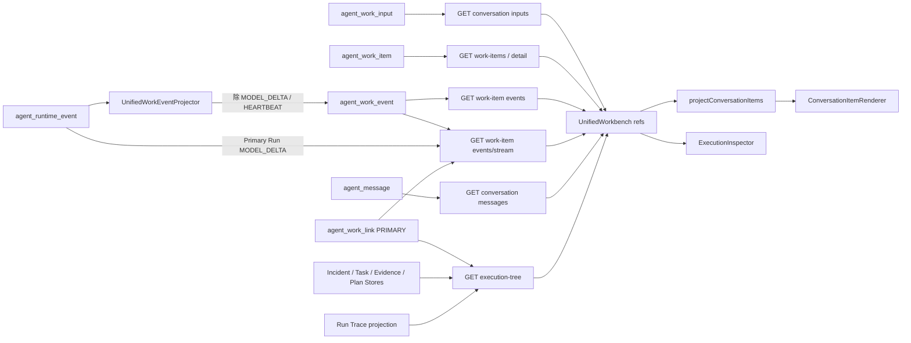

# Unified Agent Workbench Frontend Observability & Conversation Rendering Audit

> 审计日期：2026-07-20
> 审计范围：当前工作区中的 Unified Agent Workbench 前端、其直接调用的 HTTP/SSE API，以及这些 API 对应的后端事件与持久化投影。
> 审计方式：只读代码审计 + 本地只读 API 样本核对。本文不修改生产代码、状态机、事件语义或数据库。

## 0. 执行摘要

当前实现已经具备“WorkItem 统一入口 + Primary Run delta 合流 + ConversationItem 前端投影 + Execution Inspector”的基本结构，但存在四个架构级事实：

1. **Workbench 实际订阅了 `MODEL_DELTA`，但真实执行期间通常拿不到 delta。** `AbstractAgentRunExecutionAdapter` 同步等待 `executor.execute()` 完成，`agent_work_link` 也在完成后才写入；统一 SSE 只能通过 PRIMARY WorkLink 找到 runId。因此 Run 完成前无法发现 Primary Run，完成后才批量回放 delta。
2. **Markdown Renderer 本身已启用 GFM 和 sanitize。** `###三级缓存如何解决循环依赖` 不会成为标题，是因为 CommonMark/marked 要求 `#` 与标题正文之间有空格。当前样本还存在标题、列表、表格之间缺少必要换行的问题。
3. **WorkItem 没有被 Primary Run 终态反向收敛。** 初次 dispatch 完成时，代码把 WorkItem 写成 `DISPATCHED/RUNNING/UNDETERMINED`；后续 WorkEvent Projector 只追加事件，不更新 WorkItem。因此可以同时看到 Run 已完成、最终回答存在，但 WorkItem 仍为 RUNNING。
4. **中间公开时间线有较多前端推导。** `userFacingSummary` 来自 Router 模型的结构化输出；但执行计划、部分状态说明、工具显示名和 ToolResult 摘要由前端模板硬编码，并非后端权威 public event。

结论：当前最大问题不是“没有事件”，而是 **事件发现时机、终态投影和公开语义归属不完整**。继续堆 UI 不能解决真实流式与状态一致性。

---

## 1. 当前页面与组件结构

### 1.1 路由

| 路由 | 当前行为 | 文件 |
|---|---|---|
| `/` | 唯一普通 Workbench，渲染 `UnifiedWorkbench` | `frontend/src/router.ts` |
| `/workbench` | 重定向到 `/` 对应的 `workbench` route | `frontend/src/router.ts` |
| `/runtime` | 兼容重定向到 Workbench | `frontend/src/router.ts` |
| `/runs` | 高级 Run 历史与回放 | `frontend/src/views/RunHistoryView.vue` |
| `/approvals` | 独立审批中心 | `frontend/src/views/ApprovalCenterView.vue` |
| `/incident-command` | 事故调查专项视图 | `frontend/src/views/IncidentCommandView.vue` |
| `/observability` | Trace / Replay / Eval / AgentOps | `frontend/src/views/ObservabilityView.vue` |

`App.vue` 在 Workbench route 下隐藏全局 `AppSidebar` 和 Topbar；Workbench 自己提供三栏布局。其他高级页面仍使用全局应用 Sidebar。

### 1.2 实际组件树

```text
App.vue
└─ RouterView
   └─ UnifiedWorkbench.vue
      ├─ task-sidebar                         (内联模板，不是独立组件)
      │  ├─ New Task
      │  ├─ Search
      │  ├─ WorkItem History
      │  └─ Product Navigation
      ├─ task-conversation-column             (内联模板)
      │  ├─ task-header
      │  ├─ task-conversation-feed
      │  │  └─ ConversationItemRenderer.vue
      │  │     ├─ USER_MESSAGE
      │  │     ├─ AGENT_STATUS
      │  │     ├─ TASK_PLAN
      │  │     ├─ ROUTE_SUMMARY
      │  │     ├─ TOOL_CALL / TOOL_RESULT
      │  │     ├─ AGENT_DELEGATION
      │  │     ├─ INCIDENT_PREVIEW
      │  │     ├─ APPROVAL_REQUEST
      │  │     ├─ FINAL_ANSWER
      │  │     └─ ERROR
      │  └─ task-composer
      └─ ExecutionInspector.vue
         ├─ Overview                          (内联 Tab)
         ├─ Activity                          (内联 Tab)
         ├─ Agents                            (内联 Tab)
         └─ Evidence                          (内联 Tab)
```

辅助实现：

| 职责 | 文件 |
|---|---|
| ConversationItem 类型 | `frontend/src/types/conversation.ts` |
| WorkItem/WorkEvent/Tree DTO | `frontend/src/types/workbench.ts` |
| Conversation Timeline 装配 | `frontend/src/utils/conversationItems.ts` |
| Markdown parse + sanitize | `frontend/src/utils/markdown.ts` |
| Workbench HTTP/SSE URL | `frontend/src/api/workbench.ts` |
| Run、message、approval HTTP API | `frontend/src/api/agent.ts` |
| 旧 Run 直连流式 composable | `frontend/src/composables/useAgentStream.ts` |
| 旧 POST SSE 客户端 | `frontend/src/api/stream.ts` |
| 全局样式与 Workbench token | `frontend/src/styles.css` |

### 1.3 Frontend Store

当前没有 Pinia、Vuex 或独立 Workbench Store。`UnifiedWorkbench.vue` 自身的 `ref/computed` 就是页面级 Store：

- WorkItem：`workItems`、`historyWorkItems`、`selectedId`、`detail`、`focus`；
- 消息：`inputs`、`conversationMessages`、`liveAnswer`；
- 事件：`streamEvents`、`workCursor`、`runCursor`、两个 eventId Set；
- 投影：`executionTree`、`budget`、`pendingApproval`、`timeline`；
- UI：drawer、busy、error、followOutput 等。

另外用 `localStorage` 保存当前 conversationId 和最近 conversationId 列表。最近任务并不是服务端全局 WorkItem 查询，而是前端读取 localStorage 中最多 12 个 conversation，再逐个调用 WorkItem API 后合并。

### 1.4 Run History

`RunHistoryView.vue` 是独立高级页面，直接读取 Run、Run Event 和 Tool Execution：

- `GET /api/agent/runs?limit=50`
- `GET /api/agent/runs/{runId}`
- `GET /api/agent/runs/{runId}/events`
- `GET /api/agent/tools/executions?runId=...`

该页面的 `record-answer` 使用文本插值和 `white-space: pre-wrap`，**不执行 Markdown 渲染**。它不是当前 Workbench Conversation Renderer 的一部分。

---

## 2. 当前数据源

### 2.1 区域与 API

| UI 区域 | HTTP API | SSE API | 前端状态 | 主要 DTO |
|---|---|---|---|---|
| 左侧 WorkItem History | `GET /conversations/{id}/work-items` | 无 | `historyWorkItems` | `WorkItem` |
| 当前用户输入 | `GET /conversations/{id}/inputs` | 无 | `inputs` | `WorkInput` |
| WorkItem Detail | `GET /work-items/{workItemId}` | WorkEvent 也从 SSE 增量进入 | `detail` | `WorkItemDetail` |
| Primary Run 可见消息 | `GET /conversations/{id}/messages` | `model-delta` | `conversationMessages` + `liveAnswer` | `AgentConversationMessage`、`WorkStreamItem` |
| 中间公开时间线 | 上述数据的组合 | 同一个统一 SSE | computed `timeline` | `ConversationItem[]` |
| 右侧 Activity | Detail 中的历史 events + SSE `work-event` | `work-event` | `streamEvents` | `WorkEvent[]` |
| 右侧 Agents/Evidence | `GET /work-items/{id}/execution-tree` | 收到 AGENT_RUN/INCIDENT/PLAN WorkEvent 后重新请求 | `executionTree` | `WorkExecutionTree` |
| Preview | WorkItem Detail | 对应 WorkEvent 只用于 Activity | `detail.preview` | `RoutePreview` |
| Approval | `GET /guardrails/approvals?limit=100` | `APPROVAL_REQUIRED` 只作为 WorkEvent | `pendingApproval` | `ApprovalRecord` |
| Budget | `GET /work-items/{id}/budget` | 无预算 SSE | `budget` | `WorkItemBudget` |
| WorkLink | WorkItem Detail 的 `links`；Tree service 内部也读取 | 无 | `detail.links`，当前中间不直接展示 | `WorkLink[]` |

### 2.2 权威持久化来源

| 数据 | 权威表/Store | 后端读取/投影 | 前端是否推导 |
|---|---|---|---|
| `agent_work_input` | PostgreSQL `agent_work_input` | `UnifiedWorkController.inputs` | 用户消息按 `sourceInputId` 配对；找不到时回退 `originalGoal` |
| `agent_work_item` | PostgreSQL `agent_work_item` | WorkItem list/detail | 左侧状态色通过字符串正则合并 control/execution/outcome |
| `agent_work_event` | PostgreSQL `agent_work_event` | WorkEvent list + unified SSE | 中间只挑选少数 phase；右侧全量分组 |
| Primary Run messages | PostgreSQL `agent_message` | message API 只返回 `USER`、`ASSISTANT_TEXT` | 最终回答按 `activeRunId` 过滤 |
| `MODEL_DELTA` | PostgreSQL `agent_runtime_event` | unified SSE 直接读 `AgentTimelineStore`；不会写入 `agent_work_event` | 只拼接到 `liveAnswer`，不进入 `streamEvents` |
| Agent Tree | WorkLink + Run Trace + Incident/Task/Evidence/Plan Store | `UnifiedWorkExecutionTreeService` | 前端再将节点状态正则映射为五种展示状态 |
| ToolCall/ToolResult | `agent_runtime_event`，同时有 `agent_message` 和 `agent_tool_execution` | WorkEvent Projector 投影非 delta Runtime Event | 中间按 `toolCallId` 配对，并硬编码显示名/结果摘要 |
| Preview | `agent_route_preview` | WorkItem detail | 前端生成固定提示文案 |
| Approval | `agent_store_record(category='approval')` | Approval API | 按 activeRunId + REQUESTED 在全局最近 100 条中查找 |
| Budget | `agent_budget_account`、`agent_budget_reservation` | WorkItem budget query | 右侧自行计算 token 百分比 |
| WorkLink | `agent_work_link` | Detail、Tree、Unified SSE primaryRunId 解析 | activeRunId/incidentId/planId 与 links 构成重复 ID 来源 |

### 2.3 API/SSE 数据流图



### 2.4 重复数据源

1. 最终回答同时存在于 `agent_message.ASSISTANT_TEXT`、`RUN_COMPLETED.content`、RunRecord.answer、Trace 中；Workbench 中间优先 message，Activity 仍可看到 RUN_COMPLETED 全文。
2. 工具事实同时存在于 Runtime Event、WorkEvent、Agent message、ToolExecution、Trace span；当前中间用 WorkEvent，Agents 用 Trace，Run History 用 ToolExecution。
3. 状态同时存在于 WorkItem 三维状态、RunState、Incident/Plan 状态和 Tree node status；没有一个统一 UI 状态投影。
4. Execution ID 同时来自 WorkItem active 字段、WorkLink 和 Execution Tree `executionId`。
5. Approval 同时有 `APPROVAL_REQUIRED` Runtime/WorkEvent 和 Approval Store；中间操作卡只认 Approval Store 查询结果。
6. Budget 同时有 WorkItem budget account、Run budget snapshot、RUN_COMPLETED payload 和 Tree metrics。

---

## 3. 事件映射矩阵

说明：`agent_work_event.eventType` 对 Runtime 事件统一为 `RUN_EVENT_PROJECTED`，真实 Runtime 类型放在 `phase` 和 `payload.runtimeEventType`。Incident/Recovery Plan 同理。

| 请求审计的事件 | 后端真实对应 | 前端收到 | 前端状态 | 中间展示 | 右侧 Inspector | 当前问题 |
|---|---|---:|---|---|---|---|
| `WORK_ITEM_CREATED` | WorkEvent 原生类型 | 是，HTTP/SSE | `streamEvents: WorkEvent` | 否；用户消息来自 input | Activity/任务接收 | 事件本身被公开时间线丢弃 |
| `ROUTING_STARTED` | WorkEvent 原生类型 | 是 | `streamEvents` | 仅当它是最新事件且无回答时，推导“正在理解目标” | Activity/路由 | 中间文案是前端模板，不是 event summary |
| `ROUTING_DECIDED` | WorkEvent + RoutingDecision | 是 | `detail.routingDecision` + `streamEvents` | 是，但正文取 `decision.userFacingSummary/reason`，事件只供时间戳 | Activity/路由 | 两个来源共同组成一个 Item |
| `ROUTE_CONFIRMATION_REQUIRED` | WorkEvent 原生类型 + `agent_route_preview` | 是 | `streamEvents` + `detail.preview` | Preview 卡来自 detail | Activity/确认审批 | WorkEvent 与 Preview 双来源 |
| `DISPATCH_READY` | WorkEvent 原生类型 | 是 | `streamEvents` | 否 | Activity/路由 | 中间计划并非来自此事件 |
| `DISPATCH_STARTED` | WorkEvent 原生类型 | 是 | `streamEvents` | 仅最新事件时推导“正在启动执行” | Activity/路由 | 公开摘要是前端模板 |
| `EXECUTION_DISPATCHED` | WorkEvent 原生类型 | 是 | `streamEvents` | 否 | Activity/路由 | WorkLink 此时才可用；对同步 Run 已经太晚 |
| `RUN_CREATED` | **没有同名 AgentEvent**；只有 `AgentRunState.CREATED` | 否（无事件） | Tree/RunRecord 可能看到 state | 否 | Agents 可能间接看到 | 缺少可投影的 Run 创建事件/早期 link |
| `CONTEXT_PROJECTED` | 实际为 `CONTEXT_PREPARED` / `CONTEXT_COMPACTED` | 是，投影为 RUN_EVENT_PROJECTED | `streamEvents.phase` | 仅最新 PREPARED 时推导公开状态 | Activity/上下文 | 技术事件不应直接进中间；当前推导可接受但非权威 public summary |
| `MODEL_TURN_STARTED` | 实际为 `MODEL_STARTED` | 是，投影为 RUN_EVENT_PROJECTED | `streamEvents.phase` | 仅最新事件时推导“正在整理回答” | Activity/模型 | 不展示隐藏推理，正确；但公开动作仍是前端模板 |
| `MODEL_DELTA` | AgentEvent 原生类型；Projector 明确跳过 | 是，统一 SSE 的独立 `model-delta` | `liveAnswer: string`，不进 `streamEvents` | 理论上作为 live FINAL_ANSWER | Activity 不展示 | 因 PRIMARY Link 写入太晚，通常完成后才批量到达 |
| `TOOL_REQUESTED` | AgentEvent，投影 phase | 是 | `streamEvents` | 是，生成 Tool card | Activity/工具；Agents trace 也有 | 多个工具数据源；显示名和摘要硬编码 |
| `TOOL_COMPLETED` | AgentEvent，投影 phase | 是 | `streamEvents` | 与 request 按 toolCallId 合并；孤立结果单独展示 | Activity/工具；Agents trace 也有 | 耗时用 sourceCreatedAt 相减，不是权威 duration 字段 |
| `APPROVAL_REQUESTED` | 实际为 `APPROVAL_REQUIRED` | 是，投影 phase；另查 Approval Store | `streamEvents` + `pendingApproval` | 只有 Approval Store 找到 REQUESTED 才展示操作卡 | Activity/确认审批 + Evidence/Approval | 全局 recent(100) 查询再前端匹配，可能漏掉旧审批 |
| `RUN_COMPLETED` | AgentEvent 原生类型，投影 phase | 是 | `streamEvents`；最终 message 单独加载 | 最终回答来自 message/liveAnswer，不直接取此事件 | Activity/结果 | Activity payload/content 又包含完整答案，形成重复 |
| `WORK_ITEM_COMPLETED` | **WorkEventType 中不存在** | 否 | 无 | 否 | 否 | 初次 Run 完成后 WorkItem 不收敛的直接缺口 |
| `RECONCILIATION_STARTED` | 无同名统一事件；dispatch attempt 有 `reconciliation=true` | 不以该名称收到 | Detail 不返回 attempt | 否 | 否 | 缺少统一技术投影 |
| `RECONCILIATION_COMPLETED` | 最接近 `DISPATCH_RECONCILED` | 若产生则收到 | `streamEvents` | 否 | 当前分类会落入默认“结果” | 缺少明确 Activity 分类与公开摘要 |
| `LEASE_CLAIMED` | Incident 为 `TASK_LEASE_CLAIMED`；dispatch/projector lease 无统一事件 | Incident 场景可作为 `INCIDENT_EVENT_PROJECTED` 收到 | `streamEvents.phase` | 否 | Activity 当前默认归入结果；Agents 可能间接反映 | 技术 lease 不应进中间，但右侧分类不准确 |
| `LEASE_EXPIRED` | 无同名事件；最接近 `TASK_LEASE_RECOVERED` | 仅 recovered 可能收到 | `streamEvents` | 否 | 默认结果 | “过期”和“已接管恢复”语义未分开投影 |
| `FENCING_REJECTED` | 无统一事件；主要表现为 Store CAS/fencing 写失败 | 否 | 无 | 否 | 否 | 若需诊断，必须增加技术事件/投影字段 |
| `BUDGET_RESERVED` | 只有 `agent_budget_reservation` 状态变化 | 否 | `budget` 只读账户快照 | 否 | Overview/Budget 仅看聚合 | 没有事件级可观测性 |
| `BUDGET_SETTLED` | 只有 reservation settled 状态 | 否 | 同上 | 否 | 同上 | 无法解释某次调用如何消费预算 |
| `BUDGET_EXHAUSTED` | Incident `TaskEventType.BUDGET_EXHAUSTED`；其他路径抛 BudgetExceededException | Incident 场景可能收到投影 | `streamEvents` 或 API error | 中间不会将 Incident payload 映射为 ERROR | Activity 默认结果 | 普通用户可能只看到停住/失败，没有统一公开原因 |

额外存在但未列入请求矩阵的 Runtime 事件：`RUN_PAUSE_REQUESTED`、`RUN_PAUSED`、`RUN_RESUMED`、`MODEL_COMPLETED`、`MODEL_FAILED`、`POLICY_DECIDED`、`RUN_WAITING_INPUT`、`RUN_INPUT_RECEIVED`、`TOOL_STARTED`、`SUB_AGENT_STARTED`、`SUB_AGENT_COMPLETED`、`RUN_FAILED`、`RUN_CANCELLED`、`HEARTBEAT`。除 delta/heartbeat 外，它们都会被投影为 WorkEvent；中间只显式处理其中极少数，右侧 Activity 才是主要接收面。

---

## 4. 流式回答审计

### 4.1 明确回答

1. **MODEL_DELTA 从哪个 endpoint 发送？**
   当前 Workbench 使用 `GET /api/agent/work-items/{workItemId}/events/stream?afterSequence=...&afterRunSequence=...`。SSE event name 为 `model-delta`。旧 Runtime 页面另有 `POST /api/agent/runs` 和 `POST /api/agent/runs/{runId}/resume/events` 流式接口。

2. **Workbench 是否订阅？**
   是。`UnifiedWorkbench.connectStream()` 同时监听 `work-event`、`model-delta`、`heartbeat`、`gap`、`sync-error`。

3. **是否只订阅 WorkEvent？**
   否。WorkEvent 和 Primary Run delta 是统一 SSE 中的两条逻辑通道。

4. **delta 如何关联 workItemId/runId？**
   后端先通过 `agent_work_link` 找 `relation=PRIMARY`、`linkType=RUN` 的 runId，再从 `agent_runtime_event` 读取该 run 的 MODEL_DELTA。SSE item 带 `sourceType=AGENT_RUN`、`sourceId/runId` 和 `sourceSequence`。前端连接本身已绑定 workItemId，但没有再次校验 sourceId 是否等于 detail.activeRunId。

5. **delta 是否写入前端 Store？**
   只追加到 `liveAnswer` 字符串，并用 `seenRunEvents` 按 eventId 去重。它不写入 `streamEvents`，也不形成独立 ConversationItem；`timeline` 将整个 `liveAnswer` 投影为一个 live FINAL_ANSWER。

6. **为什么界面只在完成后显示最终答案？**
   根因是后端发现时机：
   - `AbstractAgentRunExecutionAdapter.dispatch()` 同步调用 `executor.execute()`；
   - `RuntimeAgentExecutor.execute()` 同步等待 `runtime.run()` 返回；
   - `DispatchCoordinator` 只有 adapter 返回后才 `completeDispatch()`；
   - `completeDispatch()` 此时才插入 PRIMARY WorkLink 并写 activeRunId；
   - unified SSE 在 WorkLink 出现前 `primaryRunId()` 返回空，无法读取 delta；
   - WorkLink 出现时 Run 已结束，所有 delta 才被快速回放；同时 5 秒 HTTP refresh 很快加载到持久化 ASSISTANT_TEXT，Conversation projector 又优先使用 persisted message。

   所以问题不是 Vue 没监听，而是 **统一 Workbench 在运行期间不知道 Primary runId**。

7. **切换页面和断线如何恢复？**
   WorkEvent 使用 `workCursor`，delta 使用 `runCursor`，SSE resume token 为 `w:{work};r:{run}`。前端断线后用 query cursor 重连。发现 WorkEvent gap 时，前端通过 HTTP 全量恢复 WorkEvent，清空 liveAnswer，把 runCursor 重置为 -1，再重放 Primary Run delta。

8. **eventId 是否去重？**
   是。WorkEvent 和 Run delta 分别使用 `seenWorkEvents`、`seenRunEvents` Set。WorkEvent 还检查 sequence 连续性。

9. **Child Agent delta 是否隔离？**
   是。Unified SSE 只读取 PRIMARY RUN WorkLink；Child Run 通过 Incident/Tree projection 进入，不会把子 Agent token 拼入主回答。

10. **最小修复路径？**
    真实修复需要后端在 Run 创建后立即暴露稳定 runId/PRIMARY relation，而不是等待同步执行完成。可选方案按推荐度排序：
    - 将 Run 拆为 `create/claim` 与异步 `execute`，dispatch 在创建成功后立即持久化 WorkLink；
    - 或让统一 SSE 根据 `dispatchRequestId -> agent_run_state` 在 WorkLink 写入前解析 runId，并以同一幂等 ID reconcile；
    - 最后才考虑前端旁路调用旧 Run SSE；该方案会绕过统一 Router/Dispatch，不推荐。

仅改前端不能获得真正的执行期 Primary Run delta。

### 4.2 另一个游标风险

`UnifiedWorkEventStreamService` 遍历 Primary Run 的所有 AgentEvent，并在过滤非 MODEL_DELTA 之前推进 `runCursor`。这是合理的“源游标”语义，但意味着前端的 afterRunSequence 不是“delta 序号”，而是完整 runtime event sequence。报告、测试和 UI 不应把它解释成 delta 数量。

---

## 5. Markdown 渲染审计

### 5.1 当前实现

- 库：`marked` 18.x；
- GFM：`gfm: true`；
- 换行：`breaks: true`；
- 支持：合法 Markdown 的标题、列表、表格、代码块、引用；
- sanitize：`DOMPurify.sanitize`；
- 禁止标签：`audio/form/iframe/img/style/video`；
- 禁止属性：`style`；
- 最终挂载：`ConversationItemRenderer` 的 `v-html="markdown"`；
- 用户消息和状态摘要仍使用纯文本插值，这是正确的。

### 5.2 `###三级缓存如何解决循环依赖` 为什么不渲染

这是输入 Markdown 不合法，不是 `marked` 未启用：

```text
###三级缓存如何解决循环依赖  -> <p>###三级缓存如何解决循环依赖</p>
### 三级缓存如何解决循环依赖 -> <h3>三级缓存如何解决循环依赖</h3>
```

CommonMark ATX heading 要求 `#` 后有空格或行结束。当前真实样本还包含 `###1. CAS`、列表项 `-线程`、标题和表格直接粘连等格式，因此标题、列表、表格都可能降级成段落。

### 5.3 是否把 Markdown 当纯文本

- Unified Workbench 的 FINAL_ANSWER：否，会 parse + sanitize；
- Workbench 的 USER_MESSAGE、状态、计划、工具摘要：是纯文本，符合预期；
- Run History 的 `record-answer`：是纯文本，不渲染 Markdown；
- Activity 原始 event：JSON/pre，属于技术视图。

### 5.4 协议 Envelope 泄漏风险

前端 `ConversationItemRenderer` 不会主动把 ToolCall JSON 拼进回答。Tool card 来自 WorkEvent payload，和 FINAL_ANSWER 分离。

风险位于后端 `JsonAgentModelGateway`：

- StreamingResponseRouter 对首字符 `{` 或首行 `````json`` 的响应会抑制增量，正常情况下不会泄漏 ToolCall；
- 但 `looksLikeStructuredToolCall()` 命中后，如果 JSON 解析失败，`toModelTurn()` 会回退为 `plain_text_fallback`，把原始响应视为最终正文；
- `complete()` 也可能把这段原始结构化文本作为 delta 发送。

因此 malformed ToolCall envelope 仍可能作为最终回答持久化。推荐修复点在 Gateway 的协议解析失败分支，而不是在 Vue 中用字符串正则删除 JSON。

### 5.5 推荐的安全修复点

1. Prompt 要求 Markdown 标题、列表、表格遵循标准空格和空行；
2. 最终回答落库前做轻量 Markdown lint/repair，只修明确语法，不改业务内容；
3. Gateway 对“疑似 ToolCall 但解析失败”返回结构化协议错误，不降级为用户正文；
4. 继续保留 DOMPurify，不开放任意 HTML、style、iframe 或图片；
5. Run History 若需要正文可读性，应复用同一个 `renderMarkdown`，而不是另造 parser。

---

## 6. 公开执行摘要与隐藏推理边界

| 当前中间内容 | 实际来源 | 是否权威公开信息 |
|---|---|---|
| “已理解任务”正文 | `routingDecision.decision.userFacingSummary`，缺失时回退 `reason` | userFacingSummary 是模型结构化公开输出；reason 更偏审计，不应无条件作为用户文案 |
| “执行计划” | 前端 `planFor(target)` 硬编码 | 否，不是模型实际计划，也不是 WorkEvent |
| “由 General/OrderCare/... 执行” | WorkItem activeExecutionTarget + 前端名称映射 | 目标是权威事实；自然语言是前端模板 |
| “开始执行” | RUN_STARTED + 前端固定文案 | 事件权威，文案前端推导 |
| “正在理解/准备上下文/整理回答” | 最新技术 phase + 前端固定文案 | 是启发式公开状态，不是后端 public summary |
| Tool 显示名 | toolName + 前端 `toolNames` 字典 | toolName 权威；中文名称前端硬编码且不完整 |
| Tool result 摘要 | metadata 字段 + `resultSummary()` | 前端启发式，未知工具退化为“工具调用已完成” |
| Agent delegation | Execution Tree node objective/status | 来自后端投影，可公开，但 objective 是否适合直接面向用户需逐角色审计 |
| Approval reason | Approval Store | 权威、可公开 |
| Preview 提示 | Preview 事实 + 前端固定说明 | Preview 权威；说明模板化 |

禁止展示模型隐藏 Chain of Thought。当前代码没有读取或渲染隐藏推理字段，也不应新增该能力。推荐的公开白名单是：

- `userFacingSummary`；
- 后端显式 `publicPlan/publicActionSummary`；
- tool action/result summary；
- retry/recovery public summary；
-经过用户化处理的 route reason；
- approval reason。

当前 `planFor()` 不应被描述为“模型制定的真实计划”。它只是基于 ExecutionTarget 的产品模板。

---

## 7. 字体与设计 Token 审计

### 7.1 当前 Token

来源：`frontend/src/styles.css`。

| Token | 当前值 |
|---|---|
| Sans font | `Inter, Segoe UI, PingFang SC, Microsoft YaHei, sans-serif` |
| Mono font | `JetBrains Mono, Cascadia Code, Consolas, monospace` |
| Text | `#202123` |
| Muted | `#666866` |
| Faint | `#92938f` |
| Border | `#dededb` |
| Soft border | `#ececea` |
| Blue | `#2563eb`，Workbench active 又硬编码 `#3178c6` |
| Amber | `#a15c05`，Workbench waiting 又硬编码 `#bd7a18` |
| Red | `#c9362b`，Workbench failed 又硬编码 `#c5463d` |
| Global radius | `14px` |

Workbench 局部实际使用：

- 正文：15.5px / 1.72；移动端 15px；
- 用户消息：14px / 1.7；
- 普通状态与工具：8–12px；
- Inspector 最小文字：7–10px；
- spacing：5、6、7、8、9、10、11、12、13、14、15、17、18、20、22、24、25、28、34 等大量自由值；
- radius：3、4、5、6、7、8、9、10、11、12、13、14、15、16、999px 混用；
- border：大部分 1px solid，但颜色既用 token 又有大量硬编码。

### 7.2 不一致位置

1. Inspector 7–9px 字号过密，与中间 15.5px 正文跨度过大；
2. 全局 `--radius: 14px` 与 Workbench 5–8px 并存，旧页面仍大量使用 10–16px；
3. 状态色既走 root token，又有 Workbench 自己的 hard-coded blue/green/amber/red；
4. `Inter` 未在前端明确加载，Windows 实际通常落到 Segoe UI，跨机器字宽会不同；
5. 旧 Runtime、旧 Unified 样式仍保留在同一个 CSS 文件，即使组件已退出主路由，也提高覆盖和回归风险；
6. spacing 没有离散 token，组件很难维持同一节奏。

### 7.3 推荐 Token（仅设计，不修改）

```text
font-sans: Segoe UI / PingFang SC / Microsoft YaHei / sans-serif
font-mono: JetBrains Mono / Cascadia Code / Consolas / monospace
font-caption: 11px / 1.45
font-body-sm: 13px / 1.6
font-body: 15px / 1.7
font-title: 16px / 1.4
space: 4, 8, 12, 16, 24, 32
radius: 4, 6, 8
border: 1px solid var(--line)
status-info/success/warning/danger: 每类只保留一个前景、背景、边框组合
```

---

## 8. 状态一致性审计

### 8.1 五类状态

| 状态维度 | 权威来源 | 当前 UI 使用 |
|---|---|---|
| `WorkControlState` | `agent_work_item.control_state` | 左侧状态色、标题副文案、Overview |
| `WorkExecutionState` | `agent_work_item.execution_state` | 顶部 StatusBadge、Inspector StatusBadge |
| `WorkOutcome` | `agent_work_item.outcome` | Overview；左侧状态色正则 |
| `RunState` | `agent_run_state.record_json` | Execution Tree node、Run History、final message 间接反映 |
| ProjectorState | `agent_work_projection_cursor` + lease/cursor | 当前 UI 不直接展示，只能从 event lag 推断 |

### 8.2 为什么会同时出现 RUNNING、工具完成、最终回答、DISPATCHED/UNDETERMINED

初次 General/OrderCare dispatch 的实际时序是：

```text
WorkItem READY_TO_DISPATCH
→ Dispatch claim
→ 同步 executor.execute()，Run 从 CREATED/RUNNING 到 COMPLETED
→ Adapter 返回 runId
→ completeDispatch 写 PRIMARY WorkLink
→ WorkItem 被固定更新为 DISPATCHED / RUNNING / UNDETERMINED
→ WorkEvent Projector 把历史 Run events 追加到 agent_work_event
→ agent_message 已经存在最终 ASSISTANT_TEXT
```

当前没有通用的 `RUN_COMPLETED -> WorkItem CLOSED/COMPLETED/ANSWERED` 终态 projector。`UnifiedWorkEventProjector` 只 append event。只有某些 resume command 路径在 `WorkCommandHandler` 中会根据返回 RunState 更新 WorkItem。

因此这些 UI 各自都“忠实”显示了不同权威源，但合起来矛盾：

- 顶部 RUNNING：来自 stale WorkItem.executionState；
- 工具已完成：来自真实 Runtime Event；
- 最终回答：来自真实 `agent_message.ASSISTANT_TEXT`；
- DISPATCHED：来自 WorkItem.controlState；
- UNDETERMINED：来自 WorkItem.outcome；
- Agents COMPLETED：来自 Run Trace/Tree；
- 计时：前端已用 terminal event/final answer 时间做兜底冻结，但这只是显示补偿，不修复 WorkItem 权威状态。

这是后端投影缺口，不应继续用更多前端正则掩盖。

### 8.3 当前前端映射错误/风险

1. `stateTone()` 把三个状态拼成字符串再用正则决定一个点色，无法表达“控制状态与执行结果不同维度”；
2. `eventStatus()` 同样基于 phase + summary 文本正则，存在误判；
3. Execution Inspector 顶部显示 WorkItem executionState，Agents 显示 Run/Task status，缺少“数据源标签”；
4. Projector lag 没有显式字段，用户无法区分“运行中”与“投影未追平”；
5. 5 秒 HTTP refresh 与 SSE 同时写页面状态，虽有 generation 防旧请求覆盖，但语义仍来自多源。

---

## 9. 建议的新信息架构

### 9.1 中间：用户可读 Conversation Timeline

只放公开、稳定、去协议化的信息：

| 放入中间 | 来源要求 |
|---|---|
| USER_MESSAGE | `agent_work_input` |
| ROUTE_SUMMARY | `userFacingSummary`，不直接回退内部 reason |
| TASK_PLAN | 后端显式 public plan；没有则标注为“标准执行流程”而非模型计划 |
| AGENT_STATUS | 后端 public action summary 或经过白名单映射的状态 |
| TOOL_CALL/RESULT | toolName + public arguments summary + public result summary |
| AGENT_DELEGATION | role、public objective、状态，不含 prompt/CoT |
| PREVIEW/APPROVAL | 权威 Preview/Approval DTO |
| ERROR | 用户可操作的错误与下一步 |
| FINAL_ANSWER | Primary Run authoritative final text |

默认不放：token event、context projection、model start/complete、lease、cursor、CAS、fencing、raw payload、raw ToolCall envelope。

### 9.2 右侧：Technical Execution Inspector

- Overview：分开显示 WorkControl、WorkExecution、WorkOutcome、RunState、Projector lag；
- Activity：全量 WorkEvent，明确 `sourceType/sourceId/sourceSequence/projectedAt`；
- Agents：Execution Tree；
- Evidence：Evidence/Conflict/Assessment/Proposal/Approval/Plan；
- 每项标明权威源，避免看起来像一个统一状态。

### 9.3 原始详情：Event Payload Drawer

原始 WorkEvent payload 不应嵌套在每条 Activity 的小 `<details>` 中。建议使用统一 Drawer：

```text
点击 Activity row
→ Drawer 显示 envelope、payload、correlation/causation、source/projection 时间
→ 支持复制 eventId/runId/workItemId
```

Drawer 只属于调试面，不进入普通对话滚动流。

---

## 10. 组件复用与重构判断

### 10.1 可以复用

1. `renderMarkdown()`：marked + DOMPurify 的安全边界合理；
2. `ConversationItemRenderer` 的类型分发外壳；
3. ToolCall/ToolResult 按 toolCallId 配对思路；
4. Unified SSE 双 cursor、eventId 去重和 gap 恢复机制；
5. `ExecutionInspector` 四 Tab 的产品分区；
6. `StatusBadge` 的基本组件形式；
7. Workbench API client 和 DTO；
8. Execution Tree 后端投影；
9. Approval/Preview 现有动作处理器。

### 10.2 必须重构

1. `UnifiedWorkbench.vue`：数据获取、SSE、历史、动作和布局仍集中在一个大组件；
2. `conversationItems.ts`：硬编码计划、工具字典、状态正则和数据装配混在一个函数；
3. `ExecutionInspector.vue`：四个 Tab 应拆成组件，Activity 分类应由稳定映射表驱动；
4. Workbench page Store：应提取 composable/store，明确 server state、transport state、derived presentation state；
5. WorkItem terminal projection：必须后端补齐，不能前端重构替代；
6. Primary Run discovery：必须让 SSE 在执行期间拿到 runId；
7. Markdown output contract：需要 prompt/lint/Gateway 协议失败策略共同保证；
8. CSS：旧 Runtime/Unified 与新 Workbench 样式应分离，建立离散 token。

---

## 11. 推荐修改顺序

1. **后端先修 Primary Run 早期可发现性**：Run create 与 execute 解耦，或通过 dispatchRequestId 解析 runId；建立流式 E2E 门禁。
2. **补 WorkItem terminal projector**：明确每个 ExecutionTarget 的 terminal state/outcome 映射和幂等更新。
3. **冻结 Public Event Contract**：定义 public summary/plan/tool/retry/recovery DTO，禁止 CoT。
4. **提取前端 Workbench Store/composable**：分离 server/transport/presentation state。
5. **重构 Conversation projector**：只消费 public contract；移除“伪模型计划”表述。
6. **拆 Execution Inspector Tabs + Event Payload Drawer**。
7. **修 Markdown contract 与 malformed ToolCall fail-closed**。
8. **统一字体、spacing、radius、status tokens**。
9. **补断线、切换 WorkItem、HITL、Multi-Agent、Markdown、状态收敛截图与自动化测试**。

---

## 12. 预计修改文件

### 12.1 仅前端阶段

- `frontend/src/views/UnifiedWorkbench.vue`
- `frontend/src/components/ConversationItemRenderer.vue`
- `frontend/src/components/ExecutionInspector.vue`
- 新增 `frontend/src/components/inspector/*`
- 新增 `frontend/src/components/EventPayloadDrawer.vue`
- `frontend/src/utils/conversationItems.ts`
- `frontend/src/types/conversation.ts`
- `frontend/src/types/workbench.ts`
- 新增 `frontend/src/composables/useUnifiedWorkbench.ts` 或等价 Store
- `frontend/src/utils/markdown.ts`
- `frontend/src/views/RunHistoryView.vue`
- `frontend/src/styles.css`，或拆分 Workbench CSS/token 文件
- `frontend/scripts/conversation-items-smoke.mjs` 及后续正式测试

### 12.2 后端必需阶段

- `workbench/dispatch/AbstractAgentRunExecutionAdapter.java`
- `workbench/dispatch/DispatchCoordinator.java`
- `workbench/web/UnifiedWorkEventStreamService.java`
- `workbench/application/UnifiedWorkEventProjector.java` 或新增 terminal projector
- `workbench/persistence/*DispatchStore*` / `WorkbenchStore`
- `runtime/AgentRunStore` / Runtime create-execute 边界
- `runtime/JsonAgentModelGateway.java`
- Public event DTO/enum 及对应测试

这只是影响面预测，不代表下一轮应一次全部修改。

---

## 13. 风险

1. 提前写 WorkLink 必须保持 dispatchRequestId 幂等和“创建 Run 后、写 Link 前崩溃”的 reconciliation；
2. WorkItem terminal projector 必须按 sourceSequence/幂等键防止旧终态覆盖新 resume；
3. Guardrail 可能在完整答案阶段改写已发 delta；RUN_COMPLETED 仍必须作为权威最终文本校正；
4. Markdown repair 不能改变代码块、业务 JSON 或签名文本；
5. Public plan 不能泄露 system prompt、hidden reasoning 或 tool protocol；
6. 多 Agent 的 child delta 必须继续隔离，不能混入 Primary Run；
7. Budget/lease/fencing 事件如果公开过多，会把技术噪声重新带回中间时间线；
8. 前端 localStorage conversation history 不是跨设备/跨浏览器权威历史。

---

## 14. 不修改后端即可解决的部分

1. 拆分前端 Store、Conversation Renderer 和 Inspector Tab；
2. 明确中间/右侧事件白名单；
3. 去除重复最终回答和重复 Tool 展示；
4. 改善 Activity 分类和 Event Payload Drawer；
5. 统一字体、字号、spacing、radius、状态色；
6. 对合法 Markdown 统一安全渲染；
7. Run History 复用 Markdown Renderer；
8. 修复前端滚动、复制、Drawer、响应式和断线 UI；
9. 将硬编码计划明确标为“标准流程”，避免冒充模型真实计划；
10. 增加前端映射和路由测试。

不能仅靠前端解决：真正执行期流式、WorkItem 权威终态、Projector lag、预算/lease/fencing 事件缺失。

---

## 15. 必须增加后端投影或字段的部分

1. **Primary runId 的早期稳定暴露**：早期 WorkLink、activeRunId 或 dispatchRequestId 查询能力；
2. **WorkItem terminal projection**：Run/Incident/Plan terminal -> control/execution/outcome/completedAt；
3. **Public execution contract**：`userFacingSummary`、`publicPlan`、`publicActionSummary`、`publicToolSummary`、`publicRecoverySummary`；
4. **Projector observability**：last source sequence、projected sequence、lag、claim/lease 状态；
5. **需要时的技术事件**：reconciliation、lease recovered/expired、fencing rejected、budget reserved/settled/exhausted；这些默认只进入 Inspector；
6. **Approval 精确查询**：按 runId/workItemId 查询 pending approval，替代 recent(100) 前端过滤；
7. **Tool public metadata**：displayName、publicArguments、resultCount、durationMs，避免前端为每个工具硬编码；
8. **Malformed ToolCall fail-closed**：疑似协议但解析失败时不能作为 final answer；
9. **Markdown output quality signal**：至少通过 prompt contract 和离线 Eval 保证标题、列表、表格格式。

---

## 16. 最终判断

当前 Workbench 的可观测能力并不弱：Runtime Event、WorkEvent、Execution Tree、Message、Budget、Approval 都已经存在。问题集中在：

```text
Run 直到完成后才与 WorkItem 建立可发现关联
+ WorkItem 不消费 Run 终态
+ 前端自行发明一部分公开执行语义
+ Markdown 输出契约不稳定
```

下一步不应先做视觉微调。应先修“Primary Run 早发现 + WorkItem 终态投影 + Public Event Contract”，然后再让 Conversation Timeline 和 Technical Inspector 分别消费同一套权威事实。
