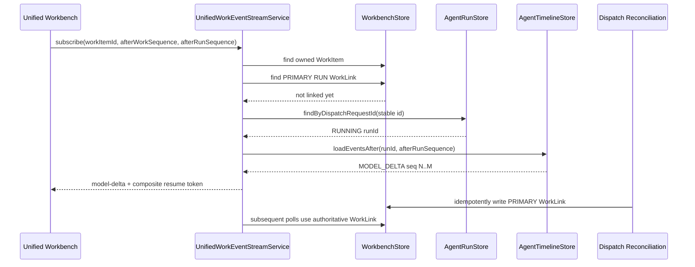

# Unified Agent Workbench Observability Repair P0-P1 Evidence

> Date: 2026-07-20  
> Scope: Primary Run early discovery and authoritative WorkItem execution-state projection  
> Result: PASSED

## 1. Outcome

This phase resolves the two blocking defects identified by the frontend observability audit:

1. Unified Workbench can discover a Primary Run while dispatch is still executing and can emit persisted `MODEL_DELTA` events before the Run completes.
2. Primary Run, Incident Investigation, and Incident Recovery Plan snapshots now converge `AgentWorkItem` to the correct active, waiting, terminal, or manual-review state.

No Vue, TypeScript, CSS, routing policy, hidden-reasoning boundary, or `DefaultAgentRuntime.run()` change was made as part of this repair.

## 2. Primary Run Early Discovery Decision

### 2.1 Selected solution

The minimal design proposed in the audit was validated and implemented:

```text
owned AgentWorkItem.dispatchRequestId
-> agent_run_state.dispatch_request_id
-> AgentRunStore.findByDispatchRequestId()
-> stable runId
-> AgentTimelineStore.loadEventsAfter()
-> Unified SSE MODEL_DELTA
```

`UnifiedWorkEventStreamService` resolves the Primary Run in this order:

1. Use the owned WorkItem's existing PRIMARY RUN WorkLink when it exists.
2. Before reconciliation has written that link, look up `agent_run_state.dispatch_request_id`.
3. Accept the discovered Run only when all bindings match:
   - Run `conversationId` equals WorkItem `conversationId`;
   - request metadata `workItemId` equals the owned WorkItem ID;
   - request metadata `_workbenchDispatchRequestId` equals WorkItem `dispatchRequestId`.

The stream service never creates a Run or WorkLink. Dispatch reconciliation remains the sole writer that converges the final PRIMARY link and active execution ID.

### 2.2 Why create/execute was not split

No create-Run/execute-Run split was necessary because the existing runtime already provides all required guarantees:

- the Run is persisted as `RUNNING` before the model loop;
- `dispatch_request_id` is stored beside the Run snapshot;
- a partial unique index prevents a second Run for the same non-null dispatch request;
- execution adapters already pass the stable WorkItem dispatch request through request metadata;
- reconnect can replay persisted runtime events by full source sequence.

Splitting `DefaultAgentRuntime.run()` would therefore add lifecycle and recovery complexity without solving an unavailable identity problem.

### 2.3 Streaming sequence



### 2.4 Cursor and isolation properties

- `afterRunSequence` remains the complete runtime event source sequence, including skipped non-delta events.
- The SSE event ID remains the composite `w:<workSequence>;r:<runSequence>` resume token.
- Reconnect starts strictly after the acknowledged runtime sequence, so visible text is not duplicated.
- Only the stable dispatch-bound Primary Run is read before WorkLink creation.
- Once a PRIMARY WorkLink exists, it is authoritative.
- Child Run delta is never loaded into the Primary answer channel.

## 3. WorkItem Execution-State Projection

### 3.1 Projection architecture

`UnifiedWorkEventProjector` now performs two independent operations for every claimed source:

1. project source events using the existing `last_source_sequence` cursor;
2. load the current authoritative source snapshot and reconcile WorkItem state.

State reconciliation runs even when there is no new source event. This is required for recovery after a process exits between event projection and a later scan.

The existing `agent_work_projection_cursor` is extended with a state watermark:

```text
last_state_version
last_state_attempt
projected_control_state
projected_execution_state
projected_outcome
```

The state update and watermark update occur in one PostgreSQL transaction.

### 3.2 Concurrency and idempotency protocol

Within one transaction, the store:

1. validates lease owner, lease expiry, and fencing token;
2. locks the WorkItem;
3. verifies the source is still the active Run, Incident, or Recovery Plan;
4. re-reads the authoritative source table;
5. verifies status, outcome, source version, and Run resume attempt;
6. rejects an older version or attempt;
7. short-circuits an already projected version and attempt;
8. updates WorkItem state and the projection watermark atomically.

This prevents duplicate projection, stale projector writes, and old terminal events overwriting a resumed execution. `ABANDONED` is preserved, and a still-running source cannot overwrite a newer `PAUSE_REQUESTED` or `CANCEL_REQUESTED` control intent.

### 3.3 Terminal and waiting mapping

#### Primary Run (GENERAL_AGENT and ORDERCARE_CASE)

| AgentRunState | WorkControlState | WorkExecutionState | WorkOutcome |
|---|---|---|---|
| CREATED, RUNNING | DISPATCHED | RUNNING | UNDETERMINED |
| WAITING_APPROVAL | DISPATCHED | WAITING_APPROVAL | UNDETERMINED |
| WAITING_INPUT, NEEDS_CLARIFICATION | WAITING_INPUT | WAITING_INPUT | UNDETERMINED |
| PAUSE_REQUESTED | PAUSE_REQUESTED | RUNNING | UNDETERMINED |
| PAUSED | PAUSED | PAUSED | UNDETERMINED |
| COMPLETED | CLOSED | COMPLETED | ANSWERED |
| FAILED, BLOCKED | CLOSED | FAILED | FAILED |
| REJECTED + failureReason=CANCELLED | CLOSED | CANCELLED | CANCELLED |
| other REJECTED | CLOSED | CANCELLED | REJECTED |
| MANUAL_REVIEW | MANUAL_REVIEW | UNKNOWN | MANUAL_REVIEW |

#### Incident Investigation

| IncidentStatus | WorkControlState | WorkExecutionState | WorkOutcome |
|---|---|---|---|
| CREATED through REVIEWING | DISPATCHED | RUNNING | UNDETERMINED |
| CLARIFYING | WAITING_INPUT | WAITING_INPUT | UNDETERMINED |
| ASSESSED | CLOSED | COMPLETED | ASSESSED |
| PARTIAL | CLOSED | COMPLETED | NOT_CONVERGED |
| MANUAL_REVIEW | MANUAL_REVIEW | UNKNOWN | MANUAL_REVIEW |
| FAILED | CLOSED | FAILED | FAILED |
| CANCELLED | CLOSED | CANCELLED | CANCELLED |

#### Incident Recovery Plan

| RecoveryPlan status/outcome | WorkControlState | WorkExecutionState | WorkOutcome |
|---|---|---|---|
| CREATED, PLANNING, PREVIEWING, EXECUTING | DISPATCHED | RUNNING | UNDETERMINED |
| WAITING_APPROVAL | DISPATCHED | WAITING_APPROVAL | UNDETERMINED |
| COMPLETED / RESOLVED | CLOSED | COMPLETED | RESOLVED |
| COMPLETED / PARTIAL | CLOSED | COMPLETED | NOT_CONVERGED |
| COMPLETED / REJECTED | CLOSED | COMPLETED | REJECTED |
| COMPLETED / MANUAL_REVIEW | MANUAL_REVIEW | UNKNOWN | MANUAL_REVIEW |
| COMPLETED / READY or NOT_STARTED | CLOSED | COMPLETED | ASSESSED |
| FAILED | CLOSED | FAILED | FAILED |
| CANCELLED | CLOSED | CANCELLED | CANCELLED |

`completedAt` is set from the source snapshot for terminal/manual-review projections and cleared when a newer resumed attempt returns to an active state.

## 4. Test Evidence

### 4.1 Real streaming PostgreSQL test

`UnifiedWorkEventStreamPostgresIT` verifies the complete early-discovery path with real stores:

- WorkItem is dispatching;
- Run is persisted with the same `dispatch_request_id`;
- no PRIMARY WorkLink exists;
- two persisted `MODEL_DELTA` events are returned while Run state is still `RUNNING`;
- reconnect with the returned runtime cursor emits no duplicate text;
- final persisted Run answer equals the accumulated live buffer.

The existing PostgreSQL and unit tests also verify Child Run isolation and full runtime sequence cursor advancement across non-delta events.

### 4.2 Projection replay and multi-instance tests

`UnifiedWorkEventProjectorPostgresIT` verifies:

- COMPLETED Run converges WorkItem to `CLOSED/COMPLETED/ANSWERED`;
- ASSESSED Incident converges WorkItem to `CLOSED/COMPLETED/ASSESSED`;
- ten projector replays do not change the WorkItem version again;
- a newer resumed attempt reopens the same WorkItem as `DISPATCHED/RUNNING/UNDETERMINED` and clears `completedAt`;
- the old `RUN_COMPLETED` event remains in history but cannot override the resumed snapshot;
- a second projector cannot claim an unexpired lease;
- expired-lease takeover increments the fencing token;
- the stale owner cannot advance the cursor or apply terminal state.

Unit mapping tests cover Run COMPLETED, FAILED, cancellation, Incident ASSESSED, and Recovery Plan RESOLVED outcomes.

### 4.3 Regression gates

Passed commands:

```powershell
mvn.cmd -q test
```

Result from Surefire reports after the unit and selected integration gates:

```text
83 report files
347 tests
0 failures
0 errors
11 skipped (environment-gated suites)
```

The following PostgreSQL Workbench integration suites were explicitly enabled and passed:

```text
UnifiedWorkEventProjectorPostgresIT
UnifiedWorkExecutionTreePostgresIT
WorkCommandHandlerPostgresIT
HierarchicalBudgetPostgresIT
DispatchTargetIdempotencyPostgresIT
JdbcDispatchStorePostgresIT
JdbcRoutingStorePostgresIT
JdbcWorkbenchStorePostgresIT
WorkbenchTenantIsolationPostgresIT
UnifiedWorkbenchControllerPostgresIT
UnifiedWorkEventStreamPostgresIT
UnifiedWorkHistoryReplayPostgresIT
```

These cover routing, dispatch, SSE, replay, budget, commands, idempotency, tenant isolation, execution tree, and recovery behavior.

## 5. Modified Files

Production repair:

- `src/main/java/com/agent/platform/workbench/web/UnifiedWorkEventStreamService.java`
- `src/main/java/com/agent/platform/workbench/application/UnifiedWorkEventProjector.java`
- `src/main/java/com/agent/platform/workbench/persistence/WorkEventProjectionStore.java`
- `src/main/java/com/agent/platform/workbench/persistence/JdbcWorkbenchStore.java`
- `src/main/java/com/agent/platform/workbench/model/WorkExecutionProjection.java`

Tests and constructor updates:

- `src/test/java/com/agent/platform/workbench/web/UnifiedWorkEventStreamServiceTests.java`
- `src/test/java/com/agent/platform/workbench/web/UnifiedWorkEventStreamPostgresIT.java`
- `src/test/java/com/agent/platform/workbench/web/UnifiedWorkHistoryReplayPostgresIT.java`
- `src/test/java/com/agent/platform/workbench/application/UnifiedWorkEventProjectorTests.java`
- `src/test/java/com/agent/platform/workbench/application/UnifiedWorkEventProjectorPostgresIT.java`

No production frontend file was modified by this phase.

## 6. Runtime Integrity Check

```text
git diff -- src/main/java/com/agent/platform/runtime/DefaultAgentRuntime.java
```

Result: empty. `DefaultAgentRuntime.run()` was not modified.

## 7. Deferred Work

The following work is intentionally not part of P0-P1:

- Public Event Contract design and implementation;
- public execution-plan semantics;
- Conversation renderer or visual redesign;
- Markdown normalization changes;
- token-delta rendering changes beyond making the existing Primary Run stream discoverable;
- generic cross-store ordering claims beyond the existing product projection sequence;
- browser screenshot evidence for later frontend phases.

No commit or push was performed.
