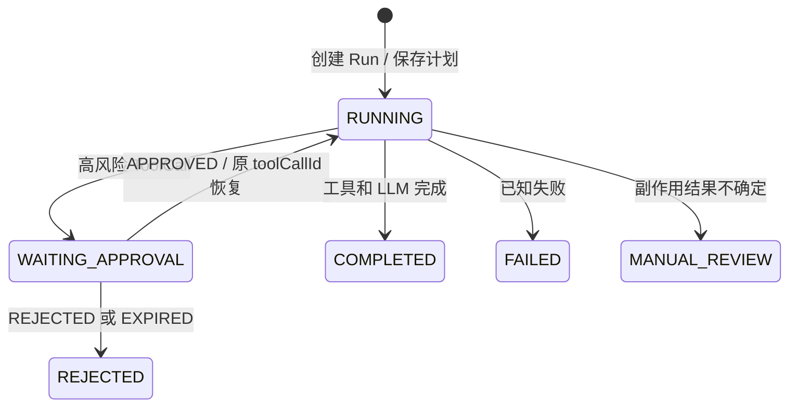

# V4.9 Reliable Agent Run

## 目标

把高风险工具从“同步判断后直接执行”收口成可持久化、可暂停、可恢复、可审计的 Agent Run。该版本聚焦面试中最能体现后端工程判断的副作用正确性，不尝试实现通用 DAG 调度平台。

## 状态闭环



核心不变量：

1. `WAITING_APPROVAL` 时只保存待执行 ToolCall，不调用工具。
2. 恢复时原 `toolCallId` 不变；同一 ID 已 `SUCCEEDED` 时复用结果，不重复执行。
3. 工具可能已执行但结果未可靠落库时，不自动重试，Run 进入 `MANUAL_REVIEW`。
4. Run、Workflow checkpoint、Approval、Tool Execution 和 Trace 使用同一 `runId/traceId` 关联。

## 持久化对象

| 对象 | 关键内容 |
| --- | --- |
| Agent Run | 原始请求、状态、执行计划、当前节点、approvalId、待执行 ToolCall、最终结果 |
| Workflow | 节点计划、每步 checkpoint、retryable/resumable 标记 |
| Approval | runId、审批状态、审批人、原因、决定时间 |
| Tool Execution | toolCallId、runId、工具名、执行状态、结果、尝试次数 |
| Trace | 初始执行和恢复后的连续 Span、状态变化与 replay event |

默认 `enterprise-agent.storage.mode=jdbc` 使用 PostgreSQL；`memory` 模式只用于零依赖演示。

## 最短演示

创建高风险 Run：

```powershell
curl.exe -X POST http://localhost:8080/api/agent/runs `
  -H "Content-Type: application/json" `
  -d "{\"conversationId\":\"approval-demo\",\"userId\":\"u1001\",\"question\":\"请关闭工单 T1001，原因是重复工单\"}"
```

保存响应中的 `runId` 和 `approvalId`，然后批准并恢复：

```powershell
curl.exe -X POST http://localhost:8080/api/agent/guardrails/approvals/{approvalId}/decide `
  -H "Content-Type: application/json" `
  -d "{\"approved\":true,\"reviewer\":\"demo-reviewer\",\"reason\":\"已核对\"}"

curl.exe -X POST http://localhost:8080/api/agent/runs/{runId}/resume
curl.exe -X POST http://localhost:8080/api/agent/runs/{runId}/resume
curl.exe "http://localhost:8080/api/agent/tools/executions?runId={runId}"
```

预期结果：两次恢复均返回 `COMPLETED`，工具执行列表只有一条 `SUCCEEDED` 记录，且其 `toolCallId` 与等待审批时保存的 ID 相同。

最后查看完整证据：

```powershell
curl.exe http://localhost:8080/api/agent/runs/{runId}
curl.exe http://localhost:8080/api/agent/workflows/{runId}
curl.exe http://localhost:8080/api/agent/traces/{runId}/replay
curl.exe -X POST http://localhost:8080/api/agent/evals/regression
```

Trace 中应依次出现 `WAITING_APPROVAL`、`run.resumed`、`approval.decision`、`tool.execute` 和 `COMPLETED`。Eval 的安全处理判定会把 `WAITING_APPROVAL` 与 `REJECTED` 视为高风险请求被正确处理。

## 面试回答边界

可以说：项目拥有显式 Agent Run 状态、持久化 checkpoint、HITL 暂停/恢复、基于 `toolCallId` 的副作用幂等和未知结果人工兜底。

不要说：实现了 Temporal、LangGraph 或任意节点都能恢复的分布式工作流引擎。当前恢复点有意聚焦高风险工具审批这一条高价值链路。
